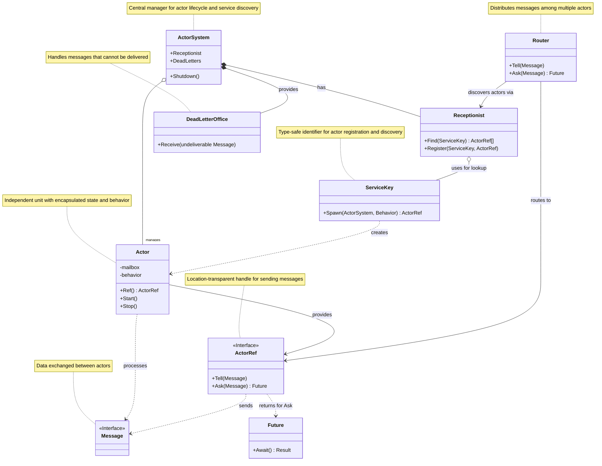

# Actor Package

## Introduction to Actors

The actor model is a conceptual model for concurrent computation that treats
"actors" as the universal primitives of concurrent computation. Originating from
Carl Hewitt's work in the 1970s and popularized by languages like Erlang and
frameworks like Akka, actors provide a high-level abstraction for building
robust, concurrent, and distributed systems.

At its core, an actor is an independent unit of computation that encapsulates:
-   **State**: An actor can maintain private state that it alone can modify.
-   **Behavior**: An actor defines how it reacts to messages it receives.
-   **Mailbox**: Each actor has a mailbox to queue incoming messages.

Actors communicate exclusively through asynchronous message passing. When an
actor receives a message, it can:
1.  Send a finite number of messages to other actors.
2.  Create a finite number of new actors.
3.  Designate the behavior to be used for the next message it receives (which
    can be the same behavior).


Concurrency is managed by the actor system, allowing many actors to
This model inherently promotes loose coupling, as actors do not share state
execute concurrently without explicit lock management by the developer for actor
state.

## Motivation for this Package

In large, long-lived systems like `lnd`, managing complexity, concurrency, and
component lifecycles becomes increasingly challenging. This `actor` package is
introduced to address several key motivations:

### Structured Message Passing

To move away from direct, synchronous method calls between major components,
especially where concurrency or complex state interactions are involved. Message
passing encourages clearer, more auditable interactions and helps manage
concurrent access to component state.

### Eliminating "God Structs"

Over time, systems can develop large "god structs" that hold references to
numerous sub-systems. This leads to tight coupling, makes dependency management
difficult, and can obscure the flow of control and data. Actors, by
encapsulating state and behavior and interacting via messages, help break down
these monolithic structures into more manageable, independent units.

### Decoupled Lifecycles

Often, the lifecycle of a sub-system is unnecessarily tied to a parent system,
or access to a sub-system requires traversing through a central "manager"
object. Actors can have independent lifecycles managed by an actor system,
allowing for more granular control over starting, stopping, and restarting
components.

An example of such interaction is when an RPC call needs to go through several
other structs to obtain a reference to a given sub-system, in order to make a
direct method call on that sub-system.

With the model described in this document, the RPC server just needs to know
about what is effectively an _abstract address_ of that sub-system. It can then
use that to obtain something similar to a mailbox to do the method call.

This allows for a more decoupled architecture, as the RPC server doesn't need to
know the exact "shape" of the method to call, just which message to send.
Refactors of the sub-system won't break the RPC server, as long as the message
(which can be constructed via a dedicated constructor) is the same.

---

This package provides a foundational actor framework tailored for Go, enabling
developers to build components that are easier to reason about, test, and
maintain in a concurrent environment.

## Core Concepts

Let's explore the fundamental building blocks provided by this package.

### Messages

Actors communicate by sending and receiving messages. Any type that an actor
needs to process must implement the `actor.Message` interface. A simple way to
do this is by embedding `actor.BaseMessage`:

```go
package mymodule

import "github.com/lightningnetwork/lnd/actor"

// MyRequest is a custom message type.
type MyRequest struct {
    // Embed BaseMessage to satisfy the Message interface.
    actor.BaseMessage 
    Data string
}

// MessageType returns a string identifier for this message type.
func (m *MyRequest) MessageType() string {
    return "MyRequest"
}

// MyResponse might be a corresponding response type.
type MyResponse struct {
    actor.BaseMessage
    Reply string
}

func (m *MyResponse) MessageType() string {
    return "MyResponse"
}
```
The `MessageType()` method provides a string representation of the message type,
which can be useful for debugging or routing.


### Actor Behavior

The logic of an actor (how it responds to messages) is defined by its
`ActorBehavior`. This is an interface that you implement:

```go
package actor

// ActorBehavior defines the logic for how an actor processes incoming messages.
type ActorBehavior[M Message, R any] interface {
    Receive(actorCtx context.Context, msg M) fn.Result[R]
}
```
The `Receive` method passes in a caller context (useful for shutdown detection)
and the incoming message. It returns an `fn.Result[R]`, which can encapsulate
either a successful response of type `R` or an error.

For simple cases, you can use `actor.FunctionBehavior` to adapt a Go function
into an `ActorBehavior`:

```go
import (
    "context"
    "fmt"
    "github.com/lightningnetwork/lnd/actor"
    "github.com/lightningnetwork/lnd/fn/v2"
)

// myActorLogic defines the processing for MyRequest messages.
func myActorLogic(ctx context.Context, msg *MyRequest) fn.Result[*MyResponse] {
    // In a real actor, you might interact with state or other services.
    // The actor's context (ctx) can be checked for shutdown signals.
    select {
    case <-ctx.Done():
        return fn.Err[*MyResponse](errors.New("actor shutting down"))
    default:
    }

    response := &MyResponse{Reply: fmt.Sprintf("Processed: %s", msg.Data)}
    return fn.Ok(response)
}

// Create a behavior from the function.
behavior := actor.NewFunctionBehavior(myActorLogic)
```

For more complex cases, you can implement the `Receive` method on a new struct,
and pass that around directly.

### Service Keys and Actor References: The Interaction Layer

Direct interaction with an actor's internal state or its concrete struct is
discouraged. Instead, communication and discovery are managed through two key
abstractions: `ServiceKey` and `ActorRef`. These provide a layer of indirection,
promoting loose coupling and location transparency (though the current
implementation is in-process).

#### `ServiceKey[M Message, R any]`

A `ServiceKey` is a type-safe identifier used for registering actors that
provide a particular service and for discovering them later. The generic type
parameters `M` (the type of message the actor handles) and `R` (the type of
response the actor produces for `Ask` operations) ensure that you discover
actors compatible with the interactions you intend to perform.

```go
// Define a service key for actors that handle MyRequest and produce MyResponse.
myServiceKey := actor.NewServiceKey[*MyRequest, *MyResponse]("my-custom-service")

// Later, this key would be used with a Receptionist (part of an ActorSystem)
// to find ActorRefs for actors offering this service.
```

#### `ActorRef[M Message, R any]`

An `ActorRef` is a lightweight, shareable reference to an actor. It's the
primary means by which you send messages to an actor. It is also generic over
the message type `M` and response type `R` that the target actor handles.

You typically obtain an `ActorRef` by looking it up in a `Receptionist` using a
`ServiceKey` (covered later when discussing the `ActorSystem`), or directly from
an actor instance via its `.Ref()` method (e.g., `sampleActor.Ref()` if you have
the `Actor` instance).

There are two main ways to send messages using an `ActorRef`:

1.  **Tell (Fire-and-Forget)**: Used for sending messages when you don't need a
    direct reply. The call returns immediately after attempting to enqueue the
    message.

    ```go
    // Assuming 'actorRef' is an ActorRef[*MyRequest, *MyResponse] obtained for an actor.
    requestMsg := &MyRequest{Data: "A fire-and-forget message"}
    actorRef.Tell(context.Background(), requestMsg)
    // The message is now in the actor's mailbox (or will be shortly).
    ```
    The `context.Context` passed to `Tell` can be used to cancel the send
    operation if, for example, the actor's mailbox is full and the send would
    block for too long.

2.  **Ask (Request-Response)**: Used when you need a response from the actor.
    This returns a `Future[R]`, which represents the eventual reply.

    ```go
    // Assuming 'actorRef' is an ActorRef[*MyRequest, *MyResponse].
    askMsg := &MyRequest{Data: "A request needing a response"}
    futureResponse := actorRef.Ask(context.Background(), askMsg)
    ```
    A `Future[R]` represents a result that will be available at some point. You
    can block until it's ready using `Await`:

    ```go
    // Await the result. It's good practice to use a context with a timeout.
    ctx, cancel := context.WithTimeout(context.Background(), 5*time.Second)
    defer cancel()

    result := futureResponse.Await(ctx)
    response, err := result.Unpack() 
    if err != nil {
        fmt.Printf("Ask failed: %v\n", err)
        // return or handle error
    } else {
        fmt.Printf("Received reply: %s\n", response.Reply)
    }
    ```
    The `Future` interface also offers non-blocking ways to handle results, like
    `OnComplete` (for callbacks) and `ThenApply` (for chaining transformations).
    A more restricted `TellOnlyRef[M]` is also available if only fire-and-forget
    semantics are required (obtained via an actor's `TellRef()` method).

### Actors

An `Actor` is the concrete entity that runs a behavior, manages a mailbox, and
has a lifecycle. You create an actor using `actor.NewActor` with an
`ActorConfig`:

```go
cfg := actor.ActorConfig[*MyRequest, *MyResponse]{
    ID:          "my-sample-actor",
    Behavior:    behavior,
    MailboxSize: 10,
    // Dead Letter Office (covered later)
    DLO:         nil,
}
sampleActor := actor.NewActor(cfg)
```

An actor doesn't start processing messages until its `Start()` method is called.
This launches a dedicated goroutine for the actor.

```go
sampleActor.Start()
```
To stop an actor, you call its `Stop()` method. This cancels the actor's
internal context, causing its goroutine to clean up and exit.

```go
// Sometime later...
sampleActor.Stop()
```


## Visualizing Actor Relationships

The following diagram illustrates the primary components of the actor package
and their relationships. It provides a high-level overview of how actors are
managed, discovered, and interacted with.



## The Actor System

While individual actors are useful, they often need to be managed and
coordinated. The `ActorSystem` serves this purpose.

```go
system := actor.NewActorSystem()
// Ensures all actors in the system are stopped.
defer system.Shutdown()
```

### Actor Lifecycle and Registration

The `ActorSystem` can manage the lifecycle of actors. You can register actors
with the system:

```go
// Using 'behavior' from earlier and 'myServiceKey' defined in the 
// "Service Keys and Actor References" section.

// RegisterWithSystem creates, starts, and registers the actor.
actorRefFromSystem := actor.RegisterWithSystem(
    system, "system-managed-actor", myServiceKey, behavior,
)
```

Alternatively, a `ServiceKey` itself provides a `Spawn` method for convenience:
```go
actorRefSpawned := myServiceKey.Spawn(system, "spawned-actor", behavior)
```

Actors registered with the system are automatically stopped when
`system.Shutdown()` is called. You can also stop and remove individual actors
using `system.StopAndRemoveActor(actorID)`.

A `ServiceKey` is essentially the mailbox address of an actor.

### Receptionist: Service Discovery

Actors often need to find other actors to communicate with. The `Receptionist`
facilitates this. Actors are registered with the receptionist using a
`ServiceKey`, which is type-safe.

```go
// Get the system's receptionist.
receptionist := system.Receptionist()

// Find actors registered for a specific service key.
foundRefs := actor.FindInReceptionist(receptionist, myServiceKey)
if len(foundRefs) > 0 {
    targetActor := foundRefs[0]
    targetActor.Tell(context.Background(), &MyRequest{Data: "Hello from a discoverer!"})
} else {
    fmt.Println("No actors found for service key:", myServiceKey)
}
```
When an actor is stopped (e.g., via `ServiceKey.Unregister` or system shutdown),
it should also be unregistered from the receptionist.

### Dead Letter Office (DLO)

What happens to messages that cannot be delivered? For example, if an actor is
stopped while messages are still in its mailbox, or if a message is sent to an
actor that doesn't exist (though the current `ActorRef` design makes the latter
less likely for direct sends).

The `ActorSystem` provides a default `DeadLetterActor`. When an actor is
configured (via `ActorConfig.DLO`), undeliverable messages (e.g., those drained
from its mailbox upon shutdown) can be routed to this DLO. This allows for
logging, auditing, or potential manual intervention for "lost" messages.

```go
// Actors created via RegisterWithSystem or ServiceKey.Spawn
// are automatically configured to use the system's DLO.
// system.DeadLetters() returns an ActorRef to the system's DLO.
```

## Routers: Distributing Work

Sometimes, you might have multiple actors performing the same kind of task, and
you want to distribute messages among them. A `Router` can do this. It's not an
actor itself but acts as a dispatcher.

A `Router` uses a `RoutingStrategy` to pick one actor from a group registered
under a `ServiceKey`.

```go
// Assume 'system' and 'myServiceKey' are set up, and multiple actors
// are registered with 'myServiceKey'.

// Create a round-robin routing strategy.
roundRobinStrategy := actor.NewRoundRobinStrategy[*MyRequest, *MyResponse]()

// Create a router for 'myServiceKey' using this strategy.
// Messages sent to this router will be forwarded to one of the actors
// registered under 'myServiceKey'.
// The router also needs a DLO for messages it can't route (e.g., if no actors are available).
serviceRouter := actor.NewRouter(
    system.Receptionist(),
    myServiceKey,
    roundRobinStrategy,
    system.DeadLetters(),
)

// Now, interact with the router as if it were an ActorRef:
serviceRouter.Tell(context.Background(), &MyRequest{Data: "Message via router"})

futureReplyFromRouter := serviceRouter.Ask(context.Background(), &MyRequest{Data: "Ask via router"})
// ... await futureReplyFromRouter ...
```
If the router cannot find any available actors for the `ServiceKey` (e.g., none
are registered or running), `Tell` operations will typically send the message to
the router's configured DLO, and `Ask` operations will return a `Future`
completed with `ErrNoActorsAvailable`.
