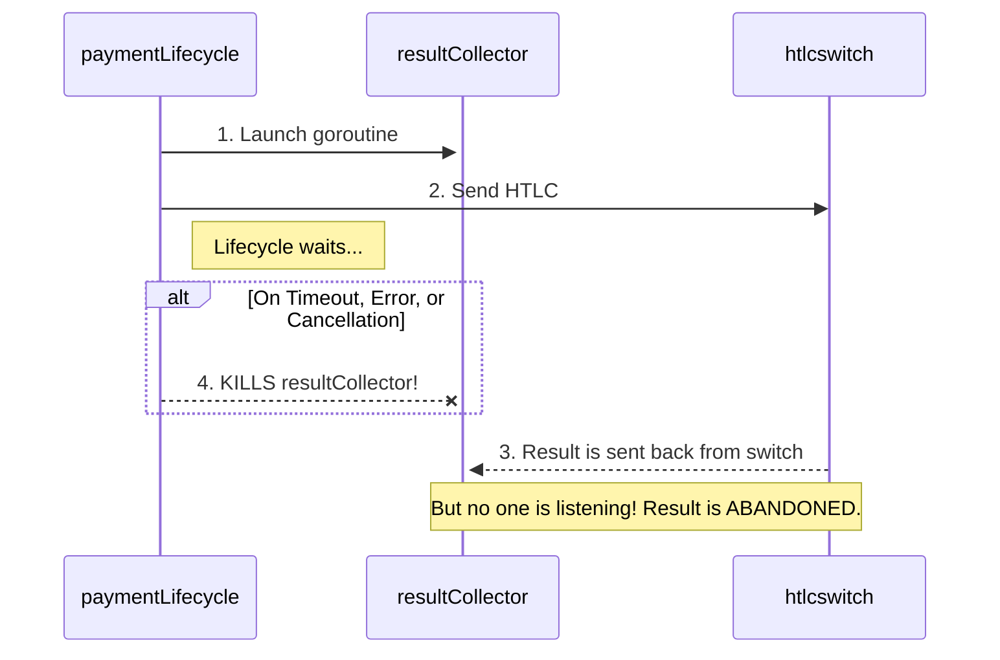
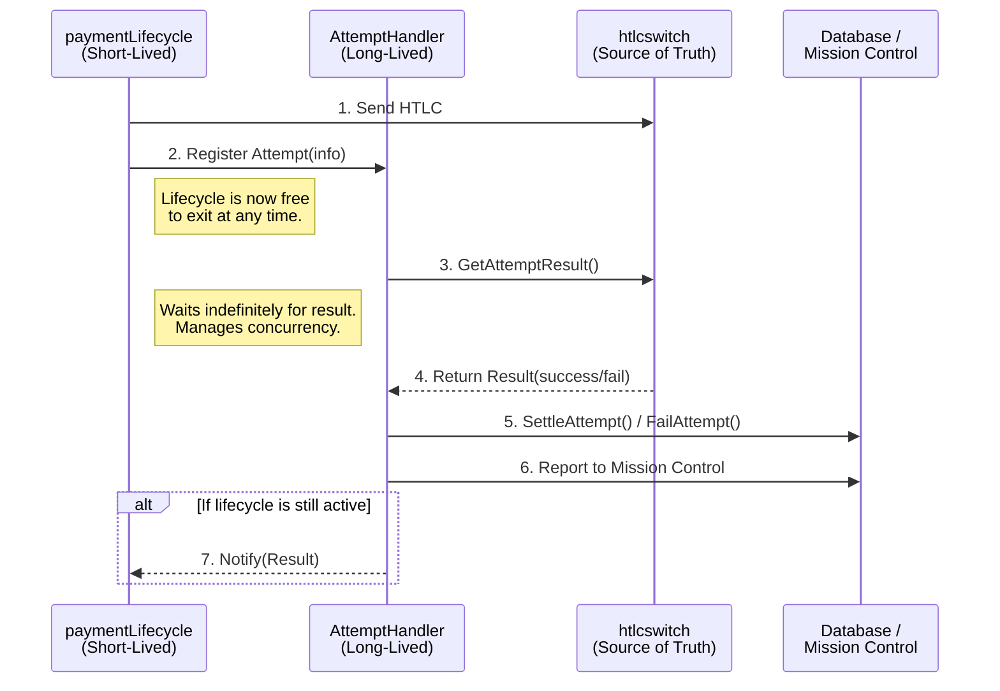

# Design Proposal: The `AttemptHandler` Service for Reliable Payment Resolution

**Author:** ziggie
**Date:** August 7, 2025
**Status:** Proposed

## 1. Problem Statement: Stuck In-Flight Payments

The current payment architecture in `lnd` suffers from a critical flaw where payments can become permanently stuck in the `INFLIGHT` state.

### Root Cause

The root cause is the **tight coupling** between the `paymentLifecycle` (the process that sends a payment) and the `resultCollector` (the goroutine that waits for the payment's result). The `resultCollector`'s lifetime is tied directly to the `paymentLifecycle`.

When the `paymentLifecycle` exits for any reason other than definitive success or failure—such as a context timeout, user cancellation, or a route-finding error—it closes a `quit` channel. This action immediately terminates all of its associated `resultCollector` goroutines.

The HTLC attempts that were already sent to the `htlcswitch`, however, are still active on the network. Because their collectors are gone, `lnd` is no longer listening for their results. This leaves the payment stuck in limbo, consuming node resources and providing a poor user experience.

### Current Flawed Architecture



## 2. Proposed Solution: The `AttemptHandler` Service

We propose a new, registration-based architecture that decouples attempt resolution from the payment lifecycle. This is achieved by introducing a new, long-lived service: the **`AttemptHandler`**.

The `AttemptHandler` is a router-level service whose lifetime is tied to the router itself, not to any individual payment.

### New Decoupled Architecture



## 3. Detailed Design

### 3.1. The `AttemptHandler` Component

A new file, `lnd/attempt_handler.go`, will be created to house the service.

```go
// lnd/attempt_handler.go

// AttemptHandler is a router-level service responsible for the guaranteed,
// independent, and reliable resolution of all in-flight HTLC attempts.
type AttemptHandler struct {
	cfg                *routing.Router
	concurrencyLimiter chan struct{} // Used as a semaphore
	wg                 sync.WaitGroup
	quit               chan struct{}
}

// AttemptInfo holds all the necessary information for the AttemptHandler to
// process a single HTLC attempt to completion.
type AttemptInfo struct {
	AttemptID      uint64
	PaymentHash    lntypes.Hash
	Route          route.Route
	errorDecryptor htlcswitch.ErrorDecryptor
	NotifyChannel  chan<- *htlcswitch.PaymentResult // Optional
}

// RegisterAttempt registers a new attempt for independent result processing.
// It provides backpressure if the node is at its concurrency limit.
func (h *AttemptHandler) RegisterAttempt(attempt *AttemptInfo) error {
    // ...
}

// processAttempt is the main goroutine for handling a single attempt. It waits
// indefinitely for a result from the switch.
func (h *AttemptHandler) processAttempt(attempt *AttemptInfo) {
    // ...
}
```

### 3.2. Concurrency and Memory Management

This is the most critical aspect of the design. To prevent unbounded resource consumption, we will use a **buffered channel as a semaphore**.

1.  **Concurrency Limit:** The `concurrencyLimiter` channel will be initialized with a fixed capacity (e.g., `5000`).
2.  **Acquiring a Slot:** Before spawning a `processAttempt` goroutine, `RegisterAttempt` must acquire a "slot" by sending a struct to the channel (`h.concurrencyLimiter <- struct{}{}`).
3.  **Providing Backpressure:** If the channel is full, the `default` case in the `select` statement will be hit immediately. `RegisterAttempt` will return an `ErrMaxCapacity` error. This safely stops the `paymentLifecycle` from creating new attempts when the node is overloaded, preventing memory exhaustion.
4.  **Releasing a Slot:** The `processAttempt` goroutine releases its slot in a `defer` block (`<-h.concurrencyLimiter`), ensuring the slot is always returned, even on panics.
5.  **No Premature Timeouts:** The `processAttempt` goroutine will **not** have its own timeout. It will wait as long as necessary for the `htlcswitch` to return a result, as an HTLC cannot be stuck forever without the switch eventually resolving it (e.g., via a chain event after a force-close).

This semaphore mechanism provides a robust, built-in, and efficient way to manage memory and concurrency without ever prematurely abandoning a legitimate in-flight HTLC.

## 4. Rejected Alternative: Callbacks in the Switch

An alternative design was considered where the `paymentLifecycle` would pass a `callback` function into the `htlcswitch`. The switch would then be responsible for executing this callback upon attempt resolution.

This alternative was **rejected** for the following key reasons:

1.  **Poor Separation of Concerns:** It pollutes the `htlcswitch`—a low-level routing engine—with high-level application concerns like database updates and mission control reporting.
2.  **Tangled Dependencies:** It would force the `htlcswitch` package to import high-level packages, creating a messy dependency graph.
3.  **Misplaced Responsibility:** It makes the switch responsible for managing the concurrency of thousands of callback goroutines, a responsibility for which it is not designed.

The `AttemptHandler` service provides a much cleaner architecture by properly isolating these application-level concerns.

## 5. Advantages of the `AttemptHandler` Design

1.  **Correctness:** It fully solves the stuck payment problem by decoupling result collection from the payment lifecycle.
2.  **Robustness:** The backpressure mechanism prevents unbounded resource consumption.
3.  **Architectural Integrity:** It maintains a clean separation of concerns and a clear, hierarchical dependency graph.
4.  **Testability:** Each component (`paymentLifecycle`, `AttemptHandler`, `htlcswitch`) can be tested in isolation more easily.
5.  **Maintainability:** The logic for handling attempt results is centralized in one place, making it easier to debug and extend in the future.
