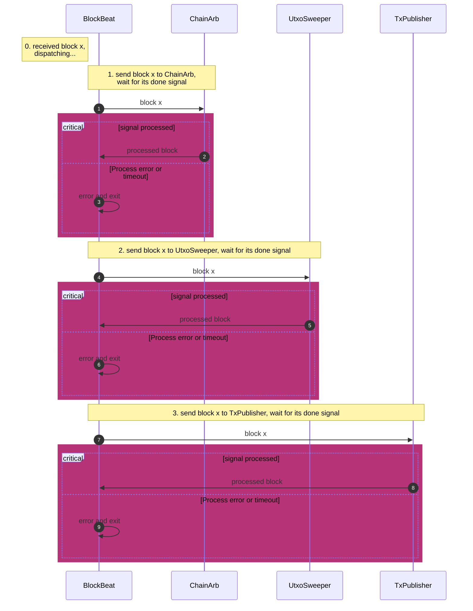

# Chainio 

`chainio` is a package designed to provide blockchain data access to various
subsystems within `lnd`. When a new block is received, it is encapsulated in a
`Blockbeat` object and disseminated to all registered consumers. Consumers may
receive these updates either concurrently or sequentially, based on their
registration configuration, ensuring that each subsystem maintains a
synchronized view of the current block state.

The main components include:

- `Blockbeat`: An interface that provides information about the block.

- `Consumer`: An interface that specifies how subsystems handle the blockbeat.

- `BlockbeatDispatcher`: The core service responsible for receiving each block
  and distributing it to all consumers.

Additionally, the `BeatConsumer` struct provides a partial implementation of
the `Consumer` interface. This struct helps reduce code duplication, allowing
subsystems to avoid re-implementing the `ProcessBlock` method and provides a
commonly used `NotifyBlockProcessed` method.


### Register a Consumer

Consumers within the same queue are notified **sequentially**, while all queues
are notified **concurrently**. A queue consists of a slice of consumers, which
are notified in left-to-right order. Developers are responsible for determining
dependencies in block consumption across subsystems: independent subsystems
should be notified concurrently, whereas dependent subsystems should be
notified sequentially.

To notify the consumers concurrently, put them in different queues,
```go
// consumer1 and consumer2 will be notified concurrently.
queue1 := []chainio.Consumer{consumer1}
blockbeatDispatcher.RegisterQueue(consumer1)

queue2 := []chainio.Consumer{consumer2}
blockbeatDispatcher.RegisterQueue(consumer2)
```

To notify the consumers sequentially, put them in the same queue,
```go
// consumers will be notified sequentially via,
// consumer1 -> consumer2 -> consumer3
queue := []chainio.Consumer{
   consumer1,
   consumer2,
   consumer3,
}
blockbeatDispatcher.RegisterQueue(queue)
```

### Implement the `Consumer` Interface

Implementing the `Consumer` interface is straightforward. Below is an example
of how
[`sweep.TxPublisher`](https://github.com/lightningnetwork/lnd/blob/5cec466fad44c582a64cfaeb91f6d5fd302fcf85/sweep/fee_bumper.go#L310)
implements this interface.

To start, embed the partial implementation `chainio.BeatConsumer`, which
already provides the `ProcessBlock` implementation and commonly used
`NotifyBlockProcessed` method,  and exposes `BlockbeatChan` for the consumer to
receive blockbeats.

```go
type TxPublisher struct {
   started atomic.Bool
   stopped atomic.Bool

   chainio.BeatConsumer

   ...
```

We should also remember to initialize this `BeatConsumer`,

```go
...
// Mount the block consumer.
tp.BeatConsumer = chainio.NewBeatConsumer(tp.quit, tp.Name())
```

Finally, in the main event loop, read from `BlockbeatChan`, process the
received blockbeat, and, crucially, call `tp.NotifyBlockProcessed` to inform
the blockbeat dispatcher that processing is complete.

```go
for {
      select {
      case beat := <-tp.BlockbeatChan:
         // Consume this blockbeat, usually it means updating the subsystem
         // using the new block data.

         // Notify we've processed the block.
         tp.NotifyBlockProcessed(beat, nil)

      ...
```

### Existing Queues

Currently, we have a single queue of consumers dedicated to handling force
closures. This queue includes `ChainArbitrator`, `UtxoSweeper`, and
`TxPublisher`, with `ChainArbitrator` managing two internal consumers:
`chainWatcher` and `ChannelArbitrator`. The blockbeat flows sequentially
through the chain as follows: `ChainArbitrator => chainWatcher =>
ChannelArbitrator => UtxoSweeper => TxPublisher`. The following diagram
illustrates the flow within the public subsystems.


