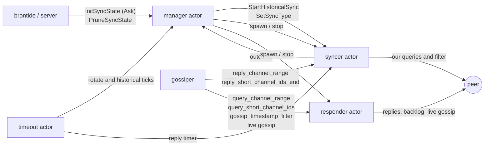
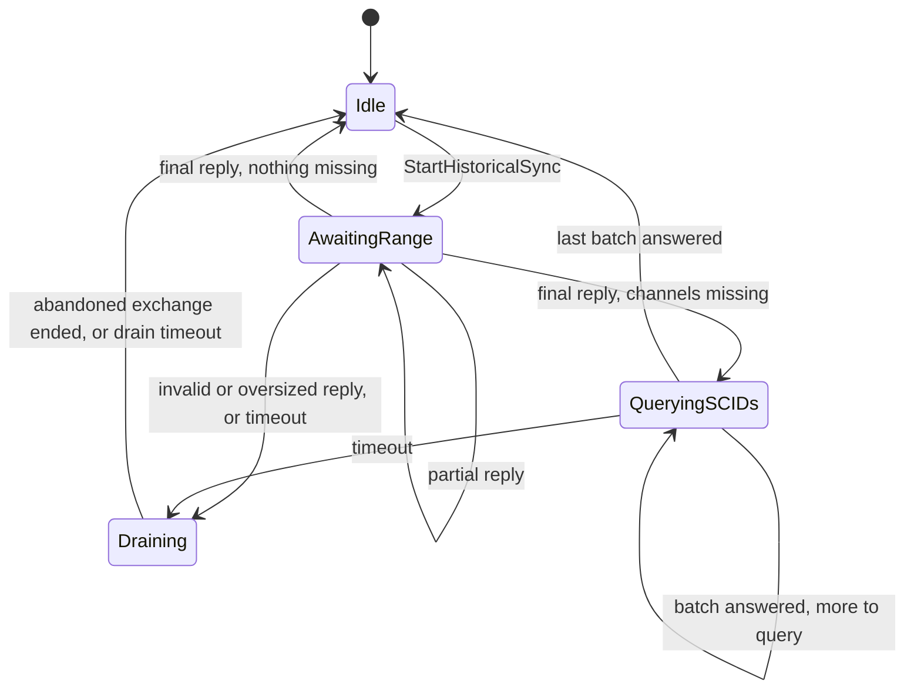
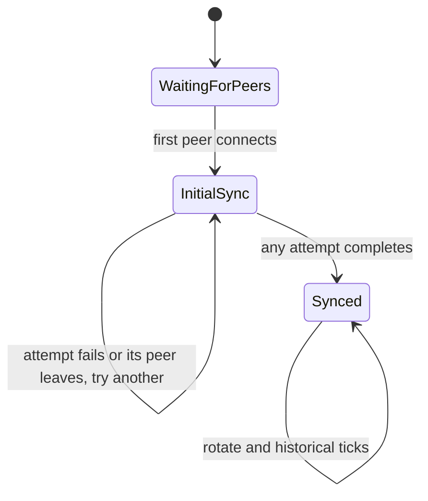

# gossipsync

Package `gossipsync` keeps lnd's channel graph in sync with its peers using the
BOLT 7 gossip queries: `query_channel_range`, `query_short_channel_ids` and
`gossip_timestamp_filter`. It replaces the `SyncManager` and `GossipSyncer` in
`discovery`, and speaks the same protocol on the wire. It is selected with the
`gossip.syncer-v2` option, and is off by default.

The package is built from two pure state machines and three kinds of actor.
The state machines decide everything the protocol does. The actors own the
state machines, carry out their side effects, and are the only goroutines that
ever touch sync state. There are no mutexes or atomics in the sync logic, and
no two goroutines share a piece of sync state.

## How it is built

Each state machine is written with `protofsm`. A state is a Go value, and its
`ProcessEvent` method returns the next state plus an **outbox**: the side
effects the transition wants, as plain values. A transition never sends a
message, arms a timer or writes to the database itself.

An actor holds its machine's current state. For every message it receives, it
calls `protofsm.ApplyEvents`, commits the state that comes back, and then
carries out the outbox with a type switch. `ApplyEvents` starts no goroutines,
so each actor is exactly one goroutine.



There is one manager actor per node, and one syncer actor and one responder
actor per connected peer. The manager spawns a peer's two actors when the peer
connects, and stops them when it disconnects.

| Actor | Service key | Owns |
|---|---|---|
| manager | `gossipsync.manager` | Every peer's role, the historical sync attempts in flight, failure epochs, the random source |
| syncer | `gossipsync.syncer.<pubkey>` | Our side of the query protocol with one peer: the reply accumulator, the SCIDs left to query, our timestamp filter |
| responder | `gossipsync.responder.<pubkey>` | The peer's side: answering its queries, its timestamp filter, the backlog replay, live forwarding |

The syncer and the responder are separate actors because their sends differ in
size by orders of magnitude. A full reply to a peer's range query, or a backlog
replay, can be megabytes behind a 50 KiB/s rate limit. If it shared a mailbox
with our own query, the peer's replies to our query would wait behind our
replies to its query. The two sides share no state, so the split is free.

## The peer syncer

The syncer runs a historical sync with one peer, and sets the peer's role. A
historical sync asks the peer for every channel in the chain with one
`query_channel_range`, filters the answer down to the channels we lack, and
then asks for those in batches of `query_short_channel_ids`.



Every state but `Idle` refuses a new `StartHistoricalSync` with a `Busy`
outcome. Every state accepts `SetSyncType`.

**Draining.** The wire gives queries no IDs, so after an attempt fails, the peer
may still be answering the abandoned query. `Draining` absorbs the rest of that
exchange, until a reply covers the abandoned query's last block, the reply
budget is spent, or the drain timer fires. Like the reply timer, the drain
timer is an inactivity timer that every absorbed reply re-arms, and its default
matches the reply timeout: any peer slow enough to be accepted in a live
exchange has its abandoned stream fully drained. Only then does the syncer
accept a new attempt. This keeps at most one query of each kind outstanding with a peer,
and it is what stops a late reply from being credited to the next attempt. The
legacy syncer used a generation counter on every queued reply for the same
purpose.

**The sync type is not a state.** A role change only means sending a new
`gossip_timestamp_filter`, which BOLT 7 allows at any time. The role is a field
of every state, so the manager can change it whether or not a query is in
flight. The legacy syncer only accepted a role change while idle, which is why
its manager waited up to five seconds for each one.

**Timers.** While waiting on the peer, the syncer arms a reply timer through
the timeout actor. It is an inactivity timer: every reply re-arms it. Each timer
carries a sequence number, and a `ReplyTimerFired` with anything but the
current number is ignored, so a timer that fires while its cancellation is in
flight is harmless.

**Outcomes are values.** An attempt ends with exactly one outcome:
`Completed`, `PeerFault`, `LocalFault` or `Busy`. A peer that breaks the
protocol produces a `PeerFault` outcome, not a Go error. `ProcessEvent` only
returns an error for an event type it doesn't know, which would be a bug.

The complete transition table, rendered from `SyncerTransitions`, follows. The
property tests fail on any transition the table doesn't list, and a unit test
checks that this copy matches the code.

<!-- The table below is generated by SyncerTransitions.RenderMarkdown. -->

| From State | Event | To State | Outbox Messages | Description |
|------------|-------|----------|-----------------|-------------|
| *Idle | *StartHistoricalSync | *AwaitingRange | *SendToPeer, *ArmReplyTimer | Send query_channel_range for the whole chain. |
| *Idle | *RangeReplyReceived | *Idle |  | Unsolicited reply, ignored. |
| *Idle | *SCIDsEndReceived | *Idle |  | Unsolicited reply, ignored. |
| *Idle | *ReplyTimerFired | *Idle |  | Timer of an ended exchange, ignored. |
| *Idle | *SetSyncType | *Idle |  | Role unchanged, or active to pinned. |
| *Idle | *SetSyncType | *Idle | *SendToPeer | Role now does or doesn't want gossip. |
| *AwaitingRange | *RangeReplyReceived | *AwaitingRange | *ArmReplyTimer | Valid partial reply buffered. |
| *AwaitingRange | *RangeReplyReceived | *QueryingSCIDs | *SendToPeer, *ArmReplyTimer | Stream complete with missing channels, send the first SCID batch. |
| *AwaitingRange | *RangeReplyReceived | *Idle | *DisarmReplyTimer, *ReportOutcome | Stream complete with nothing missing, or the local lookup failed. |
| *AwaitingRange | *RangeReplyReceived | *Draining | *ReportOutcome, *ArmReplyTimer | Invalid or oversized reply, the attempt fails. |
| *AwaitingRange | *ReplyTimerFired | *Draining | *ReportOutcome, *ArmReplyTimer | Current timer: the peer stopped answering, the attempt fails. |
| *AwaitingRange | *ReplyTimerFired | *AwaitingRange |  | Stale timer, ignored. |
| *AwaitingRange | *StartHistoricalSync | *AwaitingRange | *ReportOutcome | Already busy, the new attempt is refused. |
| *AwaitingRange | *SCIDsEndReceived | *AwaitingRange |  | Unsolicited reply, ignored. |
| *AwaitingRange | *SetSyncType | *AwaitingRange |  | Role unchanged, or active to pinned. |
| *AwaitingRange | *SetSyncType | *AwaitingRange | *SendToPeer | Role now does or doesn't want gossip. |
| *QueryingSCIDs | *SCIDsEndReceived | *QueryingSCIDs | *SendToPeer, *ArmReplyTimer | Batch answered, send the next one. |
| *QueryingSCIDs | *SCIDsEndReceived | *Idle | *DisarmReplyTimer, *ReportOutcome | Last batch answered, the attempt is done. |
| *QueryingSCIDs | *ReplyTimerFired | *Draining | *ReportOutcome, *ArmReplyTimer | Current timer: the peer stopped answering, the attempt fails. |
| *QueryingSCIDs | *ReplyTimerFired | *QueryingSCIDs |  | Stale timer, ignored. |
| *QueryingSCIDs | *StartHistoricalSync | *QueryingSCIDs | *ReportOutcome | Already busy, the new attempt is refused. |
| *QueryingSCIDs | *RangeReplyReceived | *QueryingSCIDs |  | Unsolicited reply, ignored. |
| *QueryingSCIDs | *SetSyncType | *QueryingSCIDs |  | Role unchanged, or active to pinned. |
| *QueryingSCIDs | *SetSyncType | *QueryingSCIDs | *SendToPeer | Role now does or doesn't want gossip. |
| *Draining | *RangeReplyReceived | *Draining | *ArmReplyTimer | Reply of the abandoned stream absorbed, the drain timer re-armed. |
| *Draining | *RangeReplyReceived | *Draining |  | Unsolicited reply, ignored. |
| *Draining | *RangeReplyReceived | *Idle | *DisarmReplyTimer | Abandoned stream ended, or the absorb budget is spent. |
| *Draining | *SCIDsEndReceived | *Idle | *DisarmReplyTimer | Abandoned SCID query answered at last. |
| *Draining | *SCIDsEndReceived | *Draining |  | Unsolicited reply, ignored. |
| *Draining | *ReplyTimerFired | *Idle | *DisarmReplyTimer | Drain timer fired, give up waiting. |
| *Draining | *ReplyTimerFired | *Draining |  | Stale timer, ignored. |
| *Draining | *StartHistoricalSync | *Draining | *ReportOutcome | Still draining, the new attempt is refused. |
| *Draining | *SetSyncType | *Draining |  | Role unchanged, or active to pinned. |
| *Draining | *SetSyncType | *Draining | *SendToPeer | Role now does or doesn't want gossip. |

## The manager

The manager decides each peer's role (passive, active or pinned) and which peer
runs each historical sync. Its state is a single value, `ManagerState`, which
its `String` method reports as one of three phases.



**Sessions and attempts.** Every connection gets a `SessionID`, and every
historical sync an `AttemptID`, both assigned by the manager. An outcome counts
only if its attempt is still in flight on the session that reports it. That
single comparison discards a report from an earlier connection with the same
public key, and a report for an attempt the manager has already given up on.

**Settle.** Each event handler only records what happened. A single `settle`
step then runs at the end of every transition, and restores the manager's two
goals:

1. While the graph is unsynced, a historical sync runs whenever some peer is
   eligible for one.
2. Once the graph is synced, the active quota is as full as the connected peers
   allow.

Putting both goals in one place is what fixed three stalls the legacy manager
has, because each of them came from a handler that forgot one of the goals:

- A node with a single peer waited two hourly ticks, not one, to retry a failed
  initial sync.
- If the initial sync failed while the only other peer was busy with an older
  attempt, nothing restarted the sync when that attempt ended.
- If the graph was synced, every peer was lost, and the first peer back failed
  its resync, nothing ever promoted that peer, so the node took in no new
  gossip.

**Failure epochs.** A peer whose attempt fails, for any reason, is not picked
again in the same epoch, and every historical tick opens a new epoch. A
`LocalFault` is backed off too even though the peer did nothing wrong:
otherwise `settle` would restart the attempt at once, and a local lookup that
keeps failing would have the peer stream its whole channel range to us in a
loop. The cost is that a transient local error that hits every peer in turn
delays the initial sync until the next tick. The next scheduled pick avoids
that peer if another peer is eligible, and retries it if no other peer is.

**Pinned peers.** A pinned peer runs its own historical sync on connect,
outside the tracked attempt and the failure epochs, and neither `settle` nor a
tick ever picks it. If that sync fails, the next historical tick starts a new
one, so the tick interval is its backoff. Without the retry, a node with no
active syncers, or with only pinned peers connected, would stay unsynced after
a single failure until the pinned peer reconnected.

**Randomness.** Every random pick draws from `Config.Rand`, over peers sorted
by session. The manager never iterates a map where the order affects what it
does, so a seeded run picks the same peers every time.

## The responder

The responder serves the peer's side of the protocol:

- **Range queries** are answered by `rangeChunker`, which splits our channels
  into `reply_channel_range` messages that tile the query from its first block
  to its last. A block with more channels than fit in one message is cut down
  to a random subset.
- **SCID queries** get every announcement and update we have for the channels,
  then `reply_short_channel_ids_end`.
- **A timestamp filter** sets the window for live forwarding, and starts a
  backlog replay of everything in the window, unless
  `IgnoreHistoricalFilters` is set.
- **Live gossip** from the gossiper is filtered against the window, and the
  peer is sent what passes.

**Backlog replay.** A replay sends up to `BacklogPageSize` messages, then sends
itself a message asking for the next page. Queries the peer sent in the
meantime are answered between pages. A newer filter replaces the replay in
progress. Sending a page takes one token from a pool shared by every
responder, of size `FilterConcurrency`, and the token goes back after the page,
so a peer's queries never hold it. `FilterConcurrency` therefore bounds the
pages being sent at once, not the replays that are open. An open replay holds
one database batch between pages, but no transaction and no lock, and `OnStop`
closes it when the peer disconnects.

## Which sends may block

A blocking send between two actors can deadlock if the actors also send to each
other, and a flooding peer must never be able to stall another peer. Each edge
was chosen with both in mind.

| Edge | Send | Why it is safe |
|---|---|---|
| gossiper to syncer or responder, with a peer's message | blocking `Tell` | The caller is that peer's own message stream, so a full mailbox slows only that peer. |
| gossiper to responder, with live gossip | `TryTell`, dropped and counted when full | The gossiper never waits on a peer. A slow peer misses its own live gossip, and `Manager.ForwardDrops` counts it. |
| manager to syncer | blocking `Tell` | A blocked sender is served before later non-blocking sends, and a peer has at most one other blocked sender, its message stream, so the wait is about two message-processing times. |
| syncer to manager | `TryTell`, then the courier | A syncer never blocks on the manager, which rules out the only possible cycle. |
| responder to itself | `TryTell`, then the courier | A blocking send to your own full mailbox never completes. |
| anyone to the timeout actor | blocking `Tell` | The timeout actor never blocks in `Receive`. |

The **courier** handles a message that must not be lost when its target's
mailbox is full. It hands the message to the timeout actor as a reminder that
fires at once, and the timeout actor retries delivery with a backoff until the
message lands or the target stops.

## Threat model

Everything here faces the network, so each input a peer controls has a bound.

| A peer can | What bounds it |
|---|---|
| Send replies we never asked for | Ignored in every state that isn't waiting for them. Each costs one mailbox slot and one transition. |
| Answer our range query with an endless stream | The reply budget, `MaxReplies`, where a zlib reply costs four. Spending the budget ends the stream. |
| Answer with too many SCIDs | `MaxSCIDs` across the stream fails the attempt. The accumulator holds at most that many entries. |
| Answer outside our query, out of order, or with an unknown encoding | The attempt fails with a `PeerFault`. The first reply must start at the query's first block. |
| Stop answering | The inactivity timeout fails the attempt, and the drain timeout, also an inactivity timeout, bounds the wait for an abandoned stream. |
| Answer slowly, just inside the timeout | The next historical tick starts the initial sync on a different peer. |
| Flood us with messages | Each per-peer mailbox holds 50 messages, so a peer can pin about 6.5 MB. A full mailbox blocks only that peer's message stream. |
| Flood us with queries | Answered one at a time, behind the per-peer and global rate limits. |
| Flood us with filters | A new filter replaces the backlog replay in progress. Backlog pages being sent across all peers are capped by `FilterConcurrency`. |
| Read our messages slowly | Only its own responder waits. Live gossip for it is dropped rather than blocking the gossiper. |

Three limits follow from the protocol itself, and no implementation can close
them:

- **Queries carry no IDs.** A peer that duplicates or corrupts its replies can
  put an extra end-of-stream on the wire, and its later replies can then be
  credited to a later attempt. The damage is bounded to that peer's own
  answers, which is no worse than the peer lying outright.
- **A peer can lie.** A peer can spend our reply budget on made-up channels,
  and the attempt completes with them. The gossiper validates every
  announcement those SCID queries return, so the lie ends at the graph.
- **An empty peer can complete a sync.** An attempt with a peer that has no
  channels completes and marks the graph synced. Channels held only by other
  peers then arrive through later historical ticks, which pick a peer at
  random. The legacy syncer behaves the same way.

## Changes from the legacy syncer

On the wire, the behavior is the same, except for the first two items below.

1. **Reply timeout.** A peer that stops answering our query fails the attempt
   after `ReplyTimeout` (five minutes by default), and the manager moves on. The
   legacy syncer waited until the next hourly tick.
2. **First reply check.** The first `reply_channel_range` of a stream must start
   at the query's first block. BOLT 7 already requires it to start at or before
   that block, and both syncers reject a reply that starts before it, so only a
   peer that breaks the spec is affected.
3. **Role changes during a query** are applied immediately instead of waiting
   for the syncer to go idle.
4. **Pinned peers** get their live gossip filtered by their timestamp filter,
   and are stopped on shutdown. The legacy syncer did neither.
5. **The three stalls** described under the manager are fixed, and a failed
   single peer is retried at the next tick.
6. **A local lookup failure** is backed off to the next epoch like a peer
   fault, instead of ending the goroutine.
7. **Live forwarding** never blocks the gossiper.
8. **Every range query covers the whole chain.** The legacy syncer could also
   send a query starting 144 blocks before our newest channel, but in
   production that path was only ever reached from tests.

One legacy behavior is not kept. When the graph is already synced and the
first peer returns after we lost every peer, both syncers run a historical
sync with it, but only the legacy syncer fails that sync over to another peer
right away if it fails. Here the next hourly tick picks a peer instead. The
active quota is filled at once either way, so live gossip resumes without
waiting for it.

## Testing

The tests come in three layers.

**Pure state machine tests** call `ProcessEvent` directly, with no goroutines.
`TestSyncerProperties` drives the syncer against a model peer that answers with
our own responder's streams, while rapid injects dropped, duplicated and
corrupted replies and timer fires. Every step is checked against
`SyncerTransitions`. `TestManagerProperties` drives the manager through random
connects, disconnects, ticks and outcomes, and checks its state against a model
built only from its outbox.

**Deterministic simulation** runs complete nodes inside `testing/synctest`
bubbles, with real actors and real timeout actors, joined by in-memory links.
`TestDSTWorkload` draws a scenario of two to four honest nodes and up to two
byzantine peers, then connects and disconnects nodes, attaches faults to
links, advances fake time across every timer, and heals the network. It checks
that every honest node with an honest neighbor finished a historical sync, and
that every sync the node under test completed with an honest peer left it with
all of that peer's channels, and that a channel the node under test announces
at the end reaches every honest neighbor that had it as an active or pinned
syncer.

A bubble returns its violations rather than failing the test, so rapid can
shrink a failing scenario and save it. To soak, and then replay a failure:

```sh
make dst-gossipsync checks=5000
go test -run TestDSTWorkload ./discovery/gossipsync/ -rapid.failfile=testdata/rapid/...
go test -run '^$' -fuzz FuzzDSTWorkload ./discovery/gossipsync/
```

The package path must come before rapid's flags: `go test` stops reading
packages at the first flag it doesn't know.

Fake time makes these runs fast: a scenario covers six hours of fake time in
about two milliseconds.

**Formal models** in [`pmodel/`](pmodel/README.md) describe the contract of the
manager and the peer syncer in P, and the P checker explores thousands of
interleavings of every test case. The bridge tests replay the models' recorded
executions against the Go state machines on every `go test`, and
[`SPEC.md`](SPEC.md) is the requirements spec derived from the models.

**TLA+ specs** in [`tla/`](tla/README.md) restate both contracts in TLA+,
and TLC checks every reachable state at a small scope rather than sampling
schedules. They check the manager's liveness under an explicit fairness
condition, and each rule of the syncer's pairing under every timing, with a
must-fail case for each rule and each fairness assumption. They are not
bridged to the Go code. Run them with `bash discovery/gossipsync/tla/check.sh`.
