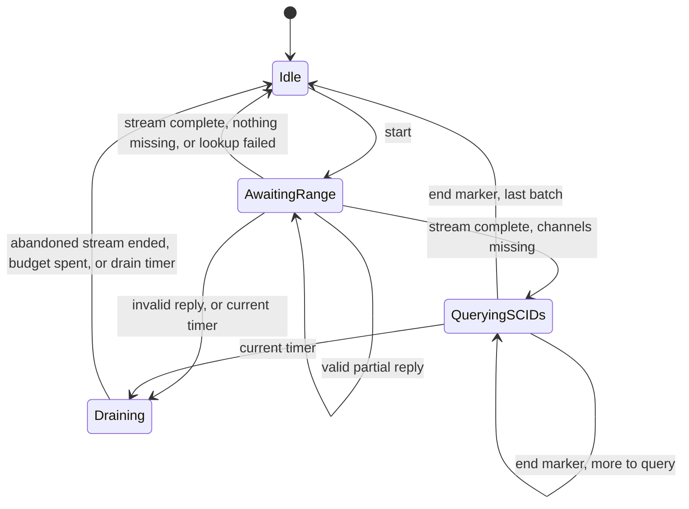

# gossipsync: manager and peer syncer contracts

Status: model-derived draft. The requirements below were derived from the P
models in `pmodel/` and checked against the Go code by the bridges named in
each requirement. They are properties of the modeled abstraction under the
explored schedules, not a proof of the Go code. The range reply rules
(GSS-003, GSS-004, GSS-015 and GSS-016, and the range phase of GSS-007) are
also proved, for every query and every stream length, of a Lean model of the
accumulator and the chunker in `lean/`, which a differential test ties to the
Go code (section 12.5).

- Model SHA-256: `77edc425aa52dcda8a2560d2e60bcb8ac499bd2f6302e3ea3e9c9a49c21d7d09`
- Model sources: `pmodel/src/manager.p`, `pmodel/src/syncer.p`,
  `pmodel/test/manager_test.p`, `pmodel/test/syncer_test.p`.
- Code revision checked: the Go code in `discovery/gossipsync` at the commit
  that last changed this file, including the pinned retry (formerly Q3) and
  the drain inactivity timer (formerly Q4).
- Checker: P 3.0.4, `p check` with the random strategy.
- TLA+ specs: `tla/SyncerPairing.tla` and `tla/ManagerLiveness.tla`, checked
  exhaustively at small scope by TLC 2.19 (tla2tools 1.7.4). Section 12.4
  lists what they add.

## 1. Abstract and scope

This document specifies the two state machines of `discovery/gossipsync`:
the manager (`ManagerState`, `manager_state.go`), which decides each peer's
role and which peer runs each historical sync, and the peer syncer (`Idle`,
`AwaitingRange`, `QueryingSCIDs` and `Draining` in `syncer_states.go`, with
the accumulator in `range_reply.go`), which runs one historical sync with one
peer over the BOLT 7 gossip queries.

In scope: role assignment, attempt bookkeeping, failure epochs, the settle
goals, stale outcome handling, reply stream validation and pairing, draining,
timers as abstract events, and outcomes. Out of scope: the actor layer
(mailboxes, the courier, spawn and stop), the responder, live gossip
forwarding, the wire encoding of messages, zlib, timestamps and the freshness
filter, and the SCID budget. Those are covered by the unit, property and
simulation tests listed in section 12, and are marked unmodeled wherever a
requirement touches them. The Lean proofs in section 12.5 cover zlib weights,
timestamps, the freshness filter and the SCID budget for the accumulator and
the chunker.

## 2. Conventions

Normative key words appear in uppercase and are used as described in BCP 14
(RFC 2119 and RFC 8174). Lowercase uses of the same words carry no special
meaning.

Every normative paragraph is followed by its metadata: a stable requirement
ID, the model locations it was derived from (paths relative to `pmodel/`),
the Go code that implements it, and the evidence that checks the two agree.
A citation of the form `src/manager.p:831` names a line in the model.

## 3. Terminology and actors

- **Session.** One connection to one peer. The manager assigns session IDs
  starting at 1, one per new connection, so a reconnect of the same public
  key is a new session.
- **Attempt.** One historical sync. The manager assigns attempt IDs starting
  at 1. An attempt is *in flight* from its start until its outcome is
  accepted or its session is removed.
- **Tracked attempt.** The attempt the manager fails over while the graph is
  unsynced. At most one attempt is tracked.
- **Quota.** `NumActiveSyncers`, the number of non-pinned peers kept active.
- **Epoch.** The count of historical ticks. A peer *failed in epoch e* if an
  attempt of its ended in epoch e with any outcome but Completed.
- **Eligible.** A session is eligible if its peer is connected and not
  pinned, it has no attempt in flight, and its peer did not fail in the
  current epoch.
- **Stale outcome.** An outcome whose attempt is not in flight, or is in
  flight on a session other than the one reporting it.
- **Stream.** The replies a peer sends to one `query_channel_range`, or the
  single `reply_short_channel_ids_end` it sends to one
  `query_short_channel_ids`.
- **Legacy reply.** A `reply_channel_range` that echoes the whole query's
  chain, first block and block count, as old lnd peers send.
- **Outstanding query.** A query whose stream the peer has not finished
  sending. A stream the peer stops sending partway is finished at that
  point.

Actors: the manager (one per node), the peer syncer (one per session), the
peer, and the timer. In the model, the manager's environment is the driver
and the `Syncer` machines (`src/manager.p:556`), and the syncer's
environment is the `World` machine (`src/syncer.p:552`).

## 4. Wire records

This specification uses `query_channel_range`, `reply_channel_range`,
`query_short_channel_ids`, `reply_short_channel_ids_end` and
`gossip_timestamp_filter` as defined by BOLT 7. The models abstract a reply
to its block range, its channels, its complete flag, and whether it was
corrupted. The syncer bridge maps each abstract reply to a
`lnwire.ReplyChannelRange` (section 12.2). No wire encoding claim here is
derived from the models.

## 5. State machines

### 5.1 Manager

The manager is one state with three reported phases (`WaitingForPeers`,
`InitialSync`, `Synced`). Each input is recorded, then a settle step restores
the goals of section 6.1. The model's `Manager` machine is
`src/manager.p:95`: `OnConnect` (`src/manager.p:324`), `OnDisconnect`
(`src/manager.p:356`), `OnOutcome` (`src/manager.p:386`), `OnHistTick`
(`src/manager.p:435`), `OnRotate` (`src/manager.p:495`) and `Settle`
(`src/manager.p:298`).

### 5.2 Peer syncer

The model's `PeerSyncer` machine is `src/syncer.p:142`, with states `Idle`
(`src/syncer.p:179`), `AwaitingRange` (`src/syncer.p:212`), `QueryingSCIDs`
(`src/syncer.p:241`) and `Draining` (`src/syncer.p:297`).

## 6. Manager requirements

### 6.1 Goals

While the graph is unsynced and the quota is non-zero, if some session is
eligible, the manager MUST have a tracked attempt in flight after it handles
any input.

- Requirement: `GSM-001`
- Model: `src/manager.p:298` (settle); monitor `ManagerContract`
  assertion (a) at `src/manager.p:831`.
- Code: `manager_state.go:352` (`settle`).
- Evidence: green `tcManagerProduction`, `tcManagerOnePeer`,
  `tcManagerLiveness`; counterexample `tcManagerNoSettleCounterexample`;
  `TestManagerProperties`; `TestPModelManagerBridge`; `TestRefModelManager`.

Once the graph is synced, after the manager handles any input, the number of
active non-pinned sessions MUST equal the smaller of the quota and the number
of connected non-pinned sessions.

- Requirement: `GSM-002`
- Model: `src/manager.p:298` (settle, synced branch); monitor assertion (b)
  at `src/manager.p:837`.
- Code: `manager_state.go:301` (`fillActive`).
- Evidence: `tcManagerProduction`; `TestManagerProperties`; both bridges.

The number of active non-pinned sessions MUST NOT exceed the quota.

- Requirement: `GSM-003`
- Model: monitor assertion (c) at `src/manager.p:826`.
- Code: `manager_state.go:301`, `manager_state.go:547` (`onRotate`).
- Evidence: `tcManagerProduction`; `TestManagerProperties`; both bridges.

### 6.2 Sessions and roles

A connection from a peer that already has a session MUST NOT create a
session, change any role, or start an attempt by itself. Any other
connection MUST get the next session ID and start as passive, or as pinned
if the operator pinned the peer.

- Requirement: `GSM-004`
- Model: `src/manager.p:324` (`OnConnect`).
- Code: `manager_state.go:370` (`onConnect`).
- Evidence: `TestManagerIgnoresDuplicateConnect`; `TestPModelManagerBridge`
  (snapshot roles and session IDs); `TestRefModelManager`.

A pinned peer's session MUST have the pinned role for as long as it is
connected, and a session whose peer is not pinned MUST NOT have the pinned
role.

- Requirement: `GSM-005`
- Model: `src/manager.p:324`; monitor assertion (d) at
  `src/manager.p:802`.
- Code: `manager_state.go:389`.
- Evidence: `tcManagerProduction`; `TestManagerProperties`; both bridges.

When a pinned peer connects, the manager MUST start an untracked attempt on
its session, whatever the peer's failure history.

- Requirement: `GSM-006`
- Model: `src/manager.p:324` (forced start); monitor assertion (h) at
  `src/manager.p:764` exempts pinned peers.
- Code: `manager_state.go:389`.
- Evidence: `TestPModelManagerBridge` (forced action records);
  `TestRefModelManager`.

When the graph is synced, the quota is non-zero, and a non-pinned peer
connects while no other non-pinned peer is connected, the manager MUST start
an untracked attempt on the new session, unless the peer failed in the
current epoch.

- Requirement: `GSM-007`
- Model: `src/manager.p:324` (forced start after the pinned branch).
- Code: `manager_state.go:400`.
- Evidence: `TestPModelManagerBridge`; `TestRefModelManager`. See open
  question Q2.

A rotation MUST demote exactly one active non-pinned session and promote
exactly one passive non-pinned session if both exist, and MUST change nothing
otherwise. Which pair it picks is unconstrained.

- Requirement: `GSM-008`
- Model: `src/manager.p:495` (`OnRotate`, two nondeterministic choices).
- Code: `manager_state.go:547`.
- Evidence: `TestPModelManagerBridge` (candidate sets equal, picks steered);
  `TestRefModelManager`.

When a peer disconnects, the manager MUST remove its session and forget every
attempt in flight on it, including the tracked attempt. Failing over the
tracked attempt and refilling the quota are left to the goals of section 6.1.

- Requirement: `GSM-009`
- Model: `src/manager.p:356` (`OnDisconnect`); ledger at
  `src/manager.p:795`.
- Code: `manager_state.go:409`.
- Evidence: `tcManagerProduction`; `TestManagerProperties`; both bridges.

### 6.3 Attempts and outcomes

A session MUST NOT have more than one attempt in flight.

- Requirement: `GSM-010`
- Model: monitor assertion (e) at `src/manager.p:758`.
- Code: `manager_state.go:261` (`historicalCandidates` excludes busy
  sessions).
- Evidence: all manager green cases; `TestManagerProperties`.

An outcome MUST count only if its attempt is in flight on the session that
reports it. A stale outcome MUST NOT change any role, the attempts in flight,
the tracked attempt, or the synced flag, and MUST NOT start an attempt.

- Requirement: `GSM-011`
- Model: `src/manager.p:386` (session check); monitor assertion (f) at
  `src/manager.p:843` and ledger at `src/manager.p:795`.
- Code: `manager_state.go:434`.
- Evidence: `tcManagerProduction` (injected stale outcomes, and outcomes of
  stopped sessions); counterexample `tcManagerNoSessionCheckCounterexample`;
  `TestManagerProperties` (stale step); `TestRefModelManager`.

The synced flag MUST be set only by a Completed outcome that counts, and once
set MUST stay set. The first such outcome MUST publish the graph as synced,
and a later one MUST NOT publish it again.

- Requirement: `GSM-012`
- Model: `src/manager.p:386`; monitor assertion (g), for the synced flag
  only, at
  `src/manager.p:849` and `src/manager.p:850`.
- Code: `manager_state.go:434`.
- Evidence: `tcManagerProduction`; `TestManagerProperties`; both bridges
  (snapshot `publish`, which is the only check of publishing once).

A counting outcome other than Completed (a peer fault, a local fault, or
busy) MUST record the current epoch as the failure epoch of the session's
peer, unless the peer is pinned, in which case it MUST instead mark the
session for retry (GSM-018). The manager MUST NOT start an attempt on a
non-pinned peer in the epoch in which that peer failed.

- Requirement: `GSM-013`
- Model: `src/manager.p:386`; monitor assertion (h) at
  `src/manager.p:764`.
- Code: `manager_state.go:459`, `manager_state.go:229`.
- Evidence: `tcManagerProduction`; counterexample
  `tcManagerNoLocalBackoffCounterexample`; `TestManagerBacksOffLocalFault`;
  `TestManagerProperties`; both bridges.

Starting a tracked attempt MUST restart the historical timer. Starting an
untracked attempt MUST NOT restart it.

- Requirement: `GSM-014`
- Model: `src/manager.p:267` (`StartAttempt`).
- Code: `manager_state.go:272`.
- Evidence: both bridges (snapshot `reset`).

### 6.4 Historical ticks

A historical tick MUST open a new epoch. If the quota is non-zero, it MUST
then start an attempt on an eligible session other than the tracked
attempt's, if one exists, choosing among those whose peer did not fail in the
epoch just closed when any such session exists. The attempt MUST be tracked
if and only if the graph is unsynced. Which session within the allowed set it
picks is unconstrained.

- Requirement: `GSM-015`
- Model: `src/manager.p:435` (`OnHistTick`).
- Code: `manager_state.go:479`.
- Evidence: `TestPModelManagerBridge` (Go's candidate set must equal the
  model's allowed set); `TestRefModelManager` (the same, for Go's own
  picks); green `tcManagerLegacyTick` and `tcManagerSinglePeerLegacyTick`
  show the order is not needed for safety. See open question Q1.

Every historical tick, whatever the quota, MUST start an untracked attempt on
each pinned session that is marked for retry and has no attempt in flight,
and MUST clear the mark. A Completed outcome MUST NOT mark a session for
retry. Apart from its connect and these retries, the manager MUST NOT start
an attempt on a pinned session.

- Requirement: `GSM-018`
- Model: `src/manager.p:479` (`RetryPinned`), mark at
  `src/manager.p:421`; liveness monitor `GraphEventuallySyncedWithPinned`
  at `src/manager.p:895`.
- Code: `manager_state.go:522` (`retryPinned`), `manager_state.go:462`,
  called at `manager_state.go:488` before the zero-quota return.
- Evidence: green `tcManagerPinnedOnly`, `tcManagerLiveness`;
  counterexample `tcManagerNoPinnedRetryCounterexample`;
  `TestManagerRetriesPinnedPeer`; both manager bridges (forced start
  records on ticks).

### 6.5 Liveness

If every syncer eventually reports an outcome, every peer eventually
completes after at most one failure per session, and historical ticks keep
arriving while the graph is unsynced and no attempt is in flight, then a
graph that is unsynced with a non-zero quota and a connected non-pinned peer
MUST eventually become synced. If every attempt completes, this MUST hold
with no ticks at all.

- Requirement: `GSM-016`
- Model: liveness monitor `GraphEventuallySynced` at `src/manager.p:868`,
  hot state at `src/manager.p:879`; ticker at `test/manager_test.p:142`.
- Code: `manager_state.go:352`, `manager_state.go:479`.
- Evidence: green `tcManagerLiveness`, `tcManagerNoTickLiveness`;
  counterexample `tcManagerNoSettleStarvesCounterexample`; TLA+ green
  `ManagerFair`, `ManagerNoTickLiveness`, `ManagerNoSettleTicks`, and the
  fairness counterexamples of section 12.4.

Under the same assumptions, and whatever the quota, a graph that is unsynced
with a pinned peer connected MUST eventually become synced.

- Requirement: `GSM-019`
- Model: liveness monitor `GraphEventuallySyncedWithPinned` at
  `src/manager.p:895`; ticker at `test/manager_test.p:142`; driver at
  `test/manager_test.p:288`.
- Code: `manager_state.go:522`.
- Evidence: green `tcManagerPinnedOnly`, `tcManagerLiveness`;
  counterexample `tcManagerNoPinnedRetryCounterexample`; TLA+ green
  `ManagerFair`, counterexample `ManagerNoPinnedRetry`.

### 6.6 Local rules

Every random pick SHOULD draw from the configured random source over
candidates sorted by session, so that a seeded run is reproducible.

- Requirement: `GSM-017`
- Model: unmodeled; the model picks nondeterministically and the bridges
  discover Go's candidate lists by rerunning the transition, so neither
  depends on the order. Authority: `README.md`, section Randomness.
- Code: `manager_state.go:236`, `manager_state.go:251`.
- Evidence: unverified.

## 7. Peer syncer requirements

### 7.1 Starting and refusing

In `Idle`, a start MUST send one `query_channel_range` covering the whole
chain and arm the reply timer. In every other state, a start MUST be refused
with a Busy outcome for that attempt, and change nothing else.

- Requirement: `GSS-001`
- Model: `src/syncer.p:179` (`Idle`), `src/syncer.p:459` (`Refuse`).
- Code: `syncer_states.go:205`, `syncer_states.go:133`.
- Evidence: `tcSyncerHonestLossy`; `TestSyncerProperties`;
  `TestPModelSyncerBridge`.

Every started attempt, refused ones included, MUST end with exactly one
outcome, and the syncer MUST return to `Idle` once the peer has nothing more
in flight and every armed timer has fired.

- Requirement: `GSS-002`
- Model: monitor `OutcomeExactlyOnce` at `src/syncer.p:918`, hot state at
  `src/syncer.p:933`; settle phase at `src/syncer.p:694`.
- Code: `syncer_states.go`.
- Evidence: every syncer green case, including `tcSyncerByzantine`;
  `TestSyncerProperties`; `TestPModelSyncerBridge`.

### 7.2 Reply validation and completion

The first non-legacy reply of a stream MUST start at the query's first block.
Each later non-legacy reply MUST start on the previous reply's last block or
the block after it, and MUST NOT end after the query's last block. A reply
that breaks either rule MUST fail the attempt with a peer fault.

- Requirement: `GSS-003`
- Model: `src/syncer.p:363` (`OnReply`), first-reply check at
  `src/syncer.p:382`; monitor `WholeStreamCredit` at `src/syncer.p:898`.
  The model has one channel per block, so a reply that continues the
  previous reply's last block is unmodeled.
- Code: `range_reply.go:190` (`checkRange`), `range_reply.go:213`.
- Evidence: `tcSyncerVerySlowPeer`; counterexample
  `tcSyncerNoFirstReplyCheckCounterexample`;
  `TestRangeReplyRejectsOutOfQuery`; `TestHonestStreamAccepted`;
  `TestPModelSyncerBridge`.
- Lean: `reject_outside_query`, `reject_first_late`, `reject_out_of_order`
  (`lean/GossipSync/Rejection.lean`), and `run_sound`
  (`lean/GossipSync/Soundness.lean`), which covers same-block continuation;
  `TestLeanDiffAccumulator`.

A range stream MUST end with a non-legacy reply that covers the query's last
block, a legacy reply that sets complete, or the reply that spends the reply
budget, whichever comes first.

- Requirement: `GSS-004`
- Model: `src/syncer.p:400` (completion rule in `OnReply`).
- Code: `range_reply.go:238` (`complete`).
- Evidence: `tcSyncerLegacySlow`, `tcSyncerLegacyPrompt`,
  `tcSyncerByzantine` (budget of three); `TestRangeReplyLegacy`;
  `TestRangeReplyBudgets`; `TestPModelSyncerBridge`.
- Lean: `legacy_done_iff`, `after_legacy` (`lean/GossipSync/Legacy.lean`),
  `run_sound`, `tiles_budget_cut` (`lean/GossipSync/RoundTrip.lean`);
  `TestLeanDiffAccumulator`. See Q11 for a modern reply this rule reads as
  legacy.

When a range stream ends, a failed local lookup MUST end the attempt with a
local fault and return to `Idle` without draining. Otherwise the syncer MUST
complete the attempt at once if nothing is missing, and query the missing
channels otherwise.

- Requirement: `GSS-005`
- Model: `src/syncer.p:363` (`lookupErr` branch and missing set).
- Code: `syncer_states.go:273` (`onReply`).
- Evidence: `TestSyncerLocalFault`; `TestPModelSyncerBridge` (traces with
  `lookup_err=1`).

The syncer MUST query the missing channels in batches of at most the batch
size, in stream order, with one `query_short_channel_ids` outstanding at a
time, and MUST complete the attempt on the end marker of the last batch.

- Requirement: `GSS-006`
- Model: `src/syncer.p:477` (`SendNextBatch`), `src/syncer.p:241`
  (`QueryingSCIDs`).
- Code: `syncer_states.go:337`, `syncer_env.go:141`.
- Evidence: `TestSyncerProperties`; `TestPModelSyncerBridge`.

With an honest peer whose streams fit in the reply budget, a Completed
attempt MUST have queried exactly the channels the peer has and we lack.

- Requirement: `GSS-007`
- Model: monitor `CompletedQueriedMissing` at `src/syncer.p:962`.
- Code: `syncer_states.go:273`, `syncer_states.go:337`.
- Evidence: `tcSyncerHonestPrompt`, `tcSyncerHonestLossy`,
  `tcSyncerVerySlowPeer`, legacy green cases; `TestSyncerProperties`.
- Lean: the range phase only, `roundtrip` and `roundtrip_all_fit`
  (`lean/GossipSync/RoundTrip.lean`): every stream our chunker sends is
  accepted in full exactly when it fits the budget and the SCID limit, with
  exactly the channels it carries; `TestLeanDiffChunker`.

### 7.3 Timers

Every arm MUST carry a new, larger sequence number, and a timer event with
any sequence number other than the latest MUST be ignored. The reply timer
MUST be re-armed by the start, by every accepted partial reply, by the move
into `QueryingSCIDs`, and by every end marker that leads to another batch.
The drain timer MUST be armed on entering `Draining`, and MUST be re-armed by
every range reply that `Draining` absorbs without ending, so that it is an
inactivity timer like the reply timer. An unsolicited reply MUST NOT re-arm
it. The drain timeout SHOULD be no shorter than the reply timeout.

- Requirement: `GSS-008`
- Model: `src/syncer.p:501` (`Arm`); drain re-arm at `src/syncer.p:335`;
  timer handlers at
  `src/syncer.p:222`, `src/syncer.p:264`, `src/syncer.p:340`.
- Code: `syncer_states.go:169`, `syncer_states.go:426`, `syncer_env.go:34`.
- Evidence: `TestSyncerProperties`; `TestDrainingRearmsTimer`;
  `TestPModelSyncerBridge` (stale timer events, arm sequence numbers, drain
  re-arms); counterexample `tcSyncerFixedDrainDeadlineCounterexample`.

A prompt honest peer MUST NOT see an attempt fail with a peer fault.

- Requirement: `GSS-009`
- Model: monitor `PromptPeerNeverFaulted` at `src/syncer.p:1007`; timing
  rule at `src/syncer.p:708`.
- Code: `syncer_states.go`.
- Evidence: `tcSyncerHonestPrompt`, `tcSyncerLegacyPrompt`.

### 7.4 Failure and draining

A peer fault in `AwaitingRange` MUST move the syncer to `Draining` with the
abandoned range query, and a reply timeout in `QueryingSCIDs` MUST move it to
`Draining` with the abandoned SCID query, arming the drain timer in both
cases.

- Requirement: `GSS-010`
- Model: `src/syncer.p:444` (`AbandonRange`), `src/syncer.p:264`.
- Code: `syncer_states.go:322`, `syncer_states.go:337`.
- Evidence: `tcSyncerHonestLossy`; counterexample
  `tcSyncerNoDrainingCounterexample`; `TestPModelSyncerBridge`.

`Draining` with an abandoned range query MUST end on a reply that sets
complete, on a non-legacy reply that covers the query's last block, or on the
reply that spends the reply budget. `Draining` with an abandoned SCID query
MUST end on an end marker. Either MUST end when the current drain timer
fires, and MUST NOT end on anything else.

- Requirement: `GSS-011`
- Model: `src/syncer.p:297`, legacy rule at `src/syncer.p:323`.
- Code: `syncer_states.go:391`, `syncer_states.go:415`.
- Evidence: `tcSyncerLegacySlow`; counterexample
  `tcSyncerLegacyDrainCounterexample`; `TestDrainingLegacyPeer`;
  `TestPModelSyncerBridge`.

### 7.5 Pairing

With an honest peer that pauses longer than the timeout at most once per
stream (assumption A-DRAIN, section 9), the syncer MUST NOT send a query
while a query of the same kind is outstanding, and MUST NOT fold a reply into
an attempt other than the one whose query it answers.

- Requirement: `GSS-012`
- Model: monitors `OneOutstandingQuery` at `src/syncer.p:852` and
  `NoCrossAttemptCredit` at `src/syncer.p:886`; timing rule at
  `src/syncer.p:708`.
- Code: `syncer_states.go:391`, `range_reply.go:190`.
- Evidence: `tcSyncerHonestLossy`, `tcSyncerLegacySlow`; counterexamples
  `tcSyncerNoDrainingCounterexample`, `tcSyncerLegacyDrainCounterexample`,
  `tcSyncerFixedDrainDeadlineCounterexample`; finding
  `tcSyncerCrossCreditBeyondDrainFinding` shows the assumption is needed;
  `TestSyncerProperties`; TLA+ green `SyncerADrain`, `SyncerLegacyADrain`,
  finding `SyncerTwoPausesFinding`.

With an honest peer, and whatever the timing, a range phase MUST only
complete on one whole stream: replies of a single query, from its first
reply on, in order.

- Requirement: `GSS-013`
- Model: monitor `WholeStreamCredit` at `src/syncer.p:898`.
- Code: `range_reply.go:213`.
- Evidence: `tcSyncerVerySlowPeer`; counterexample
  `tcSyncerNoFirstReplyCheckCounterexample`; TLA+ green `SyncerVerySlow`
  (lnd-format peers only), finding `SyncerLegacyVerySlowFinding`, which
  shows a legacy-format peer beyond A-DRAIN breaking it (Q10).
- Lean: `reject_first_late` (`lean/GossipSync/Rejection.lean`) proves the
  first-reply check the property rests on.

### 7.6 Roles

Every state MUST accept a role change. The syncer MUST send a
`gossip_timestamp_filter` if and only if the new role differs from the old
one in whether it wants gossip.

- Requirement: `GSS-014`
- Model: `src/syncer.p:519` (`SetType`).
- Code: `syncer_states.go:182`.
- Evidence: `TestSyncerProperties`; `TestPModelSyncerBridge`.

### 7.7 Unmodeled limits

A zlib reply MUST be charged four units of the reply budget, and a stream
whose SCIDs exceed the SCID limit MUST fail with a peer fault.

- Requirement: `GSS-015`
- Model: unmodeled; the model uses plain replies and a fixed budget.
  Authority: `range_reply.go:118`.
- Code: `range_reply.go:118`.
- Evidence: `TestRangeReplyBudgets`.
- Lean: `add_used_by_encoding`, `run_budget` (`lean/GossipSync/Budget.lean`),
  `reject_too_large` (`lean/GossipSync/Rejection.lean`),
  `roundtrip_too_large`; `TestLeanDiffAccumulator`. The budget is charged
  after a reply is accepted, so the total can pass the budget by up to three
  units on the last reply (Q12).

Channels whose two update timestamps are both outside the freshness horizon
SHOULD NOT be queried.

- Requirement: `GSS-016`
- Model: unmodeled; the model and the syncer bridge run without
  timestamps. Authority: `range_reply.go:257`.
- Code: `range_reply.go:257`.
- Evidence: `TestRangeReplyFreshness`.
- Lean: `received_fresh` (`lean/GossipSync/Soundness.lean`), with the
  horizon in whole seconds; `TestLeanDiffAccumulator`.

## 8. Failure, timeout and restart behavior

Failures are values. A syncer attempt ends in Completed, a peer fault, a
local fault, or busy (GSS-002), and the manager treats the last three alike
(GSM-013): a non-pinned peer is backed off for the epoch, and a pinned peer
is retried at the next tick (GSM-018). A reconnect is a new session
(GSM-004), so outcomes of the old session are stale (GSM-011). The model does not cover a process restart: the
manager starts from `NewManagerState` and the syncer from `NewIdle`. The
manager has no terminal state, and neither does the syncer. Chain
reorganizations are out of scope.

## 9. Safety properties and assumptions

The manager monitor `ManagerContract` (`src/manager.p:673`) checks GSM-001
to GSM-003, GSM-005, and GSM-009 to GSM-013 from its own ledger after every
input, and `GraphEventuallySyncedWithPinned` checks GSM-019, over random
workloads of three peers, a quota of zero to two, random
pinning, and stale outcomes. The syncer monitors check GSS-002, GSS-007,
GSS-009, GSS-012 and GSS-013 over four blocks, zero to four channels, chunk
sizes of one and two, batch sizes of one and two, up to three attempts, and
24 environment steps before the settle phase.

Assumptions, each stated as an environment rule of the model:

- **A-FAIR (manager).** Every syncer eventually reports, and, for GSM-016,
  fails at most once per session, while ticks keep coming whenever the graph
  is unsynced and nothing is in flight (`test/manager_test.p:142`). The
  TLA+ spec states a weaker form as the formula `Fairness` in
  `tla/ManagerLiveness.tla`, under which a syncer may fail any number of
  times but not forever (section 12.4).
- **A-ORDER (syncer).** The peer answers queries in order, and a stream's
  messages arrive in order or not at all. BOLT 7 lets a peer close the
  connection if we query again before it has finished answering.
- **A-DRAIN (syncer).** An honest peer pauses longer than the timeout at
  most once per stream (`src/syncer.p:708`). Both timers are inactivity
  timers with the same five-minute timeout, so a timer fires with messages
  still in flight only at such a long pause. One long pause may fail a live
  exchange, but the drain then outlasts the rest of the stream, which is
  what `README.md` means by "any peer slow enough to be accepted in a live
  exchange has its abandoned stream fully drained". The model's `SLOW`
  profile is this assumption, `PROMPT` has no long pause at all, and
  `VERYSLOW` allows any number.

## 10. Security and resource considerations

The threat model is in `README.md`. The model adds two observations. First,
the first-reply check is what bounds the damage when A-DRAIN fails, for a
peer that pauses past the timeout twice in one stream: an attempt can then
be credited a whole earlier stream, but never a partial one (GSS-013,
`tcSyncerCrossCreditBeyondDrainFinding`). That bound holds for lnd-format
peers only: a legacy-format peer's replies skip the range checks, so the
tail of its stream can complete an attempt on its own (Q10). Second, a byzantine peer
that duplicates or corrupts replies can pair a reply with the wrong attempt,
as `README.md` states, but every attempt still ends with exactly one outcome
and the syncer returns to `Idle` (GSS-002, `tcSyncerByzantine`).

## 11. Compatibility

Legacy-format peers are handled: their streams complete on the complete flag
(GSS-004) and drain until it (GSS-011). The first-reply check (GSS-003)
rejects a stream that BOLT 7 allows to start before the query's first block;
since the query always starts at block zero, only a peer that breaks the
spec is affected.

## 12. Conformance and traceability

### 12.1 Checker runs

| Run | Schedules per case | Max steps | Seed | Result |
|---|---|---|---|---|
| quick (`check.sh` default) | 2000 | 3000 | random | every green case 0 bugs, every must-fail case found its bug |
| full | 10000 | 3000 | 7 | see the table below |
| trace recording | 40 per bridged case | 3000 | 1 | 200 manager and 240 syncer executions per recording, replayed twice by `check.sh` (checked-in and fresh, same seed) |

| Case | Kind | Full run (seed 7) | Time |
|---|---|---|---|
| `tcManagerLegacyTick` | green | 0 bugs in 10000 schedules | 46s |
| `tcManagerLiveness` | green | 0 bugs in 10000 schedules | 34s |
| `tcManagerNoTickLiveness` | green | 0 bugs in 10000 schedules | 19s |
| `tcManagerOnePeer` | green | 0 bugs in 10000 schedules | 12s |
| `tcManagerPinnedOnly` | green | 0 bugs in 10000 schedules | 20s |
| `tcManagerProduction` | green | 0 bugs in 10000 schedules | 21s |
| `tcManagerSinglePeerLegacyTick` | green | 0 bugs in 10000 schedules | 11s |
| `tcManagerNoLocalBackoffCounterexample` | counterexample | bug found at schedule 5 | 0s |
| `tcManagerNoPinnedRetryCounterexample` | counterexample | bug found at schedule 2 | 0s |
| `tcManagerNoSessionCheckCounterexample` | counterexample | bug found at schedule 2 | 1s |
| `tcManagerNoSettleCounterexample` | counterexample | bug found at schedule 1 | 0s |
| `tcManagerNoSettleStarvesCounterexample` | counterexample | bug found at schedule 1 | 0s |
| `tcSyncerByzantine` | green | 0 bugs in 10000 schedules | 44s |
| `tcSyncerHonestLossy` | green | 0 bugs in 10000 schedules | 51s |
| `tcSyncerHonestPrompt` | green | 0 bugs in 10000 schedules | 59s |
| `tcSyncerLegacyPrompt` | green | 0 bugs in 10000 schedules | 52s |
| `tcSyncerLegacySlow` | green | 0 bugs in 10000 schedules | 54s |
| `tcSyncerVerySlowPeer` | green | 0 bugs in 10000 schedules | 75s |
| `tcSyncerFixedDrainDeadlineCounterexample` | counterexample | bug found at schedule 2 | 1s |
| `tcSyncerLegacyDrainCounterexample` | counterexample | bug found at schedule 99 | 1s |
| `tcSyncerNoDrainingCounterexample` | counterexample | bug found at schedule 7 | 1s |
| `tcSyncerNoFirstReplyCheckCounterexample` | counterexample | bug found at schedule 510 | 3s |
| `tcSyncerCrossCreditBeyondDrainFinding` | finding | bug found at schedule 223 | 1s |

### 12.2 Bridges

- `TestPModelManagerBridge` (`pmodel_bridge_test.go`) replays manager
  traces. For each choice, it discovers Go's candidate list by rerunning the
  pure transition at every index, requires Go's candidate set to equal the
  model's allowed set, steers `ManagerEnv.Rand` to the model's session, and
  compares the observable snapshot: roles, synced, tracked session, sessions
  in flight, attempts started, timer reset, publish.
- `TestPModelSyncerBridge` (`pmodel_syncer_bridge_test.go`) replays syncer
  traces, mapping abstract block `b` to heights `[500b, 500b+499]`, and
  compares each transition's projected outbox as a multiset. Since the
  drain and reply timeouts now default to the same duration, the bridge
  gives the drain timer a distinct one, so a drain arm and a reply arm
  project differently.
- `TestRefModelManager` (`refmodel_test.go`) drives `ManagerState` and an
  independent Go reference model with the same rapid workload, requires
  Go's candidate set at every pick to equal the reference's allowed set, and
  compares snapshots.

Each bridge was shown to fail when a recorded choice, allowed set, snapshot,
outcome or SCID batch was altered, and when the model or the reference model
was mutated (a tick without the failure preference, a partial reply that does
not re-arm, busy outcomes not backed off).

### 12.3 Matrix

| Requirement | P model | Monitor/property | Production code | Tests/traces | Status |
|---|---|---|---|---|---|
| GSM-001 | `Settle` | `ManagerContract` (a) | `settle` | `TestManagerProperties`, both manager bridges, `tcManagerNoSettleCounterexample` | verified |
| GSM-002 | `Settle` | `ManagerContract` (b) | `fillActive` | `TestManagerProperties`, both manager bridges | verified |
| GSM-003 | `Settle`, `OnRotate` | `ManagerContract` (c) | `fillActive`, `onRotate` | `TestManagerProperties`, both manager bridges | verified |
| GSM-004 | `OnConnect` | bridge snapshot | `onConnect` | `TestManagerIgnoresDuplicateConnect`, both manager bridges | verified |
| GSM-005 | `OnConnect` | `ManagerContract` (d) | `onConnect` | `TestManagerProperties`, both manager bridges | verified |
| GSM-006 | `OnConnect` | forced action records | `onConnect` | both manager bridges | verified |
| GSM-007 | `OnConnect` | forced action records | `onConnect` | both manager bridges | partially verified: no liveness property covers the resync (Q2) |
| GSM-008 | `OnRotate` | bridge candidate sets | `onRotate` | both manager bridges | verified |
| GSM-009 | `OnDisconnect` | ledger | `onDisconnect` | `TestManagerProperties`, both manager bridges | verified |
| GSM-010 | `Eligible` | `ManagerContract` (e) | `historicalCandidates` | `TestManagerProperties` | verified |
| GSM-011 | `OnOutcome` | `ManagerContract` (f), ledger | `onOutcome` | `TestManagerProperties`, `tcManagerNoSessionCheckCounterexample`, both manager bridges | verified |
| GSM-012 | `OnOutcome` | `ManagerContract` (g) | `onOutcome` | `TestManagerProperties`, both manager bridges | verified |
| GSM-013 | `OnOutcome`, `Eligible` | `ManagerContract` (h) | `onOutcome`, `failedThisEpoch` | `TestManagerBacksOffLocalFault`, `tcManagerNoLocalBackoffCounterexample`, both manager bridges | verified |
| GSM-014 | `StartAttempt` | bridge snapshot | `startAttempt` | both manager bridges | verified |
| GSM-015 | `OnHistTick` | bridge candidate sets | `onHistoricalTick` | both manager bridges, `tcManagerLegacyTick` | verified |
| GSM-016 | `Settle`, `OnHistTick` | `GraphEventuallySynced` | `settle`, `onHistoricalTick` | `tcManagerLiveness`, `tcManagerNoTickLiveness`, `tcManagerNoSettleStarvesCounterexample`, `TestDSTWorkload`, TLA+ `ManagerFair` | partially verified: model liveness verified exhaustively at small scope under the explicit fairness formula `Fairness` (TLA+), with each conjunct shown necessary; the Go code is checked by the bridge on P executions and by the simulation, not by a liveness checker |
| GSM-017 | none | none | `candidates`, `pick` | none | unmodeled: an implementation rule for reproducibility |
| GSM-018 | `RetryPinned`, `OnOutcome` | `GraphEventuallySyncedWithPinned`, forced action records | `retryPinned`, `onOutcome` | `TestManagerRetriesPinnedPeer`, `tcManagerNoPinnedRetryCounterexample`, both manager bridges | verified |
| GSM-019 | `RetryPinned` | `GraphEventuallySyncedWithPinned` | `retryPinned` | `tcManagerPinnedOnly`, `tcManagerLiveness`, `tcManagerNoPinnedRetryCounterexample`, TLA+ `ManagerFair`, `ManagerNoPinnedRetry` | partially verified: model liveness verified exhaustively at small scope under `Fairness` (TLA+); the Go code follows the P executions through the bridge |
| GSS-001 | `Idle`, `Refuse` | `OutcomeExactlyOnce` | `Idle`, `busy` | `TestSyncerProperties`, `TestPModelSyncerBridge` | verified |
| GSS-002 | all states | `OutcomeExactlyOnce` | all states | `TestSyncerProperties`, `TestPModelSyncerBridge`, `tcSyncerByzantine` | verified |
| GSS-003 | `OnReply` | `WholeStreamCredit` | `checkRange` | `TestRangeReplyRejectsOutOfQuery`, `tcSyncerNoFirstReplyCheckCounterexample`, `TestPModelSyncerBridge`, `TestLeanDiffAccumulator` | proved in Lean (`run_sound`, `reject_*`), including same-block continuation, which the P model leaves out |
| GSS-004 | `OnReply` | bridge outbox | `complete` | `TestRangeReplyLegacy`, `TestRangeReplyBudgets`, `TestPModelSyncerBridge`, `TestLeanDiffAccumulator` | verified; proved in Lean (`legacy_done_iff`, `run_sound`) |
| GSS-005 | `OnReply` | bridge outbox | `onReply` | `TestSyncerLocalFault`, `TestPModelSyncerBridge` | verified |
| GSS-006 | `SendNextBatch` | `CompletedQueriedMissing` | `QueryingSCIDs`, `nextBatch` | `TestSyncerProperties`, `TestPModelSyncerBridge` | verified |
| GSS-007 | `OnReply`, `QueryingSCIDs` | `CompletedQueriedMissing` | `onReply` | `TestSyncerProperties`, honest green cases, `TestLeanDiffChunker` | verified; range phase proved in Lean (`roundtrip`) |
| GSS-008 | `Arm`, `Draining` | bridge outbox | `armTimer`, `Draining` | `TestSyncerProperties`, `TestDrainingRearmsTimer`, `TestPModelSyncerBridge`, `tcSyncerFixedDrainDeadlineCounterexample` | verified |
| GSS-009 | all states | `PromptPeerNeverFaulted` | all states | `tcSyncerHonestPrompt`, `tcSyncerLegacyPrompt` | verified |
| GSS-010 | `AbandonRange`, `QueryingSCIDs` | `NoCrossAttemptCredit` | `abandon`, `QueryingSCIDs` | `tcSyncerNoDrainingCounterexample`, `TestPModelSyncerBridge` | verified |
| GSS-011 | `Draining` | `NoCrossAttemptCredit` | `Draining` | `TestDrainingLegacyPeer`, `tcSyncerLegacyDrainCounterexample`, `TestPModelSyncerBridge` | verified |
| GSS-012 | `Draining`, `OnReply` | `OneOutstandingQuery`, `NoCrossAttemptCredit` | `Draining`, `checkRange` | `TestSyncerProperties`, `tcSyncerHonestLossy`, `tcSyncerFixedDrainDeadlineCounterexample`, `tcSyncerCrossCreditBeyondDrainFinding`, TLA+ `SyncerADrain`, `SyncerTwoPausesFinding`, `SyncerCompleteFlagFinding` | partially verified: holds in every reachable state under A-DRAIN at small scope (TLA+), for streams that fit in the reply budget (`SyncerOverBudgetFinding`); a peer with two long pauses in one stream still beats the drain (Q9), and a peer that sets complete on every reply ends it early (Q8) |
| GSS-013 | `OnReply` | `WholeStreamCredit` | `checkRange` | `tcSyncerVerySlowPeer`, `tcSyncerNoFirstReplyCheckCounterexample`, TLA+ `SyncerVerySlow`, `SyncerLegacyVerySlowFinding` | partially verified: holds for lnd-format peers under any timing, for streams that fit in the reply budget; fails for a legacy-format peer beyond A-DRAIN or beyond the budget (Q10) |
| GSS-014 | `SetType` | bridge outbox | `setSyncType` | `TestSyncerProperties`, `TestPModelSyncerBridge` | verified |
| GSS-015 | none | Lean `add_used_by_encoding`, `run_budget`, `reject_too_large` | `add` | `TestRangeReplyBudgets`, `TestLeanDiffAccumulator` | proved in Lean; unmodeled in P, which has plain replies only |
| GSS-016 | none | Lean `received_fresh` | `bothOutOfBounds` | `TestRangeReplyFreshness`, `TestLeanDiffAccumulator` | proved in Lean; unmodeled in P, which has no timestamps |

### 12.4 TLA+ specs

`tla/` restates both contracts in TLA+ and checks them with TLC, which
visits every reachable state at a small scope instead of sampling schedules:
four blocks and three attempts for the syncer, two peers and three sessions
for the manager, with every quota up to two and every choice of pinned
peers. `tla/README.md` has the cases, the results and the scope limits. The
results that change this document:

| Result | TLA+ case | Effect here |
|---|---|---|
| Both manager liveness properties hold under `Fairness`, a formula that lets a syncer fail any number of times but not forever | `ManagerFair` | GSM-016 and GSM-019 no longer rest on the informal A-FAIR |
| Dropping any one of the five fairness conjuncts, or using weak fairness on completion, breaks liveness | `ManagerNoTickFairness`, `ManagerWeakCompletion`, `ManagerNoTakeFairness`, `ManagerNoDrainFairness`, `ManagerNoDeliveryFairness` | every part of `Fairness` is needed |
| With fair ticks, liveness holds even without settle; settle is needed for goal (a), and for liveness without ticks | `ManagerNoSettleTicks`, `ManagerNoSettleStarves` | sharpens GSM-001 and GSM-016 |
| Every pairing property holds in every reachable state under A-DRAIN, in both reply formats, for streams that fit in the reply budget | `SyncerADrain`, `SyncerLegacyADrain` | GSS-012 evidence |
| A stream longer than the reply budget breaks the one-outstanding-query rule even with a prompt peer, since the budget ends the range phase with the tail still in flight | `SyncerOverBudgetFinding` | GSS-009, GSS-012 and GSS-013 hold only for streams that fit in the budget, as GSS-007 already assumes |
| Two long pauses beat the drain | `SyncerTwoPausesFinding` | Q9 confirmed |
| A peer that sets complete on every reply breaks the one-outstanding-query rule under A-DRAIN | `SyncerCompleteFlagFinding` | Q8 confirmed |
| A legacy-format peer beyond A-DRAIN completes an attempt on part of a stream | `SyncerLegacyVerySlowFinding` | GSS-013 downgraded, new Q10 |

The TLA+ specs are not bridged to the Go code, so their evidence is about
the contract only.

No requirement has integration test (itest) evidence: the package has no
itest yet, which the matrix records by omission from every row. The
simulation tests (`TestSimInitialSync`, `TestDSTWorkload`,
`FuzzDSTWorkload`) run the real actors end to end in `testing/synctest`.

### 12.5 Lean proofs

`lean/` holds a Lean 4 model of `rangeAccumulator.add` and
`rangeChunker.replies`, written as plain functions over natural numbers and
lists, and theorems about it that hold for every query, every limit and every
stream length. `lean/README.md` documents each abstraction the model makes and
walks through the proofs. The headline theorems:

| Theorem | Statement | Requirements |
|---|---|---|
| `run_sound` | A stream completed without spending the budget lies in the query, starts at its first block, ends at its last, covers every block, is linked reply to reply when no reply is legacy, and buffers exactly its replies' channels | GSS-003, GSS-004 |
| `reject_outside_query`, `reject_first_late`, `reject_out_of_order`, `reject_encoding`, `reject_too_large` | Each class of malformed reply is rejected, with the matching error | GSS-003, GSS-013, GSS-015 |
| `add_eq_ok` | `add` succeeds exactly when none of those conditions holds | GSS-003 |
| `add_used_by_encoding`, `run_budget` | A zlib reply costs four units and a plain one costs one; a stream consumes at most `max(1, MaxReplies)` replies, and its charge stays below `max(1, MaxReplies) + 4` | GSS-015 |
| `legacy_done_iff`, `after_legacy`, `echo_without_complete_waits` | A legacy reply ends the stream only by its complete flag or the budget, and after one the only non-legacy reply accepted is the last block | GSS-004 |
| `received_fresh` | A timestamped channel is buffered exactly when one of its timestamps is within the horizon | GSS-016 |
| `roundtrip`, `roundtrip_budget_cut`, `roundtrip_too_large`, `roundtrip_all_fit` | Our chunker's stream is accepted in full exactly when `w * (n - 1) < MaxReplies` (given `MaxReplies > 0`) and its SCIDs fit the limit, with every channel it carries after the freshness filter; otherwise it is cut short by the budget or rejected as too large | GSS-007 (range phase) |

`lean/check.sh` builds the model with Lean 4.34.0, which checks every proof,
refuses any `sorry` and any axiom beyond Lean's standard three, and runs
`TestLeanDiffAccumulator` and `TestLeanDiffChunker` with 100,000 rapid checks
each. The two tests run the Go code and the compiled model on the same random
queries, limits, clocks, reply streams and graphs, including malformed
streams and heights near the top of the `uint32` range, and compare every
step. They agreed on every check. Each of twelve mutations of the model was
caught by the differential test, and ten of them also broke a proof.

## 13. Abstractions, disagreements and open questions

### 13.1 Abstractions

- The manager model's syncers are abstract: they answer with any outcome,
  and drain for a bounded number of steps. The syncer's own contract is the
  second model, and the two meet only at the outcome kinds.
- Timers are events, not durations. The timing profiles say when a timer may
  fire relative to the link, which is all the contract depends on.
- The syncer model has four blocks and one channel per block, so it never
  splits a block across replies and never truncates one.
- The manager bridge compares observable snapshots, not internal fields such
  as failure epochs, so internal changes like the pruning of old failure
  epochs need no model change.

### 13.2 Disagreements found between model and code

1. **Legacy-format peers in Draining (fixed).** The ideal
   pairing monitor failed on the draining rule the code had when this model
   was written: every legacy reply covers the query's last block, so Draining
   ended on the first absorbed legacy reply, and the rest of the stream,
   which skips the range checks, completed the next attempt. Scenario:
   attempt 1's reply timer fires with the legacy stream in flight; the first
   reply ends the drain; attempt 2 starts; the old stream's next reply is
   credited to attempt 2. The fix landed concurrently, and the syncer bridge
   caught the change on its first replay. The old rule is kept as
   `tcSyncerLegacyDrainCounterexample`.
2. **The pinned retry and the drain inactivity timer (formerly Q3 and Q4).**
   Both were model findings against an earlier revision of the code, and
   both are now fixed. The model adopted the new rules
   (GSM-018, GSS-008), the former findings became
   `tcManagerPinnedOnly` (green) and `tcSyncerFixedDrainDeadlineCounterexample`,
   and the bridges and the reference model agree with the fixed code.
3. **Legacy-format tails beyond A-DRAIN (open, Q10).** The TLA+ syncer
   spec found that GSS-013 as stated, "whatever the timing", does not hold
   for legacy-format peers. The P model has the same behavior but never
   runs a legacy peer under `VERYSLOW`, and the Go code agrees with both,
   so this is a gap in the requirement, not in the code.
4. No other disagreement was found. Every recorded execution replays with
   equal candidate sets and equal snapshots, and the reference model agrees
   with the Go manager on every rapid workload tried.

### 13.3 Open questions

- **Q1. The tick order is not load-bearing, but the tick preference is now
  contract.** Picking before opening the epoch, without the fallback to peers
  that failed in the last epoch, keeps every safety and liveness property
  (`tcManagerLegacyTick`, `tcManagerSinglePeerLegacyTick`), because settle
  retries a failed peer as soon as the next tick opens its epoch. The bridges
  do require Go's tick candidates to equal the model's, so the current rule
  (open the epoch, then prefer peers that did not fail in the epoch just
  closed) is specified as GSM-015. Should the preference be contract, or
  latitude the implementation may change?
- **Q2. An untracked resync after losing every peer is not failed over.**
  Scenario: the graph is synced, every peer disconnects, peer A reconnects
  and runs an untracked resync (GSM-007), and the resync fails. Nothing
  retries until the next historical tick, and a peer B that connects in the
  meantime gets no resync, since A is connected. The model states no
  liveness property for the resync, so this is recorded rather than checked.
  `README.md` documents it as the one legacy behavior not kept. Is one tick
  of delay acceptable, or should the resync be tracked like the initial sync?
- **Q5. The SCID phase has no activity signal between end markers.**
  During `QueryingSCIDs`, only an end marker re-arms the reply timer, since
  the announcements that answer a batch go to the gossiper. The reply
  timeout is five minutes for this reason. In the model,
  a slow SCID batch under the `SLOW` profile times out, fails the attempt
  with a peer fault, and drains its end marker, which is safe but blames an
  honest peer. Should the gossiper's receipt of an announcement for an
  outstanding batch count as activity?
- **Q6. Randomness order is unverified.** GSM-017 is an implementation rule
  no model or bridge depends on, since the bridges discover Go's candidate
  lists by rerunning the pure transition. Should a seeded determinism test
  cover it?
- **Q7. Byzantine pairing is out of contract.** A peer that duplicates an
  end-of-stream can have its later replies credited to a later attempt, which
  `README.md` accepts as bounded to that peer's own answers. The model checks
  only GSS-002 against a byzantine peer. Is a stronger bound, for example
  that such a peer can never complete an attempt it did not answer from its
  first reply, worth stating?
- **Q8. Draining and the accumulator disagree on the complete flag.** The
  accumulator ends a non-legacy stream only on the reply that covers the
  query's last block (`range_reply.go:238`), but Draining also ends one on
  any reply that sets complete (`syncer_states.go:391`). BOLT 7 requires
  `sync_complete` to be false on every reply but the last, so a conforming
  peer never tells the two rules apart, and the model, whose honest peers
  conform, copies the Draining rule. A peer that sets the flag on every
  reply would end the drain on its first absorbed reply; a start in that
  window would then query while the peer is still answering, and the tail
  would fail the new attempt's first-reply check. Should Draining apply the
  accumulator's own rule, so that the two cannot disagree?
- **Q9. Two long pauses in one stream still beat the drain.** With both
  timers inactivity timers of equal length, a peer that pauses past the
  timeout once is drained correctly, but a second long pause in the same
  stream fires the drain timer, and an inactivity timer cannot tell that
  pause from a peer that stopped. Scenario: attempt 1 times out at the first
  pause with its stream still in flight; the second pause fires the drain
  timer; a tick starts attempt 2; the rest of the old stream, or all of it
  if none had arrived, reaches attempt 2.
  `tcSyncerCrossCreditBeyondDrainFinding` shows it. The first-reply check
  limits the damage to a whole, equivalent stream (GSS-013), and a new
  attempt on the same peer needs a new epoch. Is this residual acceptable,
  as the no-IDs limit in `README.md` is, or worth closing, for example by
  refusing the next attempt on the peer until a reply covering the
  abandoned query's last block has been seen?

- **Q10. A legacy peer's tail can complete an attempt beyond A-DRAIN.**
  Scenario: attempt 1 accepts the first reply of a two-reply legacy
  stream; the peer then pauses past the timeout twice, so the reply timer
  fails the attempt and the drain timer ends the drain; attempt 2 starts,
  and the old stream's last reply arrives. It echoes the whole query and
  sets complete, so it skips `checkRange` and ends the stream, and attempt
  2 completes having seen one reply's channels. `SyncerLegacyVerySlowFinding`
  in `tla/` shows it. The damage is a completed attempt with a subset of the
  peer's channels, which later ticks repair, and it needs an old peer with
  two long pauses in one stream, or a stream longer than the reply budget
  (the budget ends attempt 1's phase with the tail in flight, and no pause
  is needed at all). With the default budget of 500 replies, the second
  needs a far larger graph than any real one. A legacy reply carries no position, so
  the syncer can't tell a tail from a whole stream; closing this would need
  the remedy proposed for Q9, refusing a new attempt on the peer until the
  abandoned stream's complete reply has been seen. Should GSS-013 be
  restated for lnd-format peers only, or is this worth closing?
- **Q11. A wrong-chain answer reads as an unfinished legacy stream.** For a
  query on a chain it doesn't serve, `responder.go` answers with one reply
  that echoes the query with complete cleared, as the legacy responder did,
  meaning "not this chain". Echoing the query is exactly what
  `isLegacyReply` tests, so an initiator's accumulator accepts the reply
  without completing (`echo_without_complete_waits` in
  `lean/GossipSync/Legacy.lean`), waits out the reply timeout, and charges
  the peer with a fault. BOLT 7 requires every final reply to set
  `sync_complete`, so only this wrong-chain answer, or a peer that breaks
  the spec, takes the path. Is one slow, failed attempt against such a peer
  acceptable, or should the accumulator end the stream on an echo whose
  complete flag is clear?
- **Q12. The reply budget is charged after the reply is accepted.** The
  accumulator never checks the budget before accepting a reply, so a zlib
  reply that arrives with fewer than four units left takes the total past
  `MaxReplies`: with the default of 500, 499 plain replies and one zlib reply
  total 503 (`budget_overshoot`, `run_budget`). The stream ends on that
  reply regardless, so the charge is at most three units over (four when
  `MaxReplies` is zero), and the number of replies processed is still at
  most `max(1, MaxReplies)`. Is the bound as
  proved the intended contract?

### 13.4 Resolved questions

- **Q3 (resolved).** A pinned peer's failed attempt was never retried while
  it stayed connected, so a node with a quota of zero, or with only pinned
  peers, stayed unsynced after one failure. The next historical tick now
  retries it (GSM-018), and the graph eventually syncs (GSM-019).
- **Q4 (resolved).** The drain timer was a one-minute deadline from
  abandonment, which a slow peer's prompt tail could outlast. It is now an
  inactivity timer, re-armed by every absorbed reply, with the reply
  timeout's length (GSS-008), and pairing holds under A-DRAIN as restated in
  section 9 (GSS-012). The residual for peers slower than A-DRAIN is Q9.
