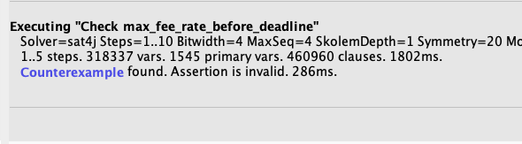
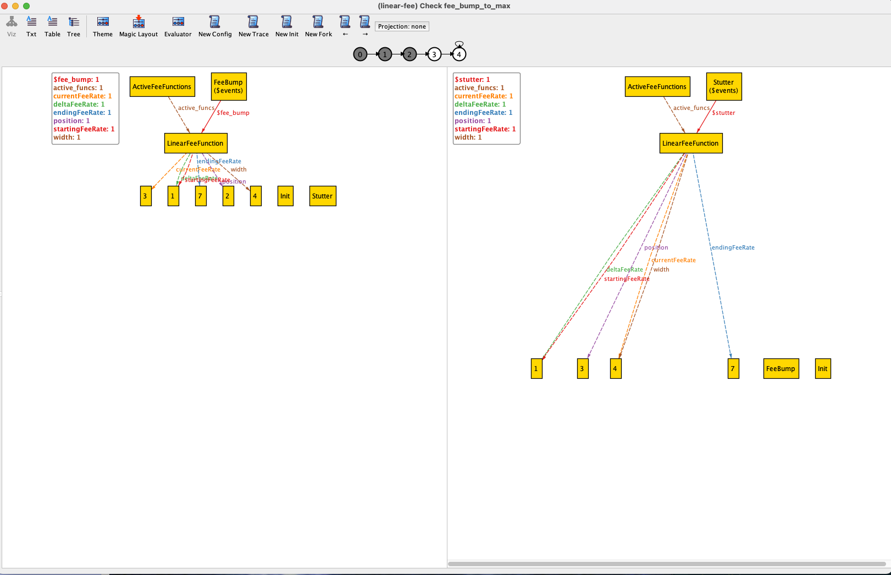
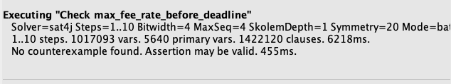

# Linear Fee Function

This is a model of the default [Linear Fee
Function](https://github.com/lightningnetwork/lnd/blob/b7c59b36a74975c4e710a02ea42959053735402e/sweep/fee_function.go#L66-L109)
fee bumping mechanism in lnd.

This model was inspired by a bug fix, due to an off-by-one error in the
original code: https://github.com/lightningnetwork/lnd/issues/8741.

The bug in the original code was fixed in this PR:
https://github.com/lightningnetwork/lnd/pull/8751.


## Model & Bug Fix Walk-through

The model includes an assertion that captures the essence of the bug:
`max_fee_rate_before_deadline`:
```alloy
// max_fee_rate_before_deadline is the main assertion in this model. This
// captures a model violation for our fee function, but only if the line in
// fee_rate_at_position is uncommented.
//
// In this assertion, we declare that if we have a fee function that has a conf
// target of 4 (we want a few fee bumps), and we bump to the final block, then
// at that point our current fee rate is the ending fee rate. In the original
// code, assertion isn't upheld, due to an off by one error.
assert max_fee_rate_before_deadline {
  always req_num_blocks_to_conf[4] => bump_to_final_block => eventually (
    all f: LinearFeeFunction | f.position = f.width.sub[1] &&
                               f.currentFeeRate = f.endingFeeRate
  )
}
```

We can modify the model to find the bug described in the original issue.
  1. First, we modify the model by forcing a `check` on the
     `max_fee_rate_before_deadline` assertion: 
    ```alloy
    check max_fee_rate_before_deadline
    ```

  2. Next, we'll modify the `fee_rate_at_position` predicate to re-introduce
     the off by one error:
    ```alloy
    p >= f.width => f.endingFeeRate // -- NOTE: Uncomment this to re-introduce the original bug.
    ```

If we hit `Execute` in the Alloy Analyzer, then we get a counter example:



We can hit `Show` in the analyzer to visualize it: 


We can see that even though we're one block (`position`) before the deadline
(`width`), our fee rate isn't at the ending fee rate yet.

If we modify the `fee_rate_at_position` to have the correct logic: 
```alloy
p >= f.width.sub[1] => f.endingFeeRate
```

Then Alloy is unable to find any counterexamples:

