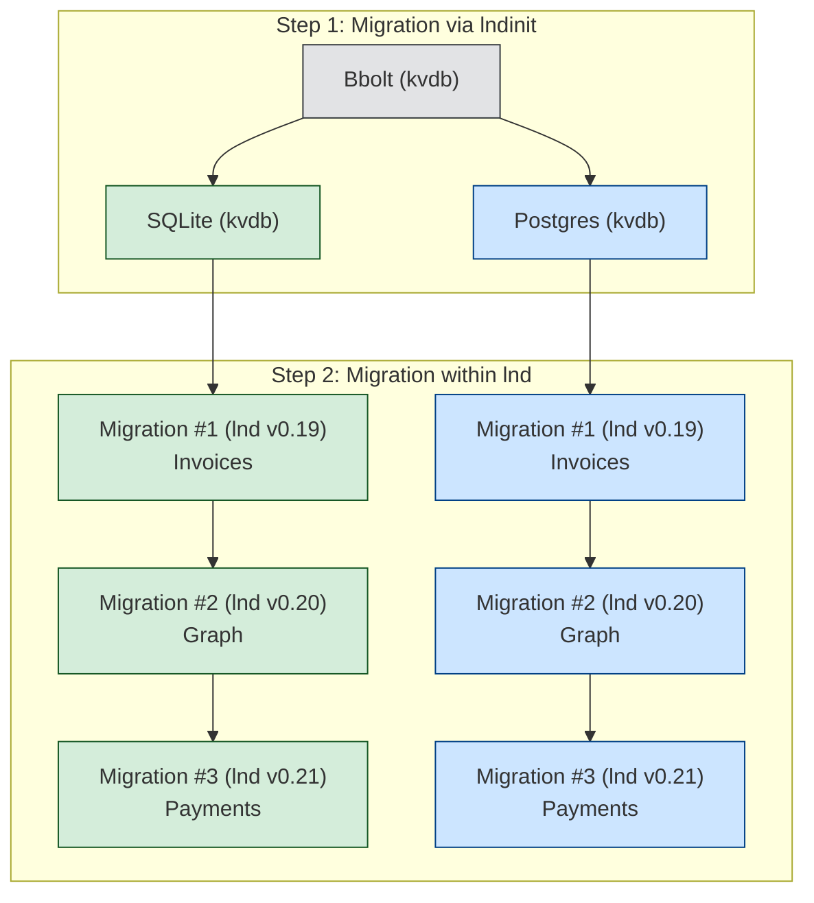

# `LND Database Upgrade Guide`: A Two-Stage Migration for Node Operators

*Table of Contents*  
- [Overview](#overview)  
- [Operation Modes](#operation-modes)  
- [Stage 1: Migration from bbolt to SQLite/Postgres (kvdb)](#stage-1-migration-from-bbolt-to-sqlitepostgres-kvdb)  
  - [Choosing Your Target Backend](#choosing-your-target-backend)  
  - [Postgres kvdb Migration](#postgres-kvdb-migration)  
  - [SQLite kvdb Migration](#sqlite-kvdb-migration)  
- [Stage 2: Migration from kvdb to Relational Database](#stage-2-migration-from-kvdb-to-relational-database)  
  - [Subsystem Readiness](#subsystem-readiness)  
- [Known Limitations and Edge Cases](#known-limitations-and-edge-cases)  
- [Best Practices for Node Operators](#best-practices-for-node-operators)  
  - [Choosing the Right Path](#choosing-the-right-path)  
  - [Timing Your Migration](#timing-your-migration)  
  - [Validation](#validation)  
- [Implementation Examples](#implementation-examples)  
  - [Migrating to SQLite kvdb](#migrating-to-sqlite-kvdb)  
  - [Migrating Invoices to Relational Backend](#migrating-invoices-to-relational-backend)  
- [Future Improvements](#future-improvements)  
- [Conclusion](#conclusion)  

---

## Overview

The `LND Database Upgrade` process enables node operators to migrate from the legacy **bbolt** key-value store to modern **SQLite** or **PostgreSQL** backends—first in **kvdb mode**, then ultimately to a **relational database** format. This two-stage migration addresses long-standing performance bottlenecks, and lays the foundation for scalable, maintainable node operations.

This guide explains the migration path, backend trade-offs, subsystem readiness, and best practices for safely upgrading your LND database.

---

## Operation Modes

The LND database upgrade operates in two sequential stages, each with distinct tooling and implications:



- **Stage 1**: Migrate from bbolt to a SQL-based **kvdb** backend using the [lndinit](https://github.com/lightninglabs/lndinit/blob/main/docs/data-migration.md) tool.
- **Stage 2**: Incrementally migrate subsystem data (invoices, graph, payments, etc.) from **kvdb** to SQL native **relational tables** as support becomes available.

---

## Stage 1: Migration from bbolt to SQLite/Postgres (kvdb)

LND cannot run with mixed backends, so all users must first leave bbolt behind. This stage uses the `lndinit` utility to perform an offline migration.

### Choosing Your Target Backend

| Backend   | Performance (in kvdb mode) | Default in LND? | Long-Term Viability |
|-----------|--------------------------|------------------|----------------------|
| Postgres  | Mediocre                 | No               | ✅ |
| SQLite    | Good                     | **Yes (future)** | ✅ |

> 💡 **Recommendation**: Unless you require Postgres for infrastructure reasons,
 **migrate to SQLite kvdb** as your backend.

### Postgres kvdb Migration

A migration script is available via `lndinit`:

- [Postgres migration script](https://github.com/lightninglabs/lndinit/blob/main/docs/data-migration.md#using-postgres-as-the-destination-remote-database)
- **Caveat**: Users report degraded performance in kvdb mode. Only proceed if you plan to **immediately follow with Stage 2** to migrate the available data stores to relational DB.
This will mitigate the poor Postgres performance on kvdb.

### SQLite kvdb Migration

- [SQLite migration script](https://github.com/lightninglabs/lndinit/blob/main/docs/data-migration.md#using-sqlite-as-the-destination-remote-database)
- **Advantage**: Maintains good performance while waiting for full relational migration.

---

## Stage 2: Migration from kvdb to Relational Database

This stage unlocks true SQL performance by restructuring data into relational tables. Migration is **per-subsystem** and **incremental**.

The migration steps are automatically applied when LND is restarted after step 1 was successfully completed and the config value db.use-native-sql=true is set.
You will see log lines from the `SQLD` subsystem about the migration, such as `Starting migration of invoices from KV to SQL`.

### Subsystem Readiness

| Subsystem           | Relational Backend | Migration Script | Status |
|---------------------|--------------------|------------------|--------|
| Invoices            | ✅ Available        | ✅              | Available with **v0.19** |
| Graph               | ✅ Available        | ✅              | Available with **v0.20** |
| Payments            | 🚧 In Progress      | Planned          | Targeted with **v0.21**|
| Btcwallet           | 🚧 In Progress      | Planned          | Targeted with **v0.21**|
| Forwarding History  | ❌ TBD              | ❌ TBD            | Future work |

---

## Known Limitations and Edge Cases

- **Single database engine required**: LND requires a single consistent backend.
You cannot run invoices in relational mode while graph remain in kvdb *unless*
both are on the same SQL engine (e.g., SQLite).
- **Data loss risk**: Always **back up your `data/` directory** before migration.
- **Downtime required**: Stage 1 requires LND to be offline. Stage 2 is done at startup, requiring a LND restart.
- **Postgres kvdb performance**: Postgres performance on kvdb is sub-optimal. It is
recommended to make the stage 2 migration immediately to avoid performance bottlenecks. Certain RPCs like `listpayments` may not perform well on Postgres if the node has a lot of payments data. If your node operation is heavy
on payments and `listpayments` performance is critical for you, we'd recommend
not doing any migration and wait till version 0.21.0 is released.
- **No migration path between SQL backend**: Once migrated to either Postgres or
SQLite, it is not possible to switch to the other, so choose your target backend carefully.
---

## Best Practices for Node Operators

### Choosing the Right Path

- **For most users**: Choose SQLite, then migrate. Later, adopt relational backends subsystem-by-subsystem.
- **Enterprise/Postgres users**: It is recommened to wait to start the migration 
until **payments relational backend** is ready, then perform **Stage 1 + Stage 2 in quick succession**.

### Timing Your Migration

- Perform migrations during **low-activity periods**.
- Monitor LND release notes for relational DB support of different subsystems.

### Validation

1. Stop LND.
2. Run migration with `lndinit`.
3. Start LND with new backend flags, to execute stage 2 migrations.
4. Validate node health: channels, balance, invoice/payment history.

---

## Implementation Examples

### Migrating to SQLite kvdb

```bash
# Stop LND
lnd --shutdown

# Backup
cp -r ~/.lnd ~/lnd-backup-$(date +%Y%m%d)

# Run migration (e.g. sqlite)
lndinit --debuglevel info migrate-db \
--source.bolt.data-dir ~/.lnd/data \
--dest.backend sqlite \
--dest.sqlite.data-dir ~/.lnd/data --network mainnet

# Start LND with SQLite backend
lnd --db.backend=sqlite
```

> 📝 Add `db.backend=sqlite` to your `lnd.conf` to make it persistent.

### Migrating Invoices to Relational Backend

Once on LND v0.19+ with SQLite/Postgres:

```bash
# Ensure backend is set
echo "db.backend=sqlite" >> ~/.lnd/lnd.conf

# Start LND — invoice migration runs automatically
lnd
```

Check logs for:
```
Migrating invoices from kvdb to relational format...
Invoice migration completed successfully.
```

---

## Future Improvements

The LND team is actively working on:

- **Payments relational backend** and migration tooling (Stage 2)
- **Btcwallet relational backend** and migration tooling (Stage 2)
- **Forwarding history** relational schema (long-term)
- **Automatic detection** of migration readiness in `lnd`

Node operators should monitor:
- [LND GitHub Releases](https://github.com/lightningnetwork/lnd/releases)
- [lndinit repository](https://github.com/lightninglabs/lndinit)

---

## Conclusion

The LND database upgrade is a strategic two-stage process designed to eliminate bbolt performance limitations while ensuring data integrity and operational continuity.

By **first migrating to SQLite/Postgres kvdb** and **then adopting relational backends incrementally**, node operators can achieve significant performance gains—especially for payment-heavy workloads—without rushing into unstable configurations.

Choose your path wisely, back up rigorously, and stay informed. The future of LND is relational, and this guide ensures you get there safely.
