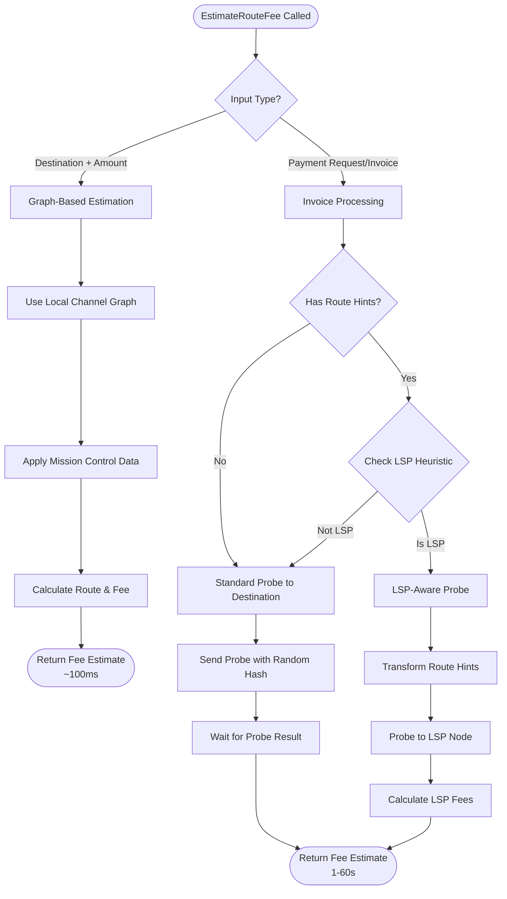
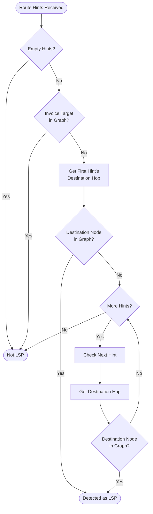
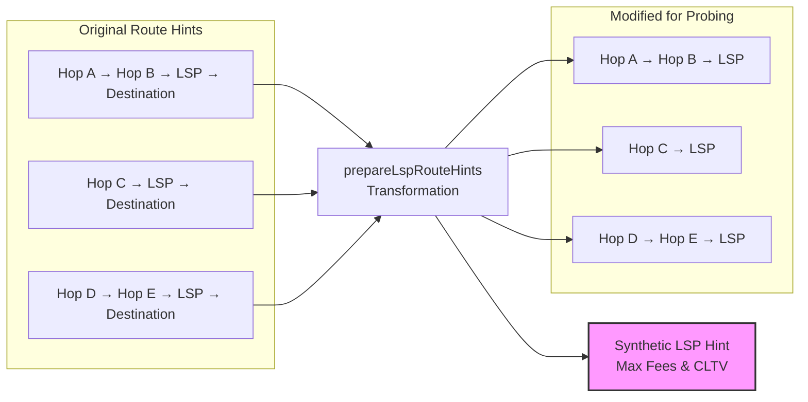

# `EstimateRouteFee`: A Guide for Wallet Developers

## Table of Contents

- [Overview](#overview)
- [Operation Modes](#operation-modes)
  - [Graph-Based Estimation](#graph-based-estimation)
  - [Probe-Based Estimation](#probe-based-estimation)
- [Private Channel and Hop Hint Handling](#private-channel-and-hop-hint-handling)
  - [Hop Hint Processing](#hop-hint-processing)
  - [Integration with Pathfinding](#integration-with-pathfinding)
- [LSP Detection and Special Handling](#lsp-detection-and-special-handling)
  - [The LSP Detection Heuristic](#the-lsp-detection-heuristic)
  - [How Probing Differs When an LSP is Detected](#how-probing-differs-when-an-lsp-is-detected)
  - [Route Hint Transformation for LSP Probing](#route-hint-transformation-for-lsp-probing)
  - [Relationship to Zero-Conf Channels](#relationship-to-zero-conf-channels)
  - [Fee Assembly After LSP Probing](#fee-assembly-after-lsp-probing)
- [Known Limitations and Edge Cases](#known-limitations-and-edge-cases)
- [Best Practices for Wallet Integration](#best-practices-for-wallet-integration)
  - [Choosing the Appropriate Mode](#choosing-the-appropriate-mode)
  - [Handling Timeouts](#handling-timeouts)
  - [Error Handling](#error-handling)
  - [Fee Presentation](#fee-presentation)
- [Implementation Examples](#implementation-examples)
  - [Basic Graph-Based Estimation](#basic-graph-based-estimation)
  - [Invoice-Based Estimation with Timeout](#invoice-based-estimation-with-timeout)
- [Future Improvements](#future-improvements)
- [Conclusion](#conclusion)

## Overview

The `EstimateRouteFee` RPC call provides wallet applications with fee estimates
for Lightning Network payments. Understanding its operation modes and heuristics
is essential for building reliable payment experiences, particularly when
dealing with private channels and Lightning Service Providers (LSPs).

This document explains the behavioral characteristics, assumptions, and best
practices for integrating `EstimateRouteFee` into wallet applications, whether
you're building directly on LND or developing third-party wallet software.

## Operation Modes

`EstimateRouteFee` operates in two distinct modes, each optimized for different
use cases and accuracy requirements.



### Graph-Based Estimation

When provided with a destination public key and amount, `EstimateRouteFee`
performs local pathfinding using the in-memory channel graph. This mode executes
entirely locally without network interaction, making it fast but potentially
less accurate for complex routing scenarios.

This approach uses your node's view of the network topology and mission control
data (historical payment success rates) to calculate the most economical route.
A 1 BTC maximum fee limit prevents unreasonable calculations. The estimate
represents the difference between sent and received amounts.

Best for well-connected public nodes with sufficient routing information in the
public graph. Response times are typically sub-second.

### Probe-Based Estimation

When provided with an invoice, `EstimateRouteFee` sends probe payments through
the network using a random payment hash. This ensures the payment fails with
"incorrect payment details" at the destination, confirming route viability
without transferring funds.

More accurate than graph-based estimation as it tests actual network conditions
(liquidity, availability, current fees). May take seconds to minutes, especially
for private channels or LSPs.

## Private Channel and Hop Hint Handling

Private channels present unique challenges for fee estimation since they don't
exist in the public channel graph. `EstimateRouteFee` handles these through hop
hints provided in BOLT11 invoices.

### Hop Hint Processing

When an invoice contains route hints, `EstimateRouteFee` treats them as
additional routing information that extends the known network graph. Each hop
hint describes a private channel that can be used to reach the destination,
including the channel's routing policies such as fees and timelock requirements.

The system makes several important assumptions about hop hints:

- **Capacity assumptions**: Private channels are assumed to have sufficient
  capacity for pathfinding calculations. This high capacity assumption
  prevents the pathfinding algorithm from prematurely rejecting routes based
  on amount constraints, as the receiver is expected to have adequate inbound
  liquidity when they include a hop hint for that channel.

- **Policy trust**: Routing policies in hop hints (base fee, proportional
  fee, CLTV delta) are trusted without verification, as there's no way to
  independently validate private channel information.

### Integration with Pathfinding

Hop hints are treated as legitimate routing options alongside public channels,
enabling paths through both public and private channels. The pathfinding
algorithm works backward from destination to source, making hop hints critical
for reaching private destinations.

Private edges bypass normal validation and capacity checks. The system trusts
invoice creators to provide accurate routing information, as incorrect hints
prevent payment receipt.

## LSP Detection and Special Handling

Lightning Service Providers require special handling due to their role as
intermediaries for nodes without direct channel connectivity. `EstimateRouteFee`
implements sophisticated heuristics to detect LSP scenarios and fundamentally
modifies its probing behavior when an LSP configuration is identified.

### The LSP Detection Heuristic

`EstimateRouteFee` employs a pattern-matching algorithm to identify when a
payment destination is likely behind an LSP. This detection is crucial because
probing through an LSP requires different handling than standard payment
probing.

The heuristic examines the structure of route hints provided in the invoice to
identify characteristic LSP patterns. The detection operates on the principle
that LSPs typically maintain private channels to their users and appear as
public nodes in the network, while the final destination is private.



The detection follows three simple rules applied sequentially:

**Rule 1: Public Invoice Target → NOT an LSP**
- If the invoice target (destination) is a public node that exists in the
  channel graph, the payment can be routed directly to it
- This means it's not an LSP setup, regardless of what route hints are provided
- Example: A well-connected merchant node with route hints for liquidity
  signaling

**Rule 2: Public Destination Hop → IS an LSP**
- If at least one route hint has a destination hop (last hop in the route hint)
  that is a public node in the graph, LSP detection is triggered
- This indicates the destination hop is an LSP serving a private client
- The private client is reached through the LSP's private channel

**Rule 3: All Private Destination Hops → NOT an LSP**
- If all destination hops in all route hints are private nodes (not in the
  public graph), this is not treated as an LSP setup
- The payment will be routed directly to the invoice destination using the
  route hints as additional path information
- This is the standard case for private channel payments

This pattern effectively distinguishes LSP configurations from other routing
scenarios. For instance, some Lightning implementations like CLN include route
hints even for public nodes to signal liquidity availability or preferred
routing paths. The heuristic correctly identifies these as non-LSP scenarios
by Rule 1 (detecting that the invoice target itself is public).

### How Probing Differs When an LSP is Detected

When the LSP detection heuristic identifies an LSP configuration,
`EstimateRouteFee` fundamentally changes its probing strategy. Understanding
these differences is crucial for wallet developers to correctly interpret fee
estimates.

#### Standard Probing Behavior

When no LSP is detected, the probe targets the invoice's actual destination
using complete route hints. The probe amount matches the invoice amount with
standard timelock requirements. Works well for directly reachable destinations.

#### LSP-Aware Probing Behavior

When an LSP configuration is detected, the probing strategy undergoes several
fundamental changes that reflect the unique characteristics of LSP-mediated
payments:

- **Probe destination changes to the LSP node** - Instead of targeting the
  final payment recipient, the probe targets the LSP itself, recognizing that
  the service provider handles the final hop independently

- **Route hints are modified via prepareLspRouteHints** - The final hop is
  stripped from all route hints, removing the LSP-to-destination segment
  while preserving intermediate hops that help reach the LSP

- **Probe amount increases by the LSP's maximum fee** - The system calculates
  the worst-case fee across all route hints and adds it to the probe amount,
  ensuring the estimate accounts for the LSP's forwarding charges

- **Timelock requirements switch to LSP's CLTV delta** - The probe uses the
  LSP's timelock requirements instead of the invoice's, with the final
  destination's CLTV added to the estimate after probing

- **Modified hints prevent traversal past the LSP** - By removing the final
  hop, the probe cannot attempt to reach the actual destination, which would
  likely fail due to the possible non-existence of LSP-to-user channels in
  the public graph

These modifications ensure that fee estimation accurately reflects the two-stage
nature of LSP-mediated payments: first reaching the LSP through the public
network, then the LSP's own hop to the final destination.

### Route Hint Transformation for LSP Probing

When an LSP is detected, the system performs a sophisticated transformation of
the route hints to enable accurate fee estimation. This transformation, handled
by the prepareLspRouteHints function, serves three critical purposes.



The transformation serves three purposes:

1. **Creates a synthetic LSP hop hint** with worst-case fees and CLTV across
   all route hints, ensuring conservative but reliable estimates

2. **Strips the final hop** from all route hints, removing the
   LSP-to-destination segment that would cause probe failure

3. **Preserves intermediate hops** that help reach the LSP

This worst-case approach prioritizes reliability over optimism, particularly
important for mobile wallets where payment success matters more than minimal
fees.

### Relationship to Zero-Conf Channels

LSP detection has important interactions with zero-conf channels, which are
commonly used in LSP deployments for instant liquidity provision.

#### Why LSPs Use Zero-Conf Channels

LSPs use zero-conf channels for instant liquidity provision to new users. These
channels enable immediate routing using SCID aliases, remain private/unconfirmed
in the public graph, and rely on LSP-user trust relationships.

#### Impact on LSP Detection

Zero-conf channels align with LSP detection patterns since SCID aliases don't
appear in the public graph, always appearing as private channels. This alignment
reflects real-world LSP deployment patterns and strengthens the heuristic's
effectiveness.

#### Implications for Fee Estimation

Key considerations for zero-conf channels behind LSPs:
- Cannot verify channel existence (not in public graph)
- Capacity assumptions may be optimistic
- Route hint fees trusted without validation
- LSP handles liquidity management

### Fee Assembly After LSP Probing

After successful LSP probing, the system adds:
- LSP's worst-case fee for the final hop
- Invoice's final CLTV requirement

This two-stage calculation captures both the cost to reach the LSP and the
LSP's forwarding charges.

## Known Limitations and Edge Cases

### Probe Success Risk

Theoretical risk of probe completion if destination has bugs or non-standard
behavior. Funds would be lost with only a warning logged. Additionally, probes
may get stuck in the network, which is why setting appropriate timeouts is
crucial. Note that liquidity may shift between the probe and the actual payment
attempt. For larger payments, Multi-Path Payments (MPP) might find better routes
than the single-path probe, potentially resulting in lower actual fees.

### LSP Heuristic Accuracy

Can produce false positives (CLN nodes with liquidity hints) and false negatives
(magic routing hints from services like Boltz). Recent improvements check public
graph existence to reduce false positives.

### Route Hint Validation

Route hints trusted without validation. Assumes invoice creators have incentives
for accuracy (incorrect hints prevent payment receipt).

### Capacity and Liquidity Assumptions

Capacity assumptions may exceed actual availability. Payments may fail despite
successful estimation—handle failures gracefully.

## Best Practices for Wallet Integration

### Choosing the Appropriate Mode

**Graph-based**: Quick estimates for well-connected public nodes when you
have the destination key.

**Probe-based**: Accurate estimates for invoices, especially:
- Private or poorly connected destinations
- Large payments requiring fee accuracy
- LSP or complex routing scenarios

### Handling Timeouts

Set timeouts based on UX needs: 30s standard, 60s for important payments, 15s
for responsive UIs. Show progress indicators and provide cancel options.
Consider graph-based fallback for consistent timeouts.

### Error Handling

Common failures:
- **NO_ROUTE**: Destination offline, no liquidity, or unreachable
- **INSUFFICIENT_BALANCE**: Insufficient funds for payment + fees
- **TIMEOUT**: Probe exceeded timeout (congestion or poor connectivity)

Translate errors to user-friendly messages with suggested actions.

### Fee Presentation

Consider showing fee ranges or confidence levels since estimates may be
conservative (especially for LSPs using worst-case fees). Probe-based estimates
reflect current conditions but may change before actual payment.

## Implementation Examples

### Basic Graph-Based Estimation

For graph-based estimation, provide the destination public key and payment
amount. The response will include the routing fee in millisatoshis and an
estimated timelock delay. This mode is ideal for quick estimates where you have
the destination's node ID.

```shell
# Estimate fee for 100,000 satoshi payment to a specific node
lncli estimateroutefee --dest 0266a18ed969ef95c8a5aa314b443b2b3b8d91ed1d9f8e95476f5f4647efdec079 --amt 100000
```

The typical flow involves calling `EstimateRouteFee` with just the destination
and amount parameters. The response arrives quickly (usually under 100ms) since
it uses only local data. Convert the returned fee from millisatoshis to satoshis
for display, and consider showing the timelock delay to inform users about the
maximum time their funds might be locked.

### Invoice-Based Estimation with Timeout

For invoice-based estimation, provide the full payment request string and
optionally specify a timeout. This mode sends actual probe payments, so timeouts
are important to prevent long waits for poorly connected destinations.

```shell
# Estimate fee for an invoice with 60-second timeout
lncli estimateroutefee --pay_req lnbc100n1p3e... --timeout 60s

# Shorter timeout for responsive UIs
lncli estimateroutefee --pay_req lnbc100n1p3e... --timeout 15s
```

When calling `EstimateRouteFee` with a payment request, always set a reasonable
timeout (30-60 seconds is typical). The response includes not just the fee but
also a failure reason if the probe fails. Common failure reasons include
NO_ROUTE (destination unreachable), INSUFFICIENT_BALANCE (not enough funds), or
TIMEOUT (probe took too long). Handle these gracefully in your UI to guide users
appropriately.

## Future Improvements

The `EstimateRouteFee` implementation continues to evolve based on real-world
usage patterns. Ongoing discussions in the LND community focus on:

**Multi-Path Payment Support**: Extending fee estimation to support MPP
scenarios where payments split across multiple routes.

**Trampoline Routing Compatibility**: Adapting fee estimation for future
trampoline routing implementations where intermediate nodes handle pathfinding.

**Blinded Path Integration**: Ensuring fee estimation works correctly with
blinded paths as they become more prevalent in the network.

Wallet developers should monitor LND releases and participate in community
discussions to stay informed about improvements and changes to fee estimation
behavior.

## Conclusion

`EstimateRouteFee` provides essential functionality for wallet applications to
present accurate fee information to users. By understanding its dual-mode
operation, hop hint processing, and LSP detection heuristics, developers can
build robust payment experiences that handle both simple public node payments
and complex private channel scenarios.

The key to successful integration lies in choosing the appropriate estimation
mode for each use case, handling edge cases gracefully, and presenting fee
information in a way that helps users make informed payment decisions. As the
Lightning Network evolves, staying informed about `EstimateRouteFee`
improvements will ensure wallets continue to provide accurate and reliable fee
estimates.
