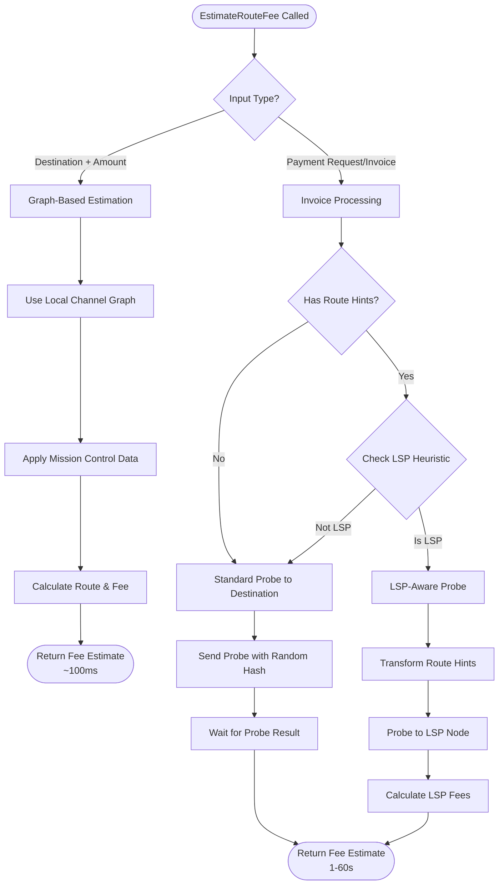
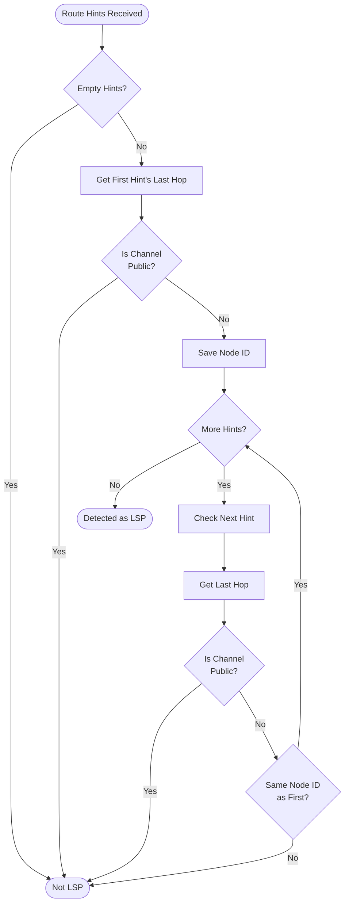
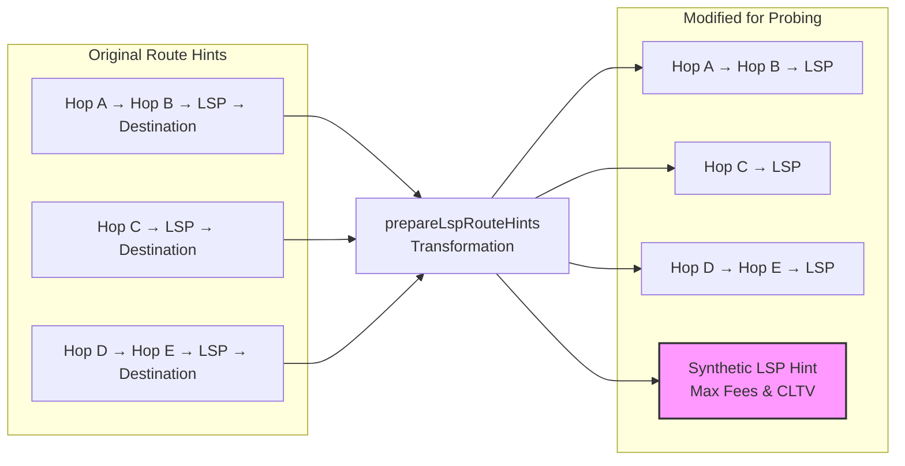

# EstimateRouteFee: A Guide for Wallet Developers

## Table of Contents

- [Overview](#overview)
- [Operation Modes](#operation-modes)
  - [Graph-Based Estimation](#graph-based-estimation)
  - [Probe-Based Estimation](#probe-based-estimation)
- [Private Channel and Hop Hint Handling](#private-channel-and-hop-hint-handling)
  - [Hop Hint Processing](#hop-hint-processing)
  - [Integration with Pathfinding](#integration-with-pathfinding)
- [LSP Detection and Special Handling](#lsp-detection-and-special-handling)
  - [The LSP Detection Heuristic](#the-lsp-detection-heuristic)
  - [How Probing Differs When an LSP is Detected](#how-probing-differs-when-an-lsp-is-detected)
  - [Route Hint Transformation for LSP Probing](#route-hint-transformation-for-lsp-probing)
  - [Relationship to Zero-Conf Channels](#relationship-to-zero-conf-channels)
  - [Fee Assembly After LSP Probing](#fee-assembly-after-lsp-probing)
- [Known Limitations and Edge Cases](#known-limitations-and-edge-cases)
- [Best Practices for Wallet Integration](#best-practices-for-wallet-integration)
  - [Choosing the Appropriate Mode](#choosing-the-appropriate-mode)
  - [Handling Timeouts](#handling-timeouts)
  - [Error Handling](#error-handling)
  - [Fee Presentation](#fee-presentation)
- [Implementation Examples](#implementation-examples)
  - [Basic Graph-Based Estimation](#basic-graph-based-estimation)
  - [Invoice-Based Estimation with Timeout](#invoice-based-estimation-with-timeout)
- [Future Improvements](#future-improvements)
- [Conclusion](#conclusion)

## Overview

The EstimateRouteFee RPC call provides wallet applications with fee estimates
for Lightning Network payments. Understanding its operation modes and heuristics
is essential for building reliable payment experiences, particularly when
dealing with private channels and Lightning Service Providers (LSPs).

This document explains the behavioral characteristics, assumptions, and best
practices for integrating EstimateRouteFee into wallet applications, whether
you're building directly on LND or developing third-party wallet software.

## Operation Modes

EstimateRouteFee operates in two distinct modes, each optimized for different
use cases and accuracy requirements.


```mermaid
flowchart TD
    Start([EstimateRouteFee Called]) --> Check{Input Type?}
    Check -->|Destination + Amount| Graph[Graph-Based Estimation]
    Check -->|Payment Request/Invoice| Invoice[Invoice Processing]
    
    Graph --> LocalPath[Use Local Channel Graph]
    LocalPath --> Mission[Apply Mission Control Data]
    Mission --> CalcFee[Calculate Route & Fee]
    CalcFee --> ReturnFast([Return Fee Estimate<br/>~100ms])
    
    Invoice --> HasHints{Has Route Hints?}
    HasHints -->|No| StandardProbe[Standard Probe to Destination]
    HasHints -->|Yes| CheckLSP{Check LSP Heuristic}
    
    CheckLSP -->|Not LSP| StandardProbe
    CheckLSP -->|Is LSP| LSPProbe[LSP-Aware Probe]
    
    StandardProbe --> SendProbe1[Send Probe with Random Hash]
    LSPProbe --> ModifyHints[Transform Route Hints]
    ModifyHints --> SendProbe2[Probe to LSP Node]
    
    SendProbe1 --> ProbeResult1[Wait for Probe Result]
    SendProbe2 --> ProbeResult2[Calculate LSP Fees]
    
    ProbeResult1 --> ReturnProbe([Return Fee Estimate<br/>1-60s])
    ProbeResult2 --> ReturnProbe
```

### Graph-Based Estimation

When provided with a destination public key and amount, EstimateRouteFee
performs local pathfinding using the in-memory channel graph. This mode executes
entirely locally without network interaction, making it fast but potentially
less accurate for complex routing scenarios.

The graph-based approach uses your node's current view of the network topology
to calculate the most economical route. It leverages mission control data, which
tracks historical payment success rates through different channels, to improve
route selection. The algorithm applies a maximum fee limit of 1 BTC as a safety
bound to prevent unreasonable fee calculations. The final fee estimate
represents the difference between the total amount that would leave your node
and the amount that would arrive at the destination.

This mode works best for well-connected public nodes where the public channel
graph provides sufficient routing information. Response times are typically
sub-second since no network communication is required.

### Probe-Based Estimation

When provided with a payment request (invoice), EstimateRouteFee sends actual
probe payments through the network. This approach provides real-world fee
estimates by attempting to route payments that are designed to fail at the
destination, confirming route viability without transferring funds.

The probe payment carries a randomly generated payment hash that differs from
the invoice's actual payment hash. This ensures the destination node cannot
claim the payment, causing it to fail with an "incorrect payment details" error.
This specific failure mode is interpreted as a successful probe, confirming that
a viable route exists while preventing any actual fund transfer.

Probe-based estimation provides more accurate results than graph-based
estimation because it tests actual network conditions, including channel
liquidity, node availability, and current fee policies. However, it requires
network round-trips and may take several seconds to complete, especially for
destinations behind private channels or LSPs.

## Private Channel and Hop Hint Handling

Private channels present unique challenges for fee estimation since they don't
exist in the public channel graph. EstimateRouteFee handles these through hop
hints provided in BOLT11 invoices.

### Hop Hint Processing

When an invoice contains route hints, EstimateRouteFee treats them as additional
routing information that extends the known network graph. Each hop hint
describes a private channel that can be used to reach the destination, including
the channel's routing policies such as fees and timelock requirements.

The system makes several important assumptions about hop hints. 
  * First, it assumes these private channels have sufficient capacity to route
  the payment, using a conservative estimate of 10 BTC capacity for pathfinding
  calculations. This high capacity assumption prevents the pathfinding algorithm
  from prematurely rejecting routes, though actual channel capacity might be lower.

  * Second, the routing policies specified in the hop hints (base fee,
  proportional fee, and CLTV delta) are trusted without verification, as there's
  no way to independently validate this information for private channels.

### Integration with Pathfinding

During the pathfinding process, hop hints are treated as legitimate routing options alongside public channels. The system integrates these private edges into its routing calculations, allowing it to find paths that traverse both public and private channels seamlessly.

The pathfinding algorithm works backward from the destination to the source, which is why hop hints are particularly important—they provide the critical last-hop information needed to reach private destinations. Without these hints, there would be no way to route payments to nodes that only have private channels.

An important characteristic of this system is that private edges bypass the normal validation and capacity checks applied to public channels. This trust model assumes that invoice creators have incentives to provide accurate routing information, as incorrect hints would prevent them from receiving payments.

## LSP Detection and Special Handling

Lightning Service Providers require special handling due to their role as intermediaries for nodes without direct channel connectivity. EstimateRouteFee implements sophisticated heuristics to detect LSP scenarios and fundamentally modifies its probing behavior when an LSP configuration is identified.

### The LSP Detection Heuristic

EstimateRouteFee employs a pattern-matching algorithm to identify when a payment
destination is likely behind an LSP. This detection is crucial because probing
through an LSP requires different handling than standard payment probing.

The heuristic examines the structure of route hints provided in the invoice to
identify characteristic LSP patterns. The detection operates on the principle
that LSPs typically maintain private channels to their users and appear as the
penultimate hop in payment routing.


```mermaid
flowchart TD
    Start([Route Hints Received]) --> Empty{Empty Hints?}
    Empty -->|Yes| NotLSP([Not LSP])
    Empty -->|No| GetFirst[Get First Hint's Last Hop]
    
    GetFirst --> CheckPub1{Is Channel<br/>Public?}
    CheckPub1 -->|Yes| NotLSP
    CheckPub1 -->|No| SaveNode[Save Node ID]
    
    SaveNode --> MoreHints{More Hints?}
    MoreHints -->|No| IsLSP([Detected as LSP])
    MoreHints -->|Yes| NextHint[Check Next Hint]
    
    NextHint --> GetLast[Get Last Hop]
    GetLast --> CheckPub2{Is Channel<br/>Public?}
    CheckPub2 -->|Yes| NotLSP
    CheckPub2 -->|No| SameNode{Same Node ID<br/>as First?}
    
    SameNode -->|No| NotLSP
    SameNode -->|Yes| MoreHints
```

The detection criteria are:

• **All route hints must terminate at the same node ID** - This indicates a single destination behind potentially multiple LSP entry points

• **Final hop channels must be private** - The channels in the last hop of each route hint must not exist in the public channel graph

• **No public channels in final hops** - If any route hint contains a public channel in its final hop, LSP detection is disabled entirely

• **Multiple route hints strengthen detection** - While not required, multiple hints converging on the same destination strongly suggest an LSP configuration

This pattern effectively distinguishes LSP configurations from other routing
scenarios. For instance, some Lightning implementations like CLN include route
hints even for public nodes to signal liquidity availability or preferred
routing paths. The heuristic correctly identifies these as non-LSP scenarios by
detecting the presence of public channels.

### How Probing Differs When an LSP is Detected

When the LSP detection heuristic identifies an LSP configuration,
EstimateRouteFee fundamentally changes its probing strategy. Understanding these
differences is crucial for wallet developers to correctly interpret fee
estimates.

#### Standard Probing Behavior

In standard operation, when no LSP is detected, the probe payment attempts to
reach the invoice's actual destination. The system sends a probe with the
complete route hints as provided in the invoice, using the destination's public
key as the target. The probe amount matches the invoice amount, and the timelock
requirements follow the invoice's specifications. This straightforward approach
works well for destinations that are directly reachable, whether through public
channels or simple private channel configurations.

#### LSP-Aware Probing Behavior

When an LSP configuration is detected, the probing strategy undergoes several
fundamental changes that reflect the unique characteristics of LSP-mediated
payments:

• **Probe destination changes to the LSP node** - Instead of targeting the final payment recipient, the probe targets the LSP itself, recognizing that the service provider handles the final hop independently

• **Route hints are modified via prepareLspRouteHints** - The final hop is stripped from all route hints, removing the LSP-to-destination segment while preserving intermediate hops that help reach the LSP

• **Probe amount increases by the LSP's maximum fee** - The system calculates the worst-case fee across all route hints and adds it to the probe amount, ensuring the estimate accounts for the LSP's forwarding charges

• **Timelock requirements switch to LSP's CLTV delta** - The probe uses the LSP's timelock requirements instead of the invoice's, with the final destination's CLTV added to the estimate after probing

• **Modified hints prevent traversal past the LSP** - By removing the final hop, the probe cannot attempt to reach the actual destination, which would likely fail due to the private nature of LSP-to-user channels

These modifications ensure that fee estimation accurately reflects the two-stage
nature of LSP-mediated payments: first reaching the LSP through the public
network, then the LSP's own hop to the final destination.

### Route Hint Transformation for LSP Probing

When an LSP is detected, the system performs a sophisticated transformation of
the route hints to enable accurate fee estimation. This transformation, handled
by the prepareLspRouteHints function, serves three critical purposes.


```mermaid
flowchart LR
    subgraph "Original Route Hints"
        H1[Hop A → Hop B → LSP → Destination]
        H2[Hop C → LSP → Destination]
        H3[Hop D → Hop E → LSP → Destination]
    end
    
    Transform[prepareLspRouteHints<br/>Transformation] 
    
    subgraph "Modified for Probing"
        M1[Hop A → Hop B → LSP]
        M2[Hop C → LSP]
        M3[Hop D → Hop E → LSP]
        LSPHint[Synthetic LSP Hint<br/>Max Fees & CLTV]
    end
    
    H1 --> Transform
    H2 --> Transform
    H3 --> Transform
    
    Transform --> M1
    Transform --> M2
    Transform --> M3
    Transform --> LSPHint
    
    style LSPHint fill:#f9f,stroke:#333,stroke-width:2px
```

First, it creates a synthetic LSP hop hint that represents the worst-case
scenario across all provided route hints. This synthetic hint contains the
maximum fees and longest timelock requirements found among all the LSP's route
hints, ensuring that fee estimates are conservative but reliable. If the LSP has
multiple channels with different fee policies, the estimate will reflect the
most expensive option.

Second, it strips the final hop from all route hints, effectively removing the
LSP-to-destination segment from the routing instructions. This prevents the
probe from attempting to traverse the private channel between the LSP and the
final destination, which would likely fail and provide inaccurate results.

Third, it preserves any intermediate hops that help the probe find routes to the
LSP. These intermediate hops might represent other nodes in the path before
reaching the LSP, and they remain essential for successful routing to the
service provider.

The worst-case parameter selection is a deliberate design choice that
prioritizes reliability over optimism. By using the highest fees and longest
timelocks across all route hints, the system ensures that actual payments will
succeed even if they route through the most expensive path. This approach is
particularly important for mobile wallets where payment reliability is more
important than minimal fees.

### Relationship to Zero-Conf Channels

LSP detection has important interactions with zero-conf channels, which are
commonly used in LSP deployments for instant liquidity provision.

#### Why LSPs Use Zero-Conf Channels

LSPs frequently leverage zero-conf channels to provide immediate payment
capability to new users, particularly in mobile wallet scenarios. These channels
enable instant routing without waiting for blockchain confirmations, creating a
seamless onboarding experience. The channels use SCID aliases instead of
confirmed channel IDs, remain private or unconfirmed in the public graph, and
operate on a trust model where the LSP (as funder) trusts itself not to
double-spend while users trust the LSP as a service provider.

#### Impact on LSP Detection

Zero-conf channels naturally align with LSP detection patterns. Since these
channels use SCID aliases rather than confirmed channel IDs, they don't appear
in the public channel graph. When the system checks whether a channel ID
corresponds to a public channel, zero-conf aliases will always appear as
private, contributing to positive LSP detection.

This alignment between zero-conf characteristics and LSP detection criteria
isn't coincidental—it reflects real-world deployment patterns where LSPs
leverage zero-conf channels for seamless user onboarding. The prevalence of
zero-conf channels in LSP deployments actually strengthens the heuristic's
effectiveness.

#### Implications for Fee Estimation

When estimating fees for payments through zero-conf channels behind LSPs,
several important considerations apply. The probe cannot independently verify
the actual existence of these channels since they're not in the public graph.
The system's 10 BTC capacity assumption may be particularly optimistic for new
zero-conf channels. Fee policies specified in route hints must be trusted
without validation, as there's no way to verify them against public channel
data. The LSP is assumed to handle all liquidity management for these channels,
which is typically accurate given the trust relationship inherent in zero-conf
channel operations.

### Fee Assembly After LSP Probing

When LSP-aware probing completes successfully, the system performs additional
calculations to derive the complete fee estimate. The probe itself only
determines the cost to reach the LSP, not the total cost to reach the final
destination.

After receiving the probe results, the system adds the LSP's fee for the final
hop (calculated as the worst-case fee across all route hints) to the routing fee
returned by the probe. It also adds the invoice's final CLTV requirement to the
timelock delay, since the probe only accounted for reaching the LSP, not the
final destination.

This two-stage calculation ensures the final estimate accurately reflects both
the cost to reach the LSP through the public network and the LSP's own charges
for completing the payment to the final destination.

## Known Limitations and Edge Cases

### Probe Success Risk

While probe payments use invalid payment hashes to prevent completion, there
exists a theoretical risk of probe success if the destination node has bugs or
non-standard behavior. In such cases, the probe payment would complete and funds
would be lost. The implementation logs a warning when this occurs but cannot
recover the funds.

### LSP Heuristic Accuracy

The LSP detection heuristic can produce both false positives and false
negatives. Public nodes that include route hints for liquidity signaling (common
in CLN implementations) may be incorrectly identified as LSPs. Conversely,
sophisticated routing hints like "magic routing hints" used by services like
Boltz may not trigger LSP detection despite functioning similarly.

Recent improvements have addressed some of these issues. For example, the
implementation now checks whether hint nodes exist in the public graph before
applying LSP assumptions, reducing false positives for public nodes with route
hints.

### Route Hint Validation

EstimateRouteFee trusts route hint accuracy without validation. Malicious or
incorrect route hints could lead to inaccurate fee estimates or failed payments.
The implementation assumes invoice creators have incentives to provide accurate
routing information, as incorrect hints would prevent payment receipt.

### Capacity and Liquidity Assumptions

The 10 BTC capacity assumption for hop hints may not reflect actual channel
capacity or available liquidity. Real channels might have lower capacity or
insufficient inbound liquidity, causing actual payments to fail despite
successful fee estimation. Wallet developers should handle payment failures
gracefully even after successful fee estimation.

## Best Practices for Wallet Integration

### Choosing the Appropriate Mode

Use graph-based estimation when you have the destination public key and need
quick estimates for UI responsiveness. This mode works well for payments to
well-connected public nodes where the public graph provides sufficient routing
information.

Use probe-based estimation when you have a full invoice and need accurate fee estimates, especially for:
- Private or poorly connected destinations
- Large payments where fee accuracy is critical
- Scenarios involving LSPs or complex routing hints

### Handling Timeouts

Probe-based estimation can take significant time, especially for poorly
connected destinations. Set appropriate timeouts based on your UX requirements.
A timeout of 30 seconds works well for most cases, but you might extend this to
60 seconds for important payments or reduce it to 15 seconds for responsive UIs.

Consider showing progressive UI feedback during long-running probes, such as a
spinner with elapsed time or a progress indicator. Provide users with a cancel
option if estimation takes too long, and consider falling back to graph-based
estimation if probes consistently timeout for a destination.

### Error Handling

EstimateRouteFee may fail for various reasons. Common failure scenarios include:

**NO_ROUTE**: No path exists to the destination. This could indicate the destination is offline, has no inbound liquidity, or is genuinely unreachable.

**INSUFFICIENT_BALANCE**: The sending node lacks sufficient balance for the payment plus estimated fees.

**TIMEOUT**: Probe payment exceeded the specified timeout. This might indicate network congestion or a poorly connected destination.

Wallet applications should translate these technical errors into user-friendly
messages and suggest appropriate actions.

### Fee Presentation

When presenting fees to users, consider that estimates may be conservative,
especially for LSP scenarios where worst-case fees are assumed. You might
display fee ranges or confidence levels rather than single values.

For probe-based estimates, the returned fee represents actual network conditions
at probe time. However, these conditions can change before the actual payment,
so wallets should handle fee variations gracefully.

## Implementation Examples

### Basic Graph-Based Estimation

For graph-based estimation, provide the destination public key and payment
amount. The response will include the routing fee in millisatoshis and an
estimated timelock delay. This mode is ideal for quick estimates where you have
the destination's node ID.

```shell
# Estimate fee for 100,000 satoshi payment to a specific node
lncli estimateroutefee --dest 0266a18ed969ef95c8a5aa314b443b2b3b8d91ed1d9f8e95476f5f4647efdec079 --amt 100000
```

The typical flow involves calling EstimateRouteFee with just the destination and
amount parameters. The response arrives quickly (usually under 100ms) since it
uses only local data. Convert the returned fee from millisatoshis to satoshis
for display, and consider showing the timelock delay to inform users about the
maximum time their funds might be locked.

### Invoice-Based Estimation with Timeout

For invoice-based estimation, provide the full payment request string and
optionally specify a timeout. This mode sends actual probe payments, so timeouts
are important to prevent long waits for poorly connected destinations.

```shell
# Estimate fee for an invoice with 60-second timeout
lncli estimateroutefee --pay_req lnbc100n1p3e... --timeout 60s

# Shorter timeout for responsive UIs
lncli estimateroutefee --pay_req lnbc100n1p3e... --timeout 15s
```

When calling EstimateRouteFee with a payment request, always set a reasonable
timeout (30-60 seconds is typical). The response includes not just the fee but
also a failure reason if the probe fails. Common failure reasons include
NO_ROUTE (destination unreachable), INSUFFICIENT_BALANCE (not enough funds), or
TIMEOUT (probe took too long). Handle these gracefully in your UI to guide users
appropriately.

## Future Improvements

The EstimateRouteFee implementation continues to evolve based on real-world
usage patterns. Ongoing discussions in the LND community focus on:

**Improved LSP Detection**: Developing more sophisticated heuristics that
accurately identify LSP configurations while avoiding false positives for
regular private channels.

**Multi-Path Payment Support**: Extending fee estimation to support MPP
scenarios where payments split across multiple routes.

**Trampoline Routing Compatibility**: Adapting fee estimation for future
trampoline routing implementations where intermediate nodes handle pathfinding.

**Blinded Path Integration**: Ensuring fee estimation works correctly with
blinded paths as they become more prevalent in the network.

Wallet developers should monitor LND releases and participate in community
discussions to stay informed about improvements and changes to fee estimation
behavior.

## Conclusion

EstimateRouteFee provides essential functionality for wallet applications to
present accurate fee information to users. By understanding its dual-mode
operation, hop hint processing, and LSP detection heuristics, developers can
build robust payment experiences that handle both simple public node payments
and complex private channel scenarios.

The key to successful integration lies in choosing the appropriate estimation
mode for each use case, handling edge cases gracefully, and presenting fee
information in a way that helps users make informed payment decisions. As the
Lightning Network evolves, staying informed about EstimateRouteFee improvements
will ensure wallets continue to provide accurate and reliable fee estimates.
