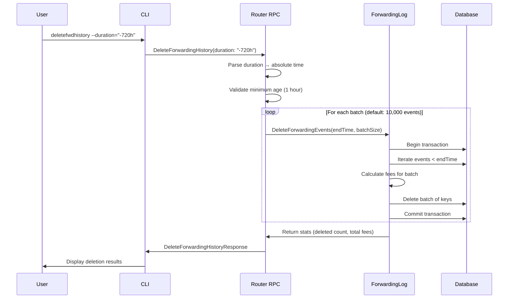
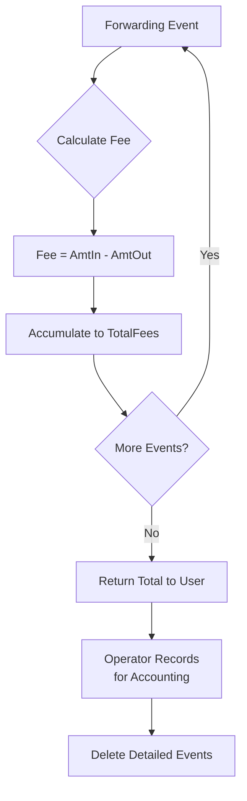

# Forwarding History Privacy Management

## Introduction

The Lightning Network excels at providing fast, low-cost payments with strong
privacy properties. However, routing nodes and Lightning Service Providers
(LSPs) face a unique challenge: their operational databases accumulate
forwarding history that, if compromised or subpoenaed, could reveal sensitive
information about payment flows across the network. This document explores the
privacy implications of forwarding logs and introduces LND's solution for
implementing data retention policies without migrating to a new node instance.

## Understanding Forwarding History

When your LND node routes a payment between two other nodes, it records detailed
information about that forwarding event in its database. This serves several
important operational purposes, including fee accounting, channel performance
analysis, and troubleshooting. Each forwarding event captures the incoming and
outgoing channels, amounts transferred, fees earned, and precise timestamps.

Over months or years of operation, a busy routing node accumulates millions of
these records. While this historical data provides valuable insights into node
performance, it also creates a potential privacy liability. An attacker who
gains access to this database—whether through a security breach, or physical
seizure—could potentially reconstruct payment paths across the network by
correlating forwarding events across multiple compromised nodes.

## Privacy Implications for Operators

For individual routing node operators, the privacy risks of retaining unlimited
forwarding history are modest but real. If an adversary gains access to your
node's database, they could analyze your forwarding patterns to infer
information about the network topology you participate in and potentially
identify payment patterns involving your channels.

### The Traditional Dilemma

Prior to this feature, routing node operators faced an uncomfortable tradeoff.
To implement a data retention policy and purge old forwarding logs, the only
practical option was to shut down the node, reset the database, and restore
channels from backups—effectively migrating to a fresh node instance. This
process carries significant operational risks, including potential channel
closures, loss of channel state, and extended downtime. For LSPs serving
customers around the clock, such maintenance windows are highly disruptive.

## The DeleteForwardingHistory Solution

LND's `DeleteForwardingHistory` RPC addresses this challenge by providing a
safe, reversible-only-forward way to implement data retention policies. The
feature allows operators to specify a time threshold—either as a relative
duration or an absolute timestamp—and permanently delete all forwarding events
older than that threshold. The deletion operation executes in configurable
batches to avoid holding large database locks, and it returns statistics about
the deleted events, including the total fees earned during that period for
accounting purposes.

### How It Works

The deletion mechanism operates at the database layer, directly manipulating the
forwarding log bucket in LND's embedded bbolt database. The forwarding log
stores events using nanosecond-precision timestamps as keys, which enables
efficient time-based range queries. When you invoke a deletion, LND constructs a
cursor-based iteration that walks through events in chronological order,
collecting keys for events older than your specified cutoff time. It then
deletes these events in batches, with each batch executed within its own
database transaction.



This batched approach ensures that even nodes with millions of forwarding events
can safely purge old data without causing database performance issues. Each
batch completes within a separate transaction, limiting lock contention and
allowing other database operations to proceed between batches.

### Security Considerations

The implementation includes several safeguards to prevent accidental data loss.
First, the RPC enforces a minimum age requirement: you cannot delete events less
than one hour old. This prevents mishaps where an operator accidentally deletes
recent forwarding history due to a timestamp parsing error or misunderstanding
the time format. The CLI command additionally requires explicit confirmation
before proceeding with the deletion.

Second, the RPC requires the "offchain:write" macaroon permission, treating
forwarding history deletion as a sensitive write operation similar to payment
deletion. This ensures that only authorized users can purge forwarding data.

Third, the operation is logged extensively. LND writes detailed log messages
before and after each deletion operation, recording the time threshold, batch
size, number of events deleted, and total fees from the deleted period. These
audit trails help operators verify that deletions executed as intended.

### Fee Accounting

One critical requirement for LSPs implementing data retention policies is
maintaining accurate accounting records. Even after purging old forwarding
events for privacy reasons, operators need to know how much revenue their node
generated during those periods for tax reporting and business analytics.

The deletion operation addresses this by calculating and returning the sum of
all fees earned from the deleted events. For each event, LND computes the fee as
the difference between the incoming and outgoing amounts, then aggregates these
fees across all deleted events. The response includes this total in
millisatoshis, allowing operators to record their earnings before purging the
detailed records.



This approach separates accounting data from operational surveillance data. You
can maintain aggregate financial records while minimizing the detailed
forwarding logs that pose privacy risks.

## Usage Guide

### Command Line Interface

The `lncli deletefwdhistory` command provides the primary interface for
operators. The command accepts time specifications in two formats: relative
durations for convenience, or absolute Unix timestamps for precision.

For most use cases, relative durations offer the most intuitive interface. To
implement a 90-day retention policy, you would periodically run:

```bash
lncli deletefwdhistory --duration="-90d"
```

The supported time units cover a wide range of retention policies:

- Seconds (`s`) and minutes (`m`) for testing or very short-term retention
- Hours (`h`) and days (`d`) for common operational timeframes
- Weeks (`w`) for weekly cleanup schedules
- Months (`M`, averaged to 30.44 days) for typical retention policies
- Years (`y`, averaged to 365.25 days) for long-term archives

The minus sign prefix indicates you're specifying how far back in time to
delete. This convention matches the relative time syntax used elsewhere in LND
and makes the intent clear: "delete events from more than X time ago."

For precise control, you can specify an absolute Unix timestamp:

```bash
lncli deletefwdhistory --before=1704067200
```

This deletes all events before January 1, 2024 00:00:00 UTC. Absolute timestamps
are particularly useful when implementing policies tied to specific dates, such
as calendar year boundaries for accounting purposes or regulatory compliance
deadlines.

### Batch Size Tuning

The `--batch_size` flag controls how many events are deleted per database
transaction. The default value of 10,000 provides a good balance for most nodes,
but you may want to adjust this based on your node's characteristics.

For nodes with slower disk I/O or running on resource-constrained hardware,
reducing the batch size decreases the duration of each database lock, improving
responsiveness to concurrent operations:

```bash
lncli deletefwdhistory --duration="-1M" --batch_size=5000
```

Conversely, for nodes with fast SSDs and low concurrent load, increasing the
batch size can speed up the overall deletion process:

```bash
lncli deletefwdhistory --duration="-1M" --batch_size=25000
```

The implementation caps the maximum batch size at 50,000 to prevent excessively
large transactions from degrading database performance.

### Automation and Scheduling

Most operators will want to automate forwarding history cleanup rather than
running deletions manually. The command integrates naturally with cron jobs or
systemd timers. For a monthly cleanup maintaining a 90-day retention window:

```bash
# Run at 3 AM on the first day of each month
0 3 1 * * /usr/local/bin/lncli deletefwdhistory --duration="-90d" >> /var/log/lnd/fwdhistory_cleanup.log 2>&1
```

Note that the automated script omits the interactive confirmation prompt. In
production automation, you should implement additional safeguards such as
pre-deletion validation checks and alerting on unexpected results.

For more sophisticated automation, consider implementing a script that:

1. Queries current forwarding history statistics
2. Calculates the appropriate deletion threshold based on database size and growth rate
3. Executes the deletion
4. Records the fees returned for accounting
5. Monitors the resulting database size and alerts if disk space isn't reclaimed as expected

### Database Compaction

Deleting forwarding events frees space within LND's bbolt database, but this
space isn't immediately returned to the operating system. bbolt uses a
copy-on-write structure where deleted data leaves "free pages" that can be
reused for future writes, but the overall file size doesn't shrink until you
compact the database.

LND supports automatic compaction via the configuration option:

```
db.bolt.auto-compact=true
```

With auto-compaction enabled, LND periodically performs compaction during normal
operation, typically triggered when the amount of free space exceeds a
threshold. However, after a large deletion operation, you may want to trigger
compaction immediately to reclaim disk space.

The recommended approach is to schedule compaction shortly after your regular
deletion operations:

1. Run `deletefwdhistory` to purge old events
2. Restart LND with `--db.bolt.auto-compact=true` if not already enabled
3. Monitor database file size to confirm space reclamation

Be aware that database compaction requires free disk space equal to the current
database size during the operation, as it creates a new, compacted copy of the
database before replacing the original.

## Integration with Existing Tools

### Forwarding History Analysis

The deletion operation doesn't interfere with LND's existing `forwardinghistory`
RPC, which allows you to query and analyze forwarding events. After a deletion,
queries for time ranges that have been purged will simply return no events for
those periods, while more recent events remain accessible.

This means you can continue using analytical tools and scripts that query
forwarding history, but you should design them to handle sparse historical data
gracefully. Tools should not assume that forwarding history extends back to the
node's inception date.

### Channel Analytics

Similarly, channel performance analysis tools that rely on forwarding history
will only have access to events within your retention window. When evaluating
channel performance metrics like forwarding frequency or fee revenue, be mindful
that historical data before your retention cutoff is no longer available.

For long-term performance tracking, consider aggregating statistics before
purging detailed events. You might maintain summary records showing weekly or
monthly aggregate forwarding counts and fees per channel, even after deleting
the individual event records.

## Privacy Best Practices

While the deletion feature provides operators with a mechanism to implement data
retention policies, it's important to understand what it does and doesn't
protect against.

### What Deletion Protects

Deleting old forwarding history reduces your node's exposure if the database is
compromised in the future. An attacker who gains access to your node after
you've implemented a 90-day retention policy can only observe the last 90 days
of forwarding activity, not the entire operational history. This limits the
window during which surveillance or correlation attacks could be performed using
your node's data.

### What Deletion Doesn't Protect

The revocation log for _active_ channels contains information that can be used
to reconstruct transaction flows. Once channels are closed, this data is
automatically deleted.

The normal logs of a node also contain information that can be used to correlate
transactions. Users can set up automated systems to manually purge logs, or
configure the logging directory to a purely in-memory file system.

### Defense in Depth

Forwarding history deletion should be one component of a comprehensive privacy
strategy, not your only defense. Other important measures include:

- Restricting physical and network access to the node
- Implementing strong authentication and access controls
- Regularly auditing who has access to the node and its backups
- Using channel aliases and avoiding personally identifiable information in
  channel names
- Running your node over Tor to hide the network-level correlation between node
  identity and IP address


The deletion feature gives you control over how long your node retains detailed
forwarding records, but it doesn't eliminate all privacy risks inherent in
operating a Lightning Network routing node.

## Troubleshooting

### Database Lock Timeouts

During deletion of very large numbers of events, you might encounter database
lock timeout errors if other operations are trying to access the database
concurrently. If this occurs:

1. Reduce the batch size to shorten each transaction
2. Schedule deletions during low-traffic periods
3. Temporarily pause other operations that query forwarding history frequently

### Insufficient Disk Space for Compaction

Database compaction requires temporary free space roughly equal to the size of
your database. If compaction fails due to insufficient disk space, you'll need
to free up space before the compaction can proceed:

1. Delete other unnecessary files from the disk
2. Move log files or other non-critical data to alternate storage
3. Consider whether you can safely delete older database backups

## Performance Considerations

Deletion performance scales linearly with the number of events being deleted. On
a node with fast SSD storage, expect deletion rates of approximately 100,000
events per second with default batch sizes. A typical cleanup deleting one
million events should complete in under a minute.

The operation's impact on node performance during deletion is minimal. Each
batch executes quickly, and the gaps between batches allow other database
operations to proceed. You can safely run deletions while the node is actively
routing payments, though you may want to avoid doing so during peak traffic
times on very busy nodes.

Database compaction has a more significant performance impact, as it requires
LND to copy the entire database. During compaction, expect elevated CPU and disk
I/O, and budget several minutes for the operation to complete depending on your
database size. LND remains operational during compaction, but you may observe
increased latency for database-heavy operations.

## Future Enhancements

The current implementation provides the core functionality needed for
privacy-conscious forwarding history management, but several enhancements could
further improve the feature:

**Selective Deletion**: Future versions might support deleting events based on
criteria beyond just time, such as deleting forwards below a certain value
threshold or forwards involving specific channels. This would allow more nuanced
retention policies that preserve high-value or otherwise interesting events
while purging routine traffic.

**Automatic Scheduled Deletion**: Rather than requiring operators to set up
external cron jobs, LND could include built-in support for configuring retention
policies that execute automatically. The configuration might specify a retention
period and check interval, with the daemon handling cleanup internally.

**Privacy-Preserving Aggregates**: Instead of deleting forwarding history
entirely, the system could support automatically aggregating old events into
coarser summaries that preserve analytical value while reducing privacy
exposure. For example, events older than 90 days could be combined into
per-channel weekly statistics, retaining information about channel performance
without preserving individual forwarding events.

**Encrypted Archives**: For operators who need to preserve old forwarding data
for compliance but want to minimize its exposure, LND could support encrypting
and archiving old events before deleting them from the active database. The
encrypted archives could be decrypted only when required for audits, providing a
balance between compliance and privacy.
