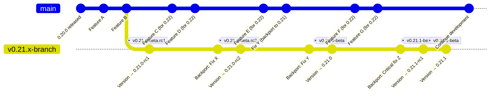
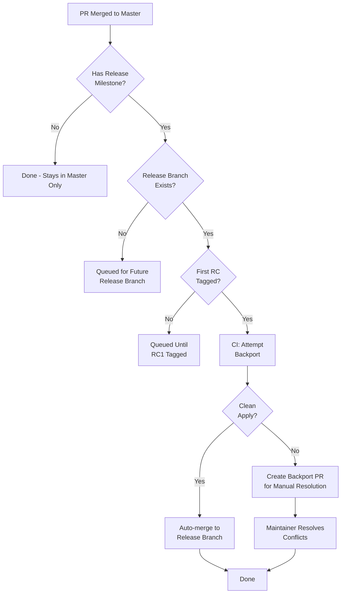
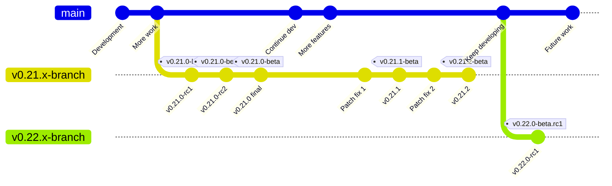

# Release Branch Management

## Overview

This document describes the branch management workflow for lnd releases. The
master branch remains open for merges at all times. Release stabilization
happens on dedicated release branches, with CI automation handling backports of
milestone-tagged changes. This approach maintains continuous development
velocity while ensuring stable releases.

## Branch Model Principles

The release process operates on four core principles:

**Master is always open.** Developers merge approved pull requests at any time
without coordination around release windows. No merge freezes occur.

**Each major release gets a dedicated branch.** When cutting a new major
version, create a release branch from master. This branch handles all release
candidates and subsequent patch releases for that version series.

**CI automation handles backports.** Pull requests merged to master and tagged
with a release milestone are automatically backported to the corresponding
release branch. The automation creates backport PRs when conflicts occur.

**Changes flow one direction only.** Changes move from master to release
branches, never in reverse. Master always represents the latest development
state.

## Master Branch

The master branch contains ongoing development work for future releases. It
never freezes for releases.

### Master Version Convention

Master uses a `.99` patch version to indicate unreleased development work. After
creating the `v0.21.x-branch` branch, update master's version in
`build/version.go` to `0.21.99-beta`. This clearly signals post-0.21 but
pre-0.22 code.

When creating the next release branch (`v0.22.x-branch`), update master to
`0.22.99-beta`. This pattern sorts correctly and is immediately recognizable as
a development build.

### Merging to Master

Developers merge to master following normal review processes. If a change should
be included in an active or upcoming release, tag the pull request with the
appropriate milestone (`v0.21.0`, `v0.21.1`, etc.). The CI automation handles
backporting after merge.

No special coordination is required. Merge whenever the PR is approved,
regardless of ongoing release activities. Initially manual input may be required
to resolve conflicts that may arise. In the future LLM bots can help alleviate
this manual work.

## Major Release Process

A major release introduces new features and represents a new minor version
(e.g., 0.21.0, 0.22.0).

### Creating the Release Branch

When ready to begin a major release:

1. Create a release branch from master: `git checkout -b v0.21.x-branch master`
2. Push the branch: `git push origin v0.21.x-branch`
3. Update `build/version.go` on the release branch to `0.21.0-beta.rc1`
4. Commit the version bump: `git commit -am "build: bump version to v0.21.0-beta.rc1"`
5. Update master's version to `0.21.99-beta` via a pull request
6. Configure branch protection for `v0.21.x-branch` on GitHub

### Release Candidate Cycle

Create the first release candidate by tagging the version bump commit:

```bash
git tag -s v0.21.0-beta.rc1 -m "lnd v0.21.0-beta.rc1"
git push origin v0.21.0-beta.rc1
```

This triggers CI to build release artifacts and Docker images.

As testing uncovers issues, develop fixes on master and tag them with the
`v0.21.0` milestone. Once merged, CI automation backports them to
`v0.21.x-branch`. If backports apply cleanly, they merge automatically. If
conflicts occur, CI creates backport PRs for manual resolution.

When ready for the next release candidate:

1. Create a pull request against the release branch to update `build/version.go` to `0.21.0-beta.rc2`
2. After merging the PR, tag the merge commit on the release branch: `git tag -s v0.21.0-beta.rc2 -m "lnd v0.21.0-beta.rc2"`
3. Push the new tag: `git push origin v0.21.0-beta.rc2`

Repeat this cycle (rc3, rc4, etc.) until the release is stable.

### Final Release

For the final release, remove the RC suffix:

1. Create a pull request against the release branch to update `build/version.go` to `0.21.0-beta`
2. After merging the PR, tag the merge commit on the release branch: `git tag -s v0.21.0-beta -m "lnd v0.21.0-beta"`
3. Push the new tag: `git push origin v0.21.0-beta`

The `v0.21.x-branch` branch now enters maintenance mode for future patch
releases.

## Minor Release Process

Minor (patch) releases fix bugs or security issues in released versions. They
reuse the existing release branch for that version series.

### Creating a Patch Release

When a critical fix is needed for version 0.21.0:

1. Develop and merge the fix to master
2. Tag the PR with the `v0.21.1` milestone
3. CI automation backports to `v0.21.x-branch`
4. Create a pull request against the release branch to update `build/version.go` to `0.21.1-beta.rc1`
5. After merging the PR, tag the merge commit: `git tag -s v0.21.1-beta.rc1 -m "lnd v0.21.1-beta.rc1"`
6. Push the new tag: `git push origin v0.21.1-beta.rc1`

If additional fixes are needed, follow the same process, incrementing through
rc2, rc3, etc.

For the final patch release:

1. Create a pull request against the release branch to update `build/version.go` to `0.21.1-beta`
2. After merging the PR, tag the merge commit: `git tag -s v0.21.1-beta -m "lnd v0.21.1-beta"`
3. Push the new tag: `git push origin v0.21.1-beta`

Multiple patch releases (0.21.1, 0.21.2, 0.21.3) can be created on the same
`v0.21.x-branch` branch throughout the version's lifetime.

## Manual Cherry-Picking

Occasionally, a fix may be needed on a release branch that doesn't apply to
master (release-specific issues, backports to older versions where master has
diverged significantly, etc.).

### When to Cherry-Pick Manually

Cherry-pick directly to a release branch when:

- The issue only exists on the release branch, not on master
- Master's code has changed significantly, making a direct backport impractical
- An urgent hotfix is needed before CI automation completes

### Cherry-Pick Process

```bash
# Switch to the release branch
git checkout v0.21.x-branch

# Cherry-pick the commit from master
git cherry-pick <commit-hash>

# If conflicts occur, resolve them and continue
git cherry-pick --continue
```

Cherry-picks still follow the normal PR flow, so a PR should be made only into
the target release branch for normal review and CI.

When manually cherry-picking, document why the normal backport flow was
bypassed. If a corresponding change is needed on master (to prevent the bug from
reappearing in future releases), ensure it's merged there as well.

## Pull Request Milestones

Developers use GitHub milestones to indicate which releases should include their
changes.

### Assigning Milestones

When opening a PR, consider whether it should be backported to an active
release:

- **Bug fixes for active releases:** Assign the major release milestone (e.g.,
`v0.21.0`)

- **Critical fixes for older versions:** Assign the patch release milestone
(e.g., `v0.20.3`)

- **Features for future releases only:** No milestone, or assign the next major
release milestone

Milestones can be assigned at any time, even after merge. CI automation
processes milestone-tagged PRs whenever they're detected.

### Multiple Milestones

If a fix needs to go into multiple release branches, assign multiple milestones
to the PR. CI handles each backport independently. For example, a security fix
might get both `v0.21.0` and `v0.20.3` milestones.

## Backport Automation

CI automation monitors merged PRs and backports milestone-tagged changes to the
appropriate release branches. This section describes the automation's behavior.
Implementation details are tracked in separate GitHub issues.

### Automatic Backports

When a PR with a release milestone merges to master:

1. CI detects the milestone and identifies the target release branch
2. CI attempts a three-way merge onto the release branch
3. If successful, CI commits directly with a reference to the original PR
4. The backported change appears in the next release candidate

Developers don't need to take any action for successful backports.

### Conflict Resolution

When a backport conflicts:

1. CI creates a new PR against the release branch
2. The PR contains the attempted backport with conflict markers
3. CI assigns the PR to the original author and notifies via GitHub mentions
4. The author or maintainers resolve conflicts and merge the backport PR

Backport PRs follow the normal review process and must pass all CI checks.

### Monitoring Backports

Track backport status through GitHub Projects or by filtering PRs. Backport PRs
include labels indicating the original PR and milestone. Successfully backported
commits reference the original PR in their commit messages.

## Version Bump Timing

Version numbers in `build/version.go` must be updated at specific points in the
release process.

**On release branches:** Update immediately before tagging. The commit that
updates the version is the commit that gets tagged. This ensures built binaries
report the correct version.

**On master:** Update when creating a new release branch. Master moves from
`0.20.99-beta` to `0.21.99-beta` when `v0.21-release` is created.

**For each RC:** Increment the RC number before tagging. `0.21.0-beta.rc1` →
`0.21.0-beta.rc2` → `0.21.0-beta.rc3`, etc.

**For final releases:** Remove the RC suffix. `0.21.0-beta.rc5` → `0.21.0-beta`.

## Branch Model Visualization

The following diagrams illustrate the branch workflow and change flow.

### Timeline View: Major Release Branch Lifecycle



After the v0.21.x-branch branch is created, both branches evolve independently.
Master continues with features for future releases while the release branch
focuses solely on stabilization and bug fixes.

### Pull Request Flow with Milestone-Based Backports



The milestone tag triggers the backport process. CI validates that the target
release branch exists and has entered the RC phase before attempting backports.

### Major vs Minor Release Branching



The v0.21.x-branch branch serves both the initial 0.21.0 release and subsequent
patch releases (0.21.1, 0.21.2). When 0.22 development is ready, a new
v0.22.x-branch branch is created, and the cycle repeats.
