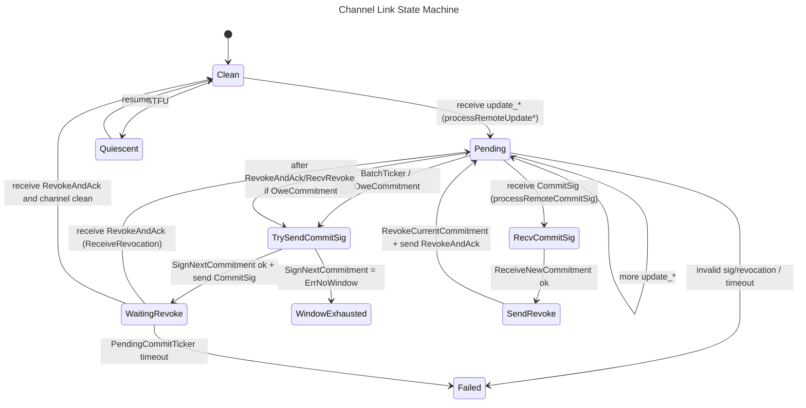

## States and Transitions

## Legend

| Term | Meaning |
|------|---------|
| `OweCommitment` | Boolean flag set on the link when there are pending local updates that have not yet been covered by a `CommitSig`. Triggers sending the next commitment signature after a `RevokeAndAck` is received or when the batch ticker fires. |
| `WindowExhausted` | `SignNextCommitment` returned `ErrNoWindow`, meaning the in-flight HTLC limit was reached. The link waits for a `RevokeAndAck` to free a slot before retrying. |
| `BatchTicker` | Periodic timer that coalesces multiple downstream updates into a single `CommitSig` round. Replaced by `noopTicker` in fuzz/test harnesses. |
| `PendingCommitTicker` | Watchdog timer that fires if a `RevokeAndAck` is not received within the allowed window, transitioning the link to `Failed`. |
