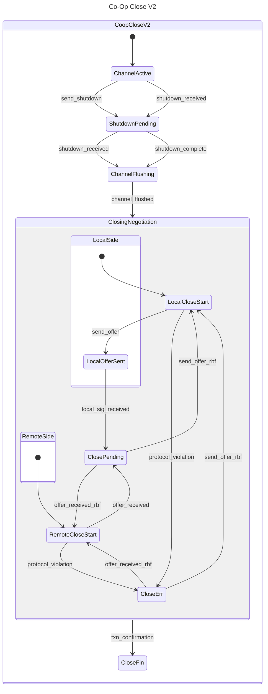

# RBF Co-op Close State Machine

## Abstract

The Lightning Network Daemon (lnd) implements a cooperative channel closing
mechanism that allows two connected peers to negotiate a mutually agreed-upon
closing transaction. This document outlines the state machine that governs the
cooperative closing process, defining the various states a channel progresses
through from active operation to final closure.

Cooperative closing is distinct from force closing in that it requires both
channel participants to agree on the final channel state and closing
transaction, resulting in lower fees and immediate fund availability compared to
unilateral channel closures.

## State Machine Overview

The cooperative closing state machine manages the lifecycle of a channel from
the moment a closing request is initiated until the closing transaction is
confirmed on the blockchain. The state transitions ensure proper negotiation of
closing fees, validation of signatures, and handling of protocol violations.

### High-Level Flow

1. An active channel receives a shutdown request (locally or remotely)
2. Channel stops accepting new HTLCs and begins flushing existing ones
3. Once flushed, nodes begin negotiating closing transaction fee
4. Upon agreement, nodes sign and broadcast the transaction
5. **RBF Iteration (optional)**: While waiting for confirmation, either node can
   propose a fee increase via Replace-By-Fee (RBF), restarting the negotiation
   process with higher fees
6. Process completes when transaction confirms on-chain

## States and Transitions

### ChannelActive

The initial state where the channel is fully operational.

- **Transitions**:
  - `send_shutdown` → `ShutdownPending` (Local node initiates closing process)
  - `shutdown_received` → `ShutdownPending` (Remote node initiates closing process)

### ShutdownPending

The channel has entered the closing process but is still processing existing HTLCs.

- **Transitions**:
  - `shutdown_received` → `ChannelFlushing` (When both parties have exchanged
  shutdown messages)

  - `shutdown_complete` → `ChannelFlushing` (When local shutdown processing is
  complete)

### ChannelFlushing

The channel no longer accepts new HTLCs and is waiting for existing HTLCs to
resolve.

- **Transitions**:
  - `channel_flushed` → `ClosingNegotiation` (When all HTLCs are settled)

### ClosingNegotiation
This composite state encompasses multiple substates related to the negotiation

of the closing transaction fee. It's divided into local and remote operation
flows.

#### LocalSide

- **LocalCloseStart**: Ready to initiate or respond to closing negotiation from
local perspective.
  - **Transitions**:
    - `send_offer` → `LocalOfferSent` (Local node proposes a closing fee)
    - `protocol_violation` → `CloseErr` (Invalid message or state detected)

- **LocalOfferSent**: Local node has sent a closing offer and is awaiting
confirmation.
  - **Transitions**:
    - `local_sig_received` → `ClosePending` (Local signature validated and
    accepted)

#### RemoteSide

- **RemoteCloseStart**: Ready to process closing negotiation initiated by remote
  node.
  - **Transitions**:
    - `offer_received` → `ClosePending` (Remote node proposal received and
    accepted)
    - `protocol_violation` → `CloseErr` (Invalid message or state detected)

#### Shared States

- **ClosePending**: Closing transaction has been negotiated, signed by both
  parties, and broadcast to the network. Waiting for on-chain confirmation.

  - **Transitions**:
    - `send_offer_rbf` → `LocalCloseStart` (Local node initiates fee increase
    via RBF)

    - `offer_received_rbf` → `RemoteCloseStart` (Remote node initiates fee
    increase via RBF)

- **CloseErr**: Error state for handling protocol violations.
  - **Transitions**:
    - `send_offer_rbf` → `LocalCloseStart` (Local node attempts recovery with
    new offer)

    - `offer_received_rbf` → `RemoteCloseStart` (Remote node attempts recovery
    with new offer)

### CloseFin

The closing transaction has been confirmed on the blockchain, and the channel is
considered closed.

- **Transitions**: None (terminal state)

## Fee Negotiation Process

Fee negotiation is a critical component of the cooperative close process. The
protocol supports Replace-By-Fee (RBF) to handle changing network fee
conditions:

1. Initial fee proposal is based on current network fee estimation
2. Either party can propose higher fees using RBF if confirmation is taking too
   long
3. Nodes can alternate proposals until reaching agreement
4. Each proposal must satisfy RBF requirements (incremental fee increase)

## Protocol Violation Handling

The `CloseErr` state provides recovery paths when protocol violations occur:

- Invalid signature formats
- Out-of-sequence messages
- Timeout violations
- Malformed closing transactions

Recovery typically involves restarting the negotiation with a new closing offer.

### RBF Nonce Flow Example

Here's how nonces flow through an RBF cooperative close with taproot:

1. **Initial Shutdown**:
   - Alice sends `shutdown` with her closee nonce `NA`
   - Bob sends `shutdown` with his closee nonce `NB`

2. **First Close Attempt** (Alice as closer):
   - Alice sends `closing_complete`:
     - Uses Bob's nonce NB (from shutdown) to create her closer signature
     - Includes `PartialSigWithNonce` with her next closee nonce `NA2`
   - Bob sends `closing_sig`:
     - Uses Alice's nonce NA (from shutdown) to create his closee signature
     - Includes `NextCloseeNonce` with his next closee nonce `NB2`

3. **RBF Iteration** (Bob as closer):
   - Bob sends `closing_complete`:
     - Uses Alice's nonce NA2 (from previous `PartialSigWithNonce`) to create
       his closer signature
     - Includes `PartialSigWithNonce` with his next closee nonce `NB3`
   - Alice sends `closing_sig`:
     - Uses Bob's nonce NB2 (from previous `NextCloseeNonce`) to create her
       closee signature
     - Includes `NextCloseeNonce` with her next closee nonce `NA3`

The pattern continues with each party using the nonce they received in the
previous round.

## Example Scenarios

### Standard Cooperative Close

1. Local node initiates closing: `ChannelActive` → `ShutdownPending` (via
   `send_shutdown`)

2. Remote acknowledges: `ShutdownPending` → `ChannelFlushing` (via
   `shutdown_received`)

3. HTLCs resolve: `ChannelFlushing` → `ClosingNegotiation` (via
   `channel_flushed`)

4. Local proposes fee: `LocalCloseStart` → `LocalOfferSent` (via `send_offer`)

5. Local signature validated: `LocalOfferSent` → `ClosePending` (via
   `local_sig_received`)

6. Transaction confirms: `ClosePending` → `CloseFin` (via `txn_confirmation`)

### Fee Bump Due to Network Congestion

1. ... (steps 1-5 same as above)
2. While in `ClosePending`, network fees increase

3. Local node initiates RBF: `ClosePending` → `LocalCloseStart` (via
   `send_offer_rbf`)

4. New proposal cycle begins with higher fees

5. When agreement is reached on new fees: `ClosePending` → `CloseFin` (via
   `txn_confirmation`)

## Taproot Channel Support

### MuSig2 Nonce Handling

For taproot channels, the cooperative close process requires coordination for
MuSig2 signature creation using a JIT (Just-In-Time) nonce pattern:

#### Nonce Exchange During Shutdown

For taproot channels using the modern RBF cooperative close flow:
- The `shutdown` message includes a single nonce field:
  - `shutdown_nonce` (TLV type 8): The sender's "closee nonce" used when they
  send `closing_sig`
- This simplified approach works because nonces are sent JIT with signatures

#### JIT (Just-In-Time) Nonce Pattern

The protocol uses an asymmetric signature pattern for taproot channels that
optimizes nonce delivery:

**Asymmetric Roles**:
- **Closer**: The party proposing a fee (sends `closing_complete`)
- **Closee**: The party accepting the fee (sends `closing_sig`)

**ClosingComplete (from Closer)**:
- Uses `PartialSigWithNonce` (98 bytes total):
  - The partial signature (32 bytes)
  - The sender's next closee nonce (66 bytes)
- Bundles the nonce because the closee hasn't seen it yet
- TLV types 5, 6, 7 (distinct from non-taproot types 1, 2, 3)

**ClosingSig (from Closee)**:
- Uses `PartialSig` (32 bytes) + separate `NextCloseeNonce`:
  - The partial signature in TLV types 5, 6, 7
  - The next closee nonce in TLV type 22 (66 bytes)
- Separates the nonce because the closer already knows the current nonce from
  shutdown or previous `PartialSigWithNonce`

This asymmetric pattern minimizes redundancy while ensuring both parties always
have the nonces they need for signing.

#### Nonce State Management

The state machine maintains a simplified `NonceState` structure with only 2 fields:
- `LocalCloseeNonce`: Our closee nonce sent in our shutdown message
- `RemoteCloseeNonce`: The peer's closee nonce from their shutdown message

The JIT pattern eliminates complex nonce rotation:
- New nonces arrive with signatures, not pre-generated
- Remote nonces are updated automatically from `PartialSigWithNonce` in
  `closing_complete`
- Local nonces are generated on-demand when creating signatures

### Wire Message Extensions

The following messages have been extended with optional TLV fields for taproot:

**shutdown**:
- Type 8: `shutdown_nonce` - Sender's closee nonce for cooperative close signing

**closing_complete**:
- Types 5, 6, 7: `PartialSigWithNonce` - Partial signature with embedded next closee nonce
  - Type 5: `closer_no_closee` (closer has output, closee is dust)
  - Type 6: `no_closer_closee` (closer is dust, closee has output)
  - Type 7: `closer_and_closee` (both have outputs)

**closing_sig**:
- Types 5, 6, 7: `PartialSig` - Just the partial signature (32 bytes)
  - Same TLV type meanings as above
- Type 22: `NextCloseeNonce` - Next closee nonce for RBF iterations (66 bytes)

### Validation Requirements

For taproot channels:
- Shutdown messages MUST include the sender's closee nonce
- ClosingComplete messages MUST use PartialSigWithNonce (includes next nonce
  bundled with signature)
- ClosingSig messages MUST use PartialSig with separate NextCloseeNonce field
- Terminal offers (final RBF attempts) MAY omit next nonces to signal finality

### Implementation Notes for Nonce Handling

The MuSig2 session's `InitRemoteNonce` method is called at specific times
depending on our role:

**When we're the Closer (LocalMusigSession)**:
1. During `ShutdownReceived`: Store their closee nonce in `NonceState.RemoteCloseeNonce`
2. During `SendOfferEvent`: Call `initLocalMusigCloseeNonce` with stored closee nonce
3. During `LocalSigReceived` (when receiving their ClosingSig):
   - Use the CURRENT `NonceState.RemoteCloseeNonce` for signature verification
   - AFTER verification succeeds, update with `NextCloseeNonce` for future RBF

**When we're the Closee (RemoteMusigSession)**:
1. Our closee nonce was sent in our `shutdown` message
2. During `OfferReceivedEvent`: Receive their JIT closer nonce in `ClosingComplete`
3. Call `initRemoteMusigCloserNonce` with their closer nonce before signing

**Critical Ordering Requirement**: The `NextCloseeNonce` from `ClosingSig` must NOT
be applied until AFTER the current signature verification completes. Premature
rotation causes signature combination failure.

The nonce from `PartialSigWithNonce` in `closing_complete` is stored but not
immediately used with `InitRemoteNonce` - it's used when we need to sign as the
closee in the next round.

### Helper Function Reference

The following helper functions manage nonce initialization:

| Function | Session | Sets | Called When |
|----------|---------|------|-------------|
| `initLocalMusigCloseeNonce` | LocalMusigSession | Remote's closee nonce | We're closer, preparing to sign |
| `initRemoteMusigCloserNonce` | RemoteMusigSession | Remote's closer nonce | We're closee, received ClosingComplete |

Note: The function names now correctly reflect what nonce is being set:
- `initLocalMusigCloseeNonce`: Sets remote's **closee** nonce (from their shutdown)
- `initRemoteMusigCloserNonce`: Sets remote's **closer** nonce (from their JIT nonce in ClosingComplete)

## Implementation Notes

- This state machine is implemented in `rbf_coop_transitions.go` and
  `rbf_coop_states.go` within the `lnwallet/chancloser` package
- The `MusigChanCloser` adapter in `peer/musig_chan_closer.go` implements the
  `MusigSession` interface for managing MuSig2 nonces
- State transitions are logged at the debug level
- The `ChanCloser` interface manages the state machine execution
- Taproot support requires the `MusigSession` interface for nonce coordination
