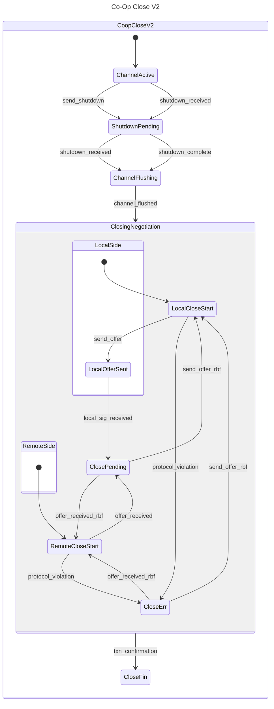

# RBF Co-op Close State Machine

## Abstract

The Lightning Network Daemon (lnd) implements a cooperative channel closing
mechanism that allows two connected peers to negotiate a mutually agreed-upon
closing transaction. This document outlines the state machine that governs the
cooperative closing process, defining the various states a channel progresses
through from active operation to final closure.

Cooperative closing is distinct from force closing in that it requires both
channel participants to agree on the final channel state and closing
transaction, resulting in lower fees and immediate fund availability compared to
unilateral channel closures.

## State Machine Overview

The cooperative closing state machine manages the lifecycle of a channel from
the moment a closing request is initiated until the closing transaction is
confirmed on the blockchain. The state transitions ensure proper negotiation of
closing fees, validation of signatures, and handling of protocol violations.

### High-Level Flow

1. An active channel receives a shutdown request (locally or remotely)
2. Channel stops accepting new HTLCs and begins flushing existing ones
3. Once flushed, nodes begin negotiating closing transaction fee
4. Upon agreement, nodes sign and broadcast the transaction
5. **RBF Iteration (optional)**: While waiting for confirmation, either node can
   propose a fee increase via Replace-By-Fee (RBF), restarting the negotiation
   process with higher fees
6. Process completes when transaction confirms on-chain

## States and Transitions

### ChannelActive

The initial state where the channel is fully operational.

- **Transitions**:
  - `send_shutdown` → `ShutdownPending` (Local node initiates closing process)
  - `shutdown_received` → `ShutdownPending` (Remote node initiates closing process)

### ShutdownPending

The channel has entered the closing process but is still processing existing HTLCs.

- **Transitions**:
  - `shutdown_received` → `ChannelFlushing` (When both parties have exchanged
  shutdown messages)

  - `shutdown_complete` → `ChannelFlushing` (When local shutdown processing is
  complete)

### ChannelFlushing

The channel no longer accepts new HTLCs and is waiting for existing HTLCs to
resolve.

- **Transitions**:
  - `channel_flushed` → `ClosingNegotiation` (When all HTLCs are settled)

### ClosingNegotiation
This composite state encompasses multiple substates related to the negotiation

of the closing transaction fee. It's divided into local and remote operation
flows.

#### LocalSide

- **LocalCloseStart**: Ready to initiate or respond to closing negotiation from
local perspective.
  - **Transitions**:
    - `send_offer` → `LocalOfferSent` (Local node proposes a closing fee)
    - `protocol_violation` → `CloseErr` (Invalid message or state detected)

- **LocalOfferSent**: Local node has sent a closing offer and is awaiting
confirmation.
  - **Transitions**:
    - `local_sig_received` → `ClosePending` (Local signature validated and
    accepted)

#### RemoteSide

- **RemoteCloseStart**: Ready to process closing negotiation initiated by remote
  node.
  - **Transitions**:
    - `offer_received` → `ClosePending` (Remote node proposal received and
    accepted)
    - `protocol_violation` → `CloseErr` (Invalid message or state detected)

#### Shared States

- **ClosePending**: Closing transaction has been negotiated, signed by both
  parties, and broadcast to the network. Waiting for on-chain confirmation.

  - **Transitions**:
    - `send_offer_rbf` → `LocalCloseStart` (Local node initiates fee increase
    via RBF)

    - `offer_received_rbf` → `RemoteCloseStart` (Remote node initiates fee
    increase via RBF)

- **CloseErr**: Error state for handling protocol violations.
  - **Transitions**:
    - `send_offer_rbf` → `LocalCloseStart` (Local node attempts recovery with
    new offer)

    - `offer_received_rbf` → `RemoteCloseStart` (Remote node attempts recovery
    with new offer)

### CloseFin

The closing transaction has been confirmed on the blockchain, and the channel is
considered closed.

- **Transitions**: None (terminal state)

## Fee Negotiation Process

Fee negotiation is a critical component of the cooperative close process. The
protocol supports Replace-By-Fee (RBF) to handle changing network fee
conditions:

1. Initial fee proposal is based on current network fee estimation
2. Either party can propose higher fees using RBF if confirmation is taking too
   long
3. Nodes can alternate proposals until reaching agreement
4. Each proposal must satisfy RBF requirements (incremental fee increase)

## Protocol Violation Handling

The `CloseErr` state provides recovery paths when protocol violations occur:

- Invalid signature formats
- Out-of-sequence messages
- Timeout violations
- Malformed closing transactions

Recovery typically involves restarting the negotiation with a new closing offer.

## Example Scenarios

### Standard Cooperative Close

1. Local node initiates closing: `ChannelActive` → `ShutdownPending` (via
   `send_shutdown`)

2. Remote acknowledges: `ShutdownPending` → `ChannelFlushing` (via
   `shutdown_received`)

3. HTLCs resolve: `ChannelFlushing` → `ClosingNegotiation` (via
   `channel_flushed`)

4. Local proposes fee: `LocalCloseStart` → `LocalOfferSent` (via `send_offer`)

5. Local signature validated: `LocalOfferSent` → `ClosePending` (via
   `local_sig_received`)

6. Transaction confirms: `ClosePending` → `CloseFin` (via `txn_confirmation`)

### Fee Bump Due to Network Congestion

1. ... (steps 1-5 same as above)
2. While in `ClosePending`, network fees increase

3. Local node initiates RBF: `ClosePending` → `LocalCloseStart` (via
   `send_offer_rbf`)

4. New proposal cycle begins with higher fees

5. When agreement is reached on new fees: `ClosePending` → `CloseFin` (via
   `txn_confirmation`)

## Implementation Notes

- This state machine is implemented in the `peer.go` and `channel.go` files
within the lnd codebase
- State transitions are logged at the debug level
- The `ChanCloser` interface manages the state machine execution
