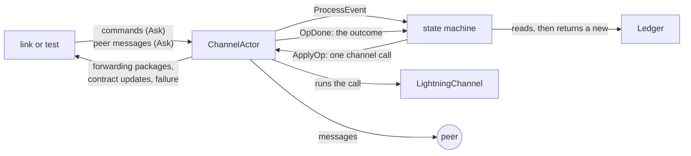
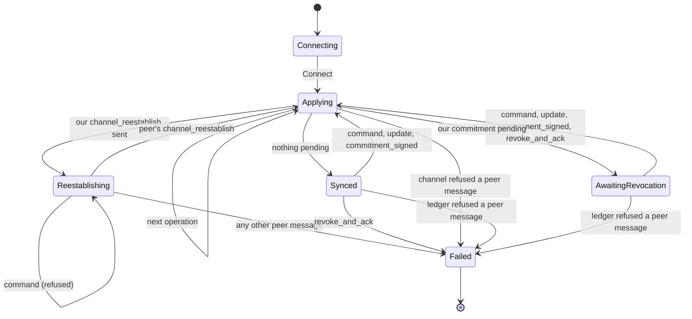
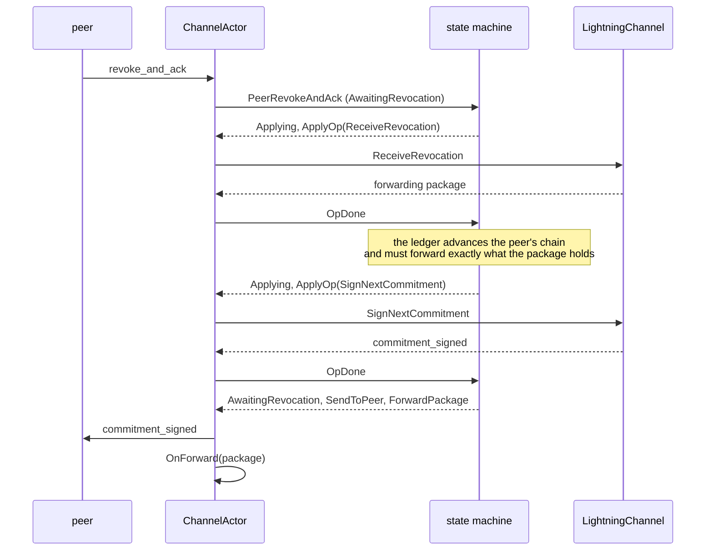

# chanfsm

Package `chanfsm` runs a channel's BOLT 2 commitment protocol, the exchange of
updates, `commitment_signed`, `revoke_and_ack` and `channel_reestablish`, as a
pure state machine inside an actor. The state machine decides whether each
command and peer message is allowed before anything touches the
`LightningChannel`, so a message the protocol doesn't allow never reaches the
channel.

The motivating bug was a `revoke_and_ack` that arrives when we have no
commitment outstanding for the peer. The old `ReceiveRevocation` accepted its
secret, rotated the peer's revocation points and consumed a shachain slot
before its database write failed, which left the in-memory channel unable to
sign a valid commitment again. A guard in `ReceiveRevocation` that checks
`hasUnackedCommitment` first closes that one path. This package removes the
whole class of bug: there is no transition that hands a revocation to the
channel unless one is expected.

The actor is not wired into the link yet. It drives a `LightningChannel` the
same way the link does, and the tests compare the two, message for message.

## How it is built

The package has three layers, and each one only knows about the layer below
it.



The **ledger** (`Ledger`, `ledger.go`) is a value model of the protocol state:
both update logs and both commitment chains, with no amounts, scripts or
signatures. Every method returns a new ledger, so the state machine can work
out what an event would do without changing anything.

The **state machine** (`states.go`) is written with `protofsm`. A state is a
Go value holding a ledger, and its `ProcessEvent` returns the next state plus
an outbox of side effects as plain values. A transition never calls the
channel or sends a message itself. When the ledger allows an event, the
transition emits an `ApplyOp` naming the one channel call to make.

The **actor** (`ChannelActor`, `actor.go`) owns the state machine and the
channel, and is the only goroutine that touches either. It runs each
`ApplyOp` against the channel and feeds the outcome straight back as an
`OpDone` event before it reads its mailbox again. Messages, forwarding
packages and failures go out only after the last operation of the event, in
the order the machine emitted them, so a callback can't re-enter the actor
halfway through.

## The ledger

Each party has an update log, and each entry has a log index that both sides
agree on. Each party also has a commitment chain: its current commitment
(the tail) and, if the other side signed a newer one that the owner hasn't
revoked the tail for yet, that pending commitment. A commitment includes
each log's entries below an index, so a `Commit` is just a height and two
indexes.

For each chain, an entry records the height of the first commitment that
included it, or zero. An update is **irrevocably committed** (locked in, in
lnd's terms) once both current commitments include it. A revocation forwards
a peer update exactly when it makes the update locked in: the new current
commitment of the peer's is the first to include it, and our current
commitment already does. That rule is freshness, and it is why the ledger
never forwards an update twice and needs no `isForwarded` flag.

The ledger mirrors lnd, including fee update coalescing (a new fee update
replaces one no commitment includes yet) and log compaction after each
revocation. It is stricter than lnd in the places BOLT 2 is:

| Event | Ledger rule | Old code path |
|---|---|---|
| `revoke_and_ack` with nothing pending | refused before the channel sees it | applied, then failed at the database write |
| Peer removes an HTLC our current commitment doesn't include | refused on arrival | accepted, then failed at the next `commitment_signed` |
| We remove an HTLC that isn't irrevocably committed | refused on arrival | accepted |

## The state machine



Once the channel is reestablished, its resting state is a function of the
ledger: `AwaitingRevocation` when the peer holds a commitment we signed and
hasn't revoked its predecessor, `Synced` otherwise. `Synced` has no
transition that authorizes `ReceiveRevocation`, so a premature revocation
fails the channel without the channel ever seeing it.

`Applying` exists only within the handling of one event, between an
authorized operation and its outcome. The actor never rests there: if it
ever did, the actor fails the channel. Some events chain operations. An
accepted `commitment_signed` is followed by our revocation, and an accepted
revocation, in either direction, is followed by a signature if we owe the
peer a commitment and none is outstanding.

A command the ledger refuses, such as adding an HTLC when the peer holds no
revocation window for us, gets an error reply and leaves the state alone. A
peer message the ledger refuses fails the channel, and so does a peer
message the channel refuses after the ledger allowed it. In that second case
the ledger is not rolled back, since the channel may have changed before it
refused. `Failed` answers every later command with `ErrChannelFailed` and
drops every peer message.

`ChannelTransitions` in `table.go` lists every transition, and the tests
fail on any transition it doesn't list. `ChannelTransitions.RenderMarkdown()`
prints it as a table.

## One event, step by step

Here is the actor handling an accepted `revoke_and_ack` while it owes the
peer a commitment:



Two checks keep the ledger honest. After a revocation, the forwarding
package the channel built must hold exactly the updates the ledger forwards;
any difference fails the channel and forwards nothing. With `CheckLedger`
set, the actor also compares the ledger with the channel's
`ProtocolSnapshot` after every operation.

## Restart and channel_reestablish

Every connection starts from the channel as lnd loads it from disk. lnd
persists less than it holds in memory:

| Kept across a restart | Lost |
|---|---|
| Both current commitments | Our new local commitment, if we hadn't revoked the previous one |
| The pending remote commitment, with our updates it added | Updates no persisted commitment covers yet |
| The peer's updates we acked but haven't signed for | |
| Our removals and fee updates the peer acked but hasn't signed for | |

`Ledger.Restore` computes exactly that from an in-memory ledger, and the
tests check it against a real reload. The restored value is a
`RestoredLedger`, a separate type whose local side is a single commitment,
since lnd never persists a local commitment it hasn't revoked the previous
one for. A `RestoredLedger` can't run the protocol: its only way back to a
`Ledger` is `Reestablish`, which answers the peer's `channel_reestablish`.

The actor starts in `Connecting`. Its first event, sent by `Start`, sends our
`channel_reestablish`, and the machine waits in `Reestablishing` for the
peer's. Until it arrives, commands are refused with `ErrNotReestablished`,
and any other peer message fails the channel, as BOLT 2 requires.

`Reestablish` compares the peer's two heights with ours and returns a
`SyncPlan`, which mirrors lnd's `ProcessChanSyncMsg`:

| Plan | When | We send |
|---|---|---|
| `InSync` | The peer has everything we sent | nothing |
| `ResendRevocation` | The peer missed our last `revoke_and_ack` | it again, then, with `SignNew`, a new `commitment_signed` if we owe one |
| `ResendCommitment` | The peer missed the commitment we signed | its updates in log order, then the `commitment_signed` |
| `ResendBoth` | The peer missed both | both, in the order we first sent them (`LastWasRevoke`) |

`SyncPlan` is a sealed sum of those four, so a plan lnd can't produce, such
as resending a pending commitment and also signing a new one, can't be
written down. The channel's retransmission must match the plan message for
message, each resent update naming the same HTLC, or the channel fails and
nothing is sent. If the peer claims our commitment is ahead of ours, the
channel checks the secret the peer sends, and the channel fails either way.
A peer that lost state it acknowledged, or that asks for a commitment we
never signed, fails the channel without the channel seeing the message.

## Threat model

Every input here comes from the peer, so each one has a bounded effect.

| A peer can | What happens |
|---|---|
| Send `revoke_and_ack` with nothing pending | The channel fails; the channel's state is untouched |
| Send a revocation whose secret is wrong | The channel refuses it, and the channel fails |
| Add an HTLC out of ID order | The ledger refuses it, and the channel fails |
| Remove an unknown HTLC, one already removed, or one our commitment lacks | The ledger refuses it on arrival, and the channel fails |
| Send `update_fail_malformed_htlc` without the BADONION bit | Refused, and the channel fails |
| Send `update_fee` when it isn't the initiator | Refused, and the channel fails |
| Send a bad `commitment_signed` | The channel refuses it, and the channel fails without a rollback |
| Talk before `channel_reestablish`, or send a second one | The channel fails |
| Forge a `channel_reestablish` | Heights we can't answer fail the channel without touching it; a data loss claim goes to the channel to check its secret, and fails the channel either way |
| Flood us with messages | `ReceiveMessage` waits until the actor has handled each message, so the peer's read loop is paced by the actor; the mailbox holds `DefaultMailboxSize` (64) messages |

Amounts, reserves, dust and fee rates are the channel's to check, and the
machine fails the channel whenever the channel refuses a peer update.

## Changes from the old code path

On every step both implementations accept, the wire messages, forwarding
packages and channel state are identical. The differences are the three
stricter rules in the ledger table above, which an honest peer never
triggers, and two latency differences:

1. **When we sign.** The link's commit ticker signs when the peer's newest
   commitment lacks some of our updates. The machine signs whenever we owe
   a commitment, which also covers peer updates we acknowledged.
2. **Exit-hop settles.** After a revocation, the link processes the
   forwarding package before it signs, so settles for payments to us ride
   that commitment. The actor signs first and dispatches the package after
   its operation loop, so those settles wait for the next commitment. That
   ordering is what keeps a forwarding callback from re-entering the actor.

Building this package also found a bug in lnd: `AdvanceCommitChainTail`
didn't persist our updates the peer acknowledged before we ever revoked a
commitment, so a restart in that window could lose a fee update and force
close the channel. The fix sits at the bottom of this stack and in its own
PR.

## What's left for the link

Wiring the actor into the link is the next step, and two things need a
decision first. The peer sets up a reconnecting taproot channel's nonces
before the link starts, while `opProcessSync` relies on
`ProcessChanSyncMsg` doing it. And a peer data loss or an unreachable height
surfaces as this package's `ErrRemoteDataLoss` or `ErrCannotSync`, not lnd's
`ErrCommitSyncRemoteDataLoss`, since the channel never sees the message.
The link's own checks (fee exposure, dust limits, holding updates,
quiescence) stay in the link.

## Testing

The tests come in layers, from single rules up to the whole protocol.

**Unit tests** (`ledger_test.go`, `table_test.go`) pin each ledger rule and
each gate: a revocation needs a pending commitment, removals follow BOLT 2's
sender and receiver rules, only the initiator updates the fee, a failed
channel refuses everything, and nothing but `channel_reestablish` moves a
reestablishing channel on.

**The mirror test** (`TestLedgerMirrorsChannel`) runs random honest
executions between two `LightningChannel`s driven the way the link drives
them, for tweakless, anchor and taproot channels. After every step it checks
each side's ledger against its channel's `ProtocolSnapshot` and forwarding
packages. It also reloads both channels from disk mid protocol, checks each
restored ledger against the reloaded channel exactly, and checks every
retransmission against the plan. That restart step is what found the
channeldb bug.

**The differential test** (`TestDifferentialActorVsLegacy`) builds two
identical worlds from one seed, one driving the channel as the link does
and one through the actor, and applies every step to both: commands,
deliveries, reconnections, and a byzantine peer's injections. The worlds
must agree byte for byte, except for the three named stricter rules, and
the test fails if any rule is never reached.

**Deterministic simulation** (`TestDSTChannel`) runs two real actors over
real channels inside a `testing/synctest` bubble, with disconnections and
crashes. A crash lands a write on disk but loses its result, as if the node
died right after committing. After healing, it checks that nothing failed
except by a crash, both sides agree, and every HTLC and every removal was
forwarded exactly once across all the forwarding packages on disk.
`TestDSTDeterminism` requires the same transcript for the same seed.

To run the randomized tests longer, or to replay a failure:

```sh
go test ./lnwallet/chanfsm/ -run TestDSTChannel -rapid.checks=2000
go test ./lnwallet/chanfsm/ -run TestDSTChannel -rapid.failfile=testdata/rapid/...
go test ./lnwallet/chanfsm/ -run '^$' -fuzz FuzzDSTChannel
```

The package path must come before rapid's flags, since `go test` stops
reading packages at the first flag it doesn't know.
