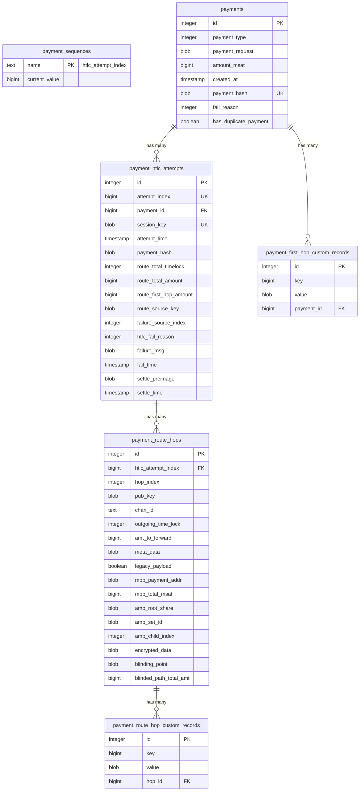
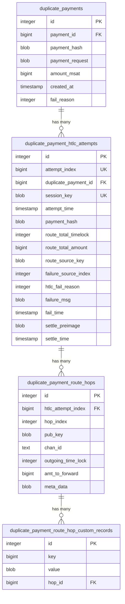

# Payment SQL Schema LND

---

## Overview

This Proof of Concept enables the LND payment subsystem to run not only via the traditional key-value store but now supports a native SQL schema implementation. This enhancement provides structured data storage and querying capabilities for payment operations. **Note:** The code is not yet optimized to run solely on SQL and currently maintains compatibility with the existing key-value store approach.

---

## Project Architecture Changes

Previously, the payment logic was distributed across multiple packages throughout the LND codebase, creating a fragmented architecture that made maintenance and development challenging. The payment functionality was scattered across the `channeldb` package (which handled database operations), the `router` package (containing core payment routing logic), and parts of the `rpcserver.go` file within the main `lnd` package.

This POC represents a significant architectural improvement by consolidating all payment database logic into a dedicated, self-contained package. The new `payments/db` package serves as the centralized location for all payment-related database operations, providing a clean abstraction layer that supports both the existing key-value store and the new SQL backend implementations.

### Key Changes:
- **Centralized payment database logic** into the new `payments/db` package
- **Abstracted data layer** supporting both key-value store and SQL backends
- **Improved code organization** by removing scattered payment logic across multiple packages
- **Enhanced maintainability** through dedicated package structure

### Current State and Future Refactoring

It's important to note that the `payments` package is currently minimal, containing only the `db` subpackage. The core payment logic, including the `control_tower` and `payment_life_cycle` components, still resides in the `routing` package (particularly within the `ChannelRouter` type). This represents the current scope of this POC - focusing specifically on the database layer abstraction.

Future PR series will address the remaining payment logic refactoring, moving components like the control tower and payment lifecycle management into the `payments` package. This will complete the architectural vision of having a fully self-contained payments subsystem, making the codebase more modular and maintainable.

---

## Interface Design and Implementation

The foundation of this refactoring was the transformation of the monolithic `payment_control.go` file into a well-structured interface hierarchy within the `payments/db` package. The original payment control logic was decomposed into smaller, focused interfaces that handle specific database operations, promoting better separation of concerns and testability.

### Main Payment Database Interface

The primary interface combines three specialized sub-interfaces:

```go
// PaymentDB is the interface that represents the underlying payments database.
type PaymentDB interface {
    PaymentReader
    PaymentWriter
    Sequencer
}
```

### PaymentReader Interface

Handles all read operations for payment queries:

```go
// PaymentReader is the interface that reads from the payments database.
type PaymentReader interface {
    // QueryPayments queries the payments database and should support
    // pagination.
    QueryPayments(ctx context.Context, query Query) (Response, error)

    // FetchPayment fetches the payment corresponding to the given payment
    // hash.
    FetchPayment(paymentHash lntypes.Hash) (*MPPayment, error)

    // FetchInFlightPayments returns all payments with status InFlight.
    FetchInFlightPayments() ([]*MPPayment, error)
}
```

### PaymentWriter Interface

Manages write operations and includes payment control:

```go
// PaymentWriter is the interface that writes to the payments database.
type PaymentWriter interface {
    // DeletePayment deletes a payment from the DB given its payment hash.
    DeletePayment(paymentHash lntypes.Hash, failedAttemptsOnly bool) error

    // DeletePayments deletes all payments from the DB given the specified
    // flags.
    DeletePayments(failedOnly, failedAttemptsOnly bool) (int, error)

    // DeleteFailedAttempts removes all failed HTLCs from the db.
    DeleteFailedAttempts(lntypes.Hash) error

    PaymentControl
}
```

### PaymentControl Interface

Controls the payment lifecycle with atomic operations:

```go
// PaymentControl is the interface that controls the payment lifecycle.
type PaymentControl interface {
    // InitPayment checks that no succeeded payment exist for this payment
    // hash.
    InitPayment(lntypes.Hash, *PaymentCreationInfo) error

    // RegisterAttempt atomically records the provided HTLCAttemptInfo.
    RegisterAttempt(lntypes.Hash, *HTLCAttemptInfo) (*MPPayment, error)

    // SettleAttempt marks the given attempt settled with the preimage.
    SettleAttempt(lntypes.Hash, uint64, *HTLCSettleInfo) (*MPPayment, error)

    // FailAttempt marks the given payment attempt failed.
    FailAttempt(lntypes.Hash, uint64, *HTLCFailInfo) (*MPPayment, error)

    // Fail transitions a payment into the Failed state.
    Fail(lntypes.Hash, FailureReason) (*MPPayment, error)
}
```

### Benefits of Interface Consolidation

This interface design addresses a significant architectural issue where payment database operations were previously scattered across multiple locations. Before this refactoring, parts of the database operations lived in the `payment_control.go` file, while other operations like deleting or fetching payments were spread throughout different areas of the `channeldb` package.

By consolidating all payment database operations under a single interface hierarchy, the codebase now has:

- **Centralized operation management**: All payment database operations are now accessible through one cohesive interface
- **Improved maintainability**: Developers no longer need to hunt through multiple files to understand payment database functionality
- **Better testability**: The interface abstraction makes it easier to mock and test payment database operations
- **Cleaner separation of concerns**: Database operations are clearly separated from business logic

### Legacy Code Preservation

The existing key-value store logic has been carefully preserved and moved to `kvstore.go` within the `payments/db` package. This ensures backward compatibility while providing the foundation for the new SQL implementation to coexist with the traditional storage approach.

---

## Test Architecture and Backend Compatibility

One of the significant advantages of this interface-based approach is the ability to reuse test cases across both storage backends. The majority of payment functionality tests have been consolidated into the `payments_test.go` file, where they can be executed against both the key-value store and SQL implementations, ensuring consistent behavior across backends.

### Shared Test Coverage

The unified test suite in `payments_test.go` covers:
- Payment creation and lifecycle management
- HTLC attempt registration and settlement
- Payment state transitions
- Query operations and pagination
- Error handling and edge cases

### Backend-Specific Testing

However, certain functionality requires backend-specific testing due to implementation differences:

- **Key-Value Store Tests** (`kvstore_test.go`): Tests specific to the traditional key-value approach, particularly focusing on duplicate payment logic where payments were historically organized in subbuckets
- **SQL Store Tests** (`sql_store_test.go`): Backend-specific tests for the SQL implementation - currently incomplete as proper testing will be implemented after finalizing the duplicate payments logic design

**Note**: Two key areas represent architectural differences between the backends that require specific testing approaches:

1. **Duplicate Payment Logic**: The key-value store traditionally handled these through subbucket organization, while the SQL implementation will require a different approach
2. **Sequence Number Handling**: The sequence number generation and management differs between backends, requiring dedicated SQL-specific tests that are not yet present

Comprehensive testing for both the SQL duplicate payment logic and sequence number handling will be addressed in future detailed chapters once the implementation strategies are finalized.

---

## SQL Implementation Details

This chapter provides a comprehensive overview of the SQL backend implementation, including the database schema design, table structures, and query patterns used to support the payment subsystem. The SQL implementation aims to provide structured data storage with improved query capabilities while maintaining compatibility with the existing payment interface.

### Database Schema Design

The SQL payment schema consists of several interconnected tables that normalize payment data for efficient storage and querying. The schema is designed to support both current payment types and legacy duplicate payments, with proper indexing for performance optimization.

#### Main Payment Tables



#### Duplicate Payment Tables

The schema includes separate tables for handling legacy duplicate payments:



#### Key Schema Features

- **Sequence Management**: `payment_sequences` table tracks HTLC attempt indexes
- **Payment Uniqueness**: Main `payments` table enforces unique payment hashes
- **HTLC Lifecycle**: Mutual exclusivity constraints ensure HTLCs can't be both settled and failed
- **Route Tracking**: Detailed hop information with support for MPP, AMP, and blinded paths
- **Custom Records**: Flexible TLV record storage for both first hops and route hops
- **Legacy Support**: Separate duplicate payment tables for historical data migration

#### Design Rationale

**HTLC Attempt Sequence Management**: The `payment_sequences` table serves a critical role in maintaining globally unique HTLC attempt indexes. Unlike traditional auto-incrementing primary keys, these sequence numbers cannot be reused even when HTLC attempts are deleted from the database. This design decision is crucial because:

- **Failed attempts may be deleted** from the database for cleanup purposes
- **The attempt index is used as the CircuitKey** in the HTLC switch's circuit map
- **Reusing indexes would cause circuit map collisions**, leading to incorrect routing behavior and potential payment failures
- **The sequence must always be increasing** to ensure unique identification across the entire payment lifecycle

This approach separates the database-level primary key (`id`) from the business-logic-level sequence number (`attempt_index`), ensuring data integrity while maintaining compatibility with the existing HTLC switch architecture.

**Foreign Key Design Decision**: As a consequence of this sequence management approach, all tables that relate to HTLC attempts use the `attempt_index` as their foreign key reference rather than the traditional `id` primary key. This design choice ensures:

- **Consistent referential integrity** even when attempt records are deleted and recreated
- **Direct correlation** between database relationships and business logic identifiers
- **Simplified query patterns** that align with the existing codebase expectations

This design decision is open for discussion as there are trade-offs between using `attempt_index` vs `id` as foreign keys. Regardless of the chosen approach, all related tables utilize SQL's `ON DELETE CASCADE` directive to maintain referential integrity and ensure clean deletion of associated records.

**Migration Considerations**: The migration from key-value store to SQL backend must carefully preserve attempt indexes to maintain compatibility with in-flight payments. Consider the scenario where:

- **Payments are still unresolved** in the HTLC switch when migration occurs
- **The switch holds CircuitKeys** that correspond to existing attempt indexes
- **New payment attempts** must continue the sequence from the correct point

The migration process must therefore:
- **Extract the exact attempt_index values** from the existing key-value store
- **Preserve these indexes** in the new SQL schema without modification
- **Initialize the sequence counter** to continue from the highest existing attempt_index
- **Ensure no gaps or duplicates** that could cause switch conflicts

**Note**: The payment `id` values will not be preserved during migration and will be assigned new auto-incremented values in the SQL schema. This is acceptable because the payment `id` is purely an internal database identifier that is not referenced by any other subsystem outside the payment database layer.

Failure to properly migrate these indexes could result in circuit map collisions for subsequent payments, leading to routing failures and payment system instability.

**Route Table Design Decision**: The schema does not include a separate route table because each HTLC attempt can only have exactly one route. This one-to-one relationship makes a separate table unnecessary and would only add complexity without providing benefits. Instead, route-level information is stored directly in the `payment_htlc_attempts` table.

**Payment Type Handling**: The schema accommodates different payment types (MPP, AMP, blinded, legacy) through nullable fields in the route hop tables rather than separate tables for each type. This design choice results in:

- **Flexible schema structure** that can handle all payment types in a unified manner
- **Nullable fields** in `payment_route_hops` for type-specific data (e.g., `mpp_payment_addr`, `amp_root_share`, `encrypted_data`)
- **Simplified queries** that don't require complex joins across multiple payment-type tables

The `payment_type` field in the `payments` table is currently defined but not yet utilized in the implementation. This field is intended to enable quick identification of payment types without needing to examine the nullable fields in related tables. The usage and population of this field should be discussed during code review to determine the best approach for payment type classification.

**Implementation Constraint**: Utilizing the `payment_type` field would require changes to the existing payment logic and would only be available for the SQL backend. Since the goal is to avoid investing additional development time in the key-value store implementation, any enhancements utilizing this field would be SQL-specific features that wouldn't be backported to the legacy storage system.

**Query Complexity Trade-off**: The normalized schema design necessitates multiple database queries when fetching complete payment information, as data is distributed across several related tables. While joins could theoretically be used, they would result in significant data duplication (e.g., when an HTLC attempt has multiple hops, the attempt data would be repeated for each hop row). The current approach favors data normalization over query simplicity, with the specific query strategies and their performance implications discussed in detail in the Query Implementation section.

**Custom Records Table Design**: The schema includes separate tables for `payment_first_hop_custom_records` and `payment_route_hop_custom_records` despite having identical structures. This design decision reflects the author's opinion that separate tables are more efficient for:

- **Targeted queries** that can focus on first-hop records without scanning hop-specific data
- **Cleaner indexing strategies** optimized for different access patterns
- **Logical separation** that mirrors the conceptual difference between first-hop and per-hop custom records

While these tables could theoretically be combined with a discriminator field, the separate table approach is considered more performant for the expected query patterns.

#### Duplicate Payment Table Design

The schema includes a separate set of tables (`duplicate_payments`, `duplicate_payment_htlc_attempts`, etc.) to handle legacy duplicate payments that share the same payment hash. This design addresses the historical reality that pre-MPP payments could result in multiple payment attempts with identical payment hashes.

**Key Design Characteristics:**

- **Separate table hierarchy** mirroring the main payment tables but without uniqueness constraints on payment hashes
- **Reference to main payment** through `payment_id` foreign key in `duplicate_payments` table
- **Simplified structure** for duplicate payment route hops (legacy payments only, no MPP/AMP/blinded path fields)
- **Isolated from main payment logic** to avoid complexity in the primary payment processing flow

**Payment Type Assumptions**: The current design assumes that duplicate payments are exclusively non-MPP, non-AMP, and non-blinded payments, which is why the duplicate payment route hops table excludes these advanced payment type fields. However, **this assumption needs verification through analysis of older code snapshots** to ensure historical accuracy and prevent data loss during migration of legacy payments.

**Migration Strategy and Table Optimization**: Currently, no migration code exists for any part of the key-value store data (not just duplicate payments). This presents an opportunity to optimize the schema based on actual user data patterns. During migration implementation, the code can:

- **Analyze existing payment data** to determine if users actually have duplicate payments
- **Investigate the root causes** for duplicate payment creation (still to be determined)
- **Conditionally remove duplicate payment tables** if analysis shows most users don't have this legacy data

**Uniqueness Constraint Preservation**: The separate table approach was specifically chosen to maintain the uniqueness constraint on `payment_hash` in the main `payments` table. This design preserves data integrity for the primary payment flow while isolating the complexity of duplicate payment handling. Without separate tables, the uniqueness constraint would need to be removed, potentially allowing new duplicate payments to be created inadvertently.

**QueryPayments Integration**: The QueryPayments logic has been adapted to handle this new duplicate payment approach. The query response now includes duplicate payments separately from the main payment results:

```go
// Response contains the result of a query to the payments database.
type Response struct {
    // Payments is the set of payments returned from the database for the
    // PaymentsQuery.
    Payments []*MPPayment

    // DuplicatePayments is the set of duplicate payments returned from the
    // database for the PaymentsQuery.
    //
    // NOTE this is only set for sql backends where we return them
    // separately.
    DuplicatePayments map[lntypes.Hash][]*MPPayment

    // FirstIndexOffset is the index of the first element in the set of
    // returned MPPayments.
    FirstIndexOffset uint64

    // LastIndexOffset is the index of the last element in the set of
    // returned MPPayments.
    LastIndexOffset uint64

    // TotalCount represents the total number of payments that are currently
    // stored in the payment database.
    TotalCount uint64
}
```

The `DuplicatePayments` field is a map keyed by payment hash, allowing multiple duplicate payments to be grouped together. This field is only populated for SQL backends, maintaining backward compatibility with the key-value store implementation.

**Review Discussion Point**: This approach of returning duplicate payments separately in the query response should be discussed with reviewers to ensure it aligns with the expected API behavior and doesn't introduce complexity for consumers of the payment database interface.

**Implementation Status and Review Requirements:**

This duplicate payment table design represents a proposed solution for handling legacy payment scenarios, but **requires agreement and consensus before further development**. The current implementation includes:

- ✅ **Schema definition** with appropriate constraints and indexes
- ✅ **Query implementation** for duplicate payment operations
- ❌ **Test coverage** for SQL-specific duplicate payment handling

**⚠️ Important**: Further development of duplicate payment functionality (including comprehensive testing and query implementation) should not proceed without explicit agreement on this table design approach. This prevents wasted development effort on a solution that may require fundamental changes based on review feedback.

### Query Implementation

This section covers the specific SQL queries used to implement each interface method, including complex operations like payment lifecycle management, HTLC tracking, and pagination support.

#### SQLQueries Interface

The SQL backend utilizes the `SQLQueries` interface, which provides a comprehensive set of methods for interacting with the payment database. This interface is generated by `sqlc` and provides type-safe SQL query execution:

```go
// SQLQueries is a subset of the sqlc.Querier interface that can be used to
// execute queries against the SQL payments tables.
type SQLQueries interface {
	// Sequence operations.
	NextHtlcAttemptIndex(ctx context.Context) (int64, error)

	/*
		Payment DB read operations.
	*/
	FilterPayments(ctx context.Context, arg sqlc.FilterPaymentsParams) ([]sqlc.Payment, error)
	FetchHtlcAttempts(ctx context.Context, arg sqlc.FetchHtlcAttemptsParams) ([]sqlc.PaymentHtlcAttempt, error)
	FetchHopsForAttempt(ctx context.Context, htlcAttemptIndex int64) ([]sqlc.PaymentRouteHop, error)
	FetchCustomRecordsForHop(ctx context.Context, hopID int64) ([]sqlc.PaymentRouteHopCustomRecord, error)
	FetchFirstHopCustomRecords(ctx context.Context, paymentID int64) ([]sqlc.PaymentFirstHopCustomRecord, error)

	// Fetch single payment without attempt data.
	FetchPayment(ctx context.Context, paymentHash []byte) (sqlc.Payment, error)

	// Fetch inflight HTLC attempts.
	FetchInflightHTLCAttempts(ctx context.Context) ([]sqlc.PaymentHtlcAttempt, error)

	/*
		Payment DB write operations.
	*/

	// Delete payment related data.
	DeleteFailedAttempts(ctx context.Context, paymentID int64) error
	DeletePayment(ctx context.Context, paymentHash []byte) error
	DeletePaymentByID(ctx context.Context, paymentID int64) error
	DeleteHTLCAttempt(ctx context.Context, attemptID int64) error

	// Insert payment related data.
	InsertPayment(ctx context.Context, arg sqlc.InsertPaymentParams) (int64, error)
	InsertFirstHopCustomRecord(ctx context.Context, arg sqlc.InsertFirstHopCustomRecordParams) error
	InsertHtlcAttempt(ctx context.Context, arg sqlc.InsertHtlcAttemptParams) (int64, error)
	InsertHop(ctx context.Context, arg sqlc.InsertHopParams) (int64, error)
	InsertHopCustomRecord(ctx context.Context, arg sqlc.InsertHopCustomRecordParams) error

	// Update HTLC attempt operations.
	UpdateHtlcAttemptSettleInfo(ctx context.Context, arg sqlc.UpdateHtlcAttemptSettleInfoParams) (int64, error)
	UpdateHtlcAttemptFailInfo(ctx context.Context, arg sqlc.UpdateHtlcAttemptFailInfoParams) (int64, error)

	// Update payment operations.
	UpdatePaymentFailReason(ctx context.Context, arg sqlc.UpdatePaymentFailReasonParams) (int64, error)

	/*
		Duplicate payment DB read operations.
	*/
	FetchDuplicatePayments(ctx context.Context, paymentHash []byte) ([]sqlc.DuplicatePayment, error)
	FetchDuplicateHtlcAttempts(ctx context.Context, arg sqlc.FetchDuplicateHtlcAttemptsParams) ([]sqlc.DuplicatePaymentHtlcAttempt, error)
	FetchDuplicateHopsForAttempt(ctx context.Context, htlcAttemptIndex int64) ([]sqlc.DuplicatePaymentRouteHop, error)
	FetchDuplicateHopCustomRecordsForHop(ctx context.Context, hopID int64) ([]sqlc.DuplicatePaymentRouteHopCustomRecord, error)

	/*
		Duplicate payment DB write operations.
		These operations are only needed for the migration of the
		kvstore because the current version does not allow to create
		payments with the same payment hash.

		Duplicate payments are legacy payments and are deleted as soon
		as their corresponding payment with the same payment hash in the
		main payments table is deleted.
	*/
	InsertDuplicatePayment(ctx context.Context, arg sqlc.InsertDuplicatePaymentParams) (int64, error)
	InsertDuplicateHtlcAttempt(ctx context.Context, arg sqlc.InsertDuplicateHtlcAttemptParams) (int64, error)
	InsertDuplicateHop(ctx context.Context, arg sqlc.InsertDuplicateHopParams) (int64, error)
	InsertDuplicateHopCustomRecord(ctx context.Context, arg sqlc.InsertDuplicateHopCustomRecordParams) error
}
```

#### Key Interface Features

- **Type Safety**: All queries are generated by `sqlc`, providing compile-time type checking
- **Comprehensive Coverage**: Supports all payment database operations including CRUD operations for payments, attempts, hops, and custom records
- **Sequence Management**: Dedicated method for generating unique HTLC attempt indexes
- **Duplicate Payment Support**: Special methods for handling legacy duplicate payments during migration
- **Transaction Support**: Interface can be used within database transactions for atomicity

#### Payment Status Determination Logic

Payment fetching and status determination follows the same logic in both key-value store and SQL backends due to the complex nature of Lightning Network payments. The challenge lies in determining the overall payment status when individual HTLC attempts may be in different states.

**Multi-HTLC Payment Complexity**: A payment can have multiple HTLC attempts where:
- Some attempts may be **settled** (successful with preimage)
- Some attempts may be **failed** (unsuccessful)
- Some attempts may still be **in-flight** (pending resolution)

**Status Resolution Process**:

1. **Fetch All Attempts**: Both backends always fetch all HTLC attempts associated with a payment
2. **Analyze Individual States**: Each HTLC attempt is examined to determine if it's settled, failed, or in-flight
3. **Determine Overall Status**: The `setState` function evaluates all attempts to determine the payment's overall status:
   - If **any HTLC is still in-flight**, the payment status remains `InFlight`
   - If **all HTLCs are resolved** (settled or failed), the payment status is updated accordingly
   - For **MPP/AMP payments**, multiple attempts may be required to fulfill the total payment amount

**State Tracking Details**: The `setState` function not only updates the payment status but also tracks detailed state information including failure reasons, settlement details, and progress tracking for multi-part payments. This unified approach ensures consistent behavior across both storage backends while handling the complexities of Lightning Network payment lifecycles.

**Performance Trade-offs**: The current implementation replicates the key-value store logic without specific performance optimizations for SQL. This approach may suffer from performance issues due to the need to fetch and analyze all HTLC attempts on every payment status query.

**Design Decision Against Status Tracking**: Despite potential performance concerns, the decision was made against keeping track of payment status directly in the main `payments` table because:

- **Consistency Risks**: Maintaining a status field would require constant updates whenever HTLC attempts change state
- **Data Integrity**: The risk of data inconsistency between the cached status and actual HTLC states was deemed too high
- **Complexity**: Ensuring atomic updates across multiple tables (payments and attempts) would add significant complexity
- **Reliability**: Computing status on-demand from HTLC attempts provides the definitive source of truth

This design prioritizes data consistency and reliability over query performance, following the principle that correctness is more important than speed in payment processing systems.

**Performance Improvement: In-Flight Payment Detection**: Despite the general performance trade-offs, the SQL implementation provides a significant improvement for a critical bottleneck. Previously, the `FetchInFlightPayments` function required fetching all payments to determine which ones were still in-flight during channel router startup (needed for relaunching and proper payment updates).

The SQL backend resolves this bottleneck by:
- **Targeted Filtering**: Using database queries to filter specifically for HTLC attempts that have neither settle nor fail information
- **Efficient Identification**: Directly identifying in-flight HTLCs without loading all payment data
- **Reverse Lookup**: Fetching only the payments associated with these in-flight attempts

**Duplicate Payment Consideration**: This optimization was not extended to duplicate payments. Whether duplicate payments should be included in the in-flight detection logic is a question for discussion with reviewers, as it depends on how legacy duplicate payments should be handled during router startup.

**Query Strategy Discussion Point**: The current implementation uses multiple database round trips to avoid fetching redundant data. For example:

- **Payment-to-HTLC Joins**: A payment joined with HTLC attempts would result in payment data being duplicated for each attempt (since one payment can have multiple attempts)
- **HTLC-to-Hop Joins**: Similarly, HTLC attempt data would be duplicated for each hop in the route
- **Cascading Redundancy**: This pattern continues across all related tables (custom records, route hops, etc.)

**Alternative Approaches for Consideration**:

1. **Current Approach**: Multiple queries to fetch normalized data without redundancy
2. **JOIN-based Approach**: Fewer queries but with significant data duplication
3. **Hybrid Approach**: Strategic use of joins for specific query patterns while maintaining separate queries for others

**Performance vs. Bandwidth Trade-off**: The choice between multiple round trips versus redundant data transfer should be evaluated based on:
- Network latency between application and database
- Query complexity and execution time
- Memory usage and data transfer costs
- Database server load characteristics

This design decision significantly impacts both performance and resource utilization, making it an important topic for reviewer discussion and potential optimization.

**Example: FilterPayments Function**: The current implementation demonstrates this multiple round trips approach. The `FilterPayments` function in the SQL backend follows this pattern:

```go
// 1. Main query: Fetch basic payment data
dbPayments, err := db.FilterPayments(ctx, filterParams)

// 2. For each payment, fetch complete data with multiple queries
for _, dbPayment := range dbPayments {
    payment, err := s.fetchPaymentWithCompleteData(ctx, db, dbPayment)
}

// fetchPaymentWithCompleteData performs multiple queries:
func (s *SQLStore) fetchPaymentWithCompleteData(ctx context.Context,
    db SQLQueries, sqlPayment sqlc.Payment) (*MPPayment, error) {
    
    // Query 1: Fetch HTLC attempts
    dbHtlcAttempts, err := db.FetchHtlcAttempts(ctx, ...)
    
    // For each HTLC attempt
    for _, dbAttempt := range dbHtlcAttempts {
        // Query 2: Fetch hops for this attempt
        dbHops, err := db.FetchHopsForAttempt(ctx, dbAttempt.AttemptIndex)
        
        // For each hop
        for i, dbHop := range dbHops {
            // Query 3: Fetch custom records for this hop
            dbHopCustomRecords, err := db.FetchCustomRecordsForHop(ctx, dbHop.ID)
        }
    }
    
    // Query 4: Fetch first hop custom records
    dbFirstHopCustomRecords, err := db.FetchFirstHopCustomRecords(ctx, sqlPayment.ID)
}
```

This results in a **N+1 query pattern** where the total number of queries can be: `1 + N + (N × M) + (N × M × P) + N` where N is payments, M is average attempts per payment, and P is average hops per attempt.

### Way Forward

The SQL payment schema implementation represents a significant step toward modernizing LND's payment subsystem, but several key areas require attention and decision-making before this POC can be considered production-ready.

#### Immediate Priorities

**1. Commit History Restructuring**
- Divide the changes into logical commits separating refactoring from actual implementation logic
- Structure commits to facilitate incremental review process
- Separate interface creation, schema design, and implementation into distinct commits
- **High Priority**: Essential for initiating the review process effectively

**2. Duplicate Payment Table Design Consensus**
- Finalize the approach for handling legacy duplicate payments
- Determine if separate tables are the optimal solution
- Validate assumptions about duplicate payment types through code history analysis
- Complete missing test coverage for SQL-specific duplicate payment scenarios

**3. Migration Strategy Development**
- Implement comprehensive migration logic from key-value store to SQL
- Ensure proper preservation of HTLC attempt indexes for in-flight payments
- Design conditional table optimization based on actual user data patterns
- Address sequence counter initialization to prevent circuit map collisions

**4. Performance Optimization Review**
- Evaluate the N+1 query pattern in functions like `FilterPayments`
- Consider hybrid approaches combining multiple queries with strategic joins
- Assess impact of query round trips versus data redundancy trade-offs
- Implement performance benchmarks comparing SQL and key-value store approaches

#### Technical Decisions for Review

**Query Strategy Optimization**
- Determine optimal balance between query complexity and performance
- Evaluate database-specific optimizations (PostgreSQL vs SQLite)
- Consider implementing query result caching for frequently accessed data
- Assess whether payment status should be tracked directly in the database

**Testing and Validation**
- Complete SQL-specific test implementations for sequence number handling
- Validate behavior parity between key-value store and SQL backends
- Implement integration tests for migration scenarios
- Add performance regression testing

#### Future Enhancements

**Payment Type Utilization**
- Implement the unused `payment_type` field for improved query efficiency
- Design SQL-specific features that leverage structured data capabilities
- Consider advanced indexing strategies based on payment types

**Monitoring and Observability**
- Implement query performance monitoring
- Add metrics for database operation latency and throughput
- Create alerting for migration-related issues

**Documentation and Maintenance**
- Document query optimization guidelines for future development
- Create operational runbooks for SQL backend management
- Establish performance baselines and optimization targets

This POC provides a solid foundation for SQL-based payment storage, but the transition from proof-of-concept to production-ready implementation requires careful attention to these areas and collaborative decision-making with the development team.

---

<!-- This is a markdown presentation file -->