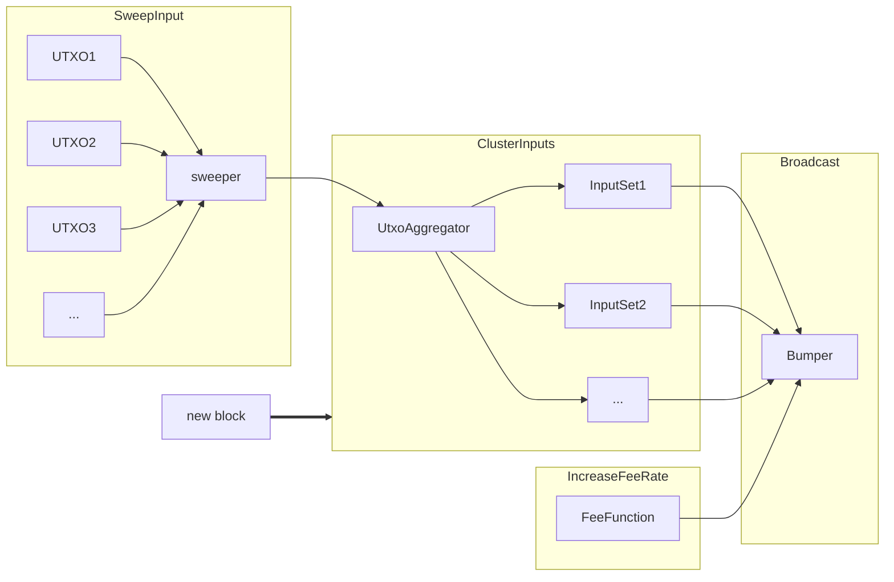

# Sweep

`sweep` is a subservice that handles sweeping UTXOs back to `lnd`'s wallet. Its
main purpose is to sweep back the outputs resulting from a force close
transaction, although users can also call `BumpFee` to feed new unconfirmed
inputs to be handled by the sweeper.

In order to sweep economically, the sweeper needs to understand the time
sensitivity and max fees that can be used when sweeping the inputs. This means
each input must come with a deadline and a fee budget, which can be set via the
RPC request or the config, otherwise the default values will be used. Once
offered to the sweeper, when a new block arrives, inputs with the same deadline
will be batched into a single sweeping transaction to minimize the cost.

The sweeper will publish this transaction and monitor it for potential fee
bumping, a process that won’t exit until the sweeping transaction is confirmed,
or the specified budget has been used up.

## Understanding Budget and Deadline

There are two questions when spending a UTXO - how much fees to pay and what
the confirmation target is, which gives us the concepts of budget and deadline.
This is especially important when sweeping the outputs of a force close
transaction - some outputs are time-sensitive, and may result in fund
loss if not confirmed in time. On the other hand, we don’t want to pay more
than what we can get back - if a sweeping transaction spends more than what is
meant to be swept, we are losing money due to fees.

To properly handle the case, the concept `budget` and `deadline` have been
introduced to `lnd` since `v0.18.0` - for each new sweeping request, the
sweeper requires the caller to specify a deadline and a budget so it can make
economic decisions. A fee function is then created based on the budget and
deadline, which proposes a fee rate to use for the sweeping transaction. When a
new block arrives, unless the transaction is confirmed or the budget is used
up, the sweeper will perform a fee bump on it via RBF.

## Package Structure

On a high level, a UTXO is offered to the sweeper via `SweepInput`. The sweeper
keeps track of the pending inputs. When a new block arrives, it asks the
`UtxoAggregator` to group all the pending inputs into batches via
`ClusterInputs`. Each batch is an `InputSet`, and is sent to the `Bumper`. The
`Bumper` creates a `FeeFunction` and a sweeping transaction using the
`InputSet`, and monitors its confirmation status. Every time it's not confirmed
when a new block arrives, the `Bumper` will perform an RBF by calling
`IncreaseFeeRate` on the `FeeFunction`.

#### `UtxoAggregator` and `InputSet`

`UtxoAggregator` is an interface that handles the batching of inputs.
`BudgetAggregator` implements this interface by grouping inputs with the same
deadline together. Inputs with the same deadline express the same time
sensitivity, so it makes sense to sweep them in the same transaction. Once
grouped, inputs in each batch are sorted based on their budgets. The only
exception is inputs with the `ExclusiveGroup` flag set, which will be swept
alone.

Once the batching is finished, an `InputSet` is returned, which is an interface
used to decide whether a wallet UTXO is needed or not when creating the
sweeping transaction. `BudgetInputSet` implements this interface by checking
the sum of the output values from these inputs against the sum of their
budgets - if the total budget cannot be covered, one or more wallet UTXOs are
needed.

For instance, commitment and HTLC transactions usually have some proportion of
their outputs timelocked, preventing them from being used to pay fees
immediately. For these transactions, wallet UTXOs are often needed to get them
confirmed in a timely manner.

#### `Bumper`

`Bumper` is a transaction creator, publisher, and monitor that works on an
`InputSet`. Once a sweeping transaction is created using the `InputSet`, the
`Bumper` will monitor its confirmation status and attempt an RBF if the
transaction is not confirmed in the next block. It relies on the `FeeFunction`
to determine the new fee rate every block, and this new fee rate may or may not
meet the BIP 125 fee requirements - in that case, the `Bumper` will try to
perform an RBF again in the coming blocks.

`TxPublisher` implements the `Bumper` interface. When a transaction is created
for the first time, unless its budget has been used up, `TxPublisher` will
guarantee that the initial publish meets the RBF requirements.

#### `FeeFunction`

`FeeFunction` is an interface that specifies a function over a starting fee
rate, an ending fee rate, and a width (the deadline delta). It's used by the
`Bumper` to suggest a new fee rate for bumping the sweeping transaction.

`LinearFeeFunction` implements this interface using a linear function - it
calculates a fee rate delta using `(ending_fee_rate - starting_fee_rate) /
deadline`, and increases the fee rate by this delta value every time a new block
arrives. Once the deadline is passed, `LinearFeeFunction` will cap its
returning fee rate at the ending fee rate.

The starting fee rate is the estimated fee rate from the fee estimator, which
is the result from calling `estimatesmartfee`(`bitcoind`),
`estimatefee`(`btcd`), or `feeurl` depending on the config. This fee estimator
is called using the deadline as the conf target, and the returned fee rate is
used as the starting fee rate. This behavior can be overridden by setting the
`--sat_per_vbyte` via `bumpfee` cli when fee bumping a specific input, which
allows users to bypass the fee estimation and set the starting fee rate
directly.

The ending fee rate is the value from dividing the budget by the size of the
sweeping transaction, and capped at the `--sweeper.maxfeerate`. The ending fee
rate can be overridden by setting the `--budget` via `bumpfee` cli.

For instance, suppose `lnd` is using `bitcoind` as its fee estimator, and an
input with a deadline of 1000 blocks and a budget of 200,000 sats is being
swept in a transaction that has a size of 500 vbytes, the fee function will be
initialized with:

- a starting fee rate of 10 sat/vB, which is the result from calling
  `estimatesmartfee 1000`.
- an ending fee rate of 400 sat/vB, which is the result of `200,000/500`.
- a fee rate delta of 390 sat/kvB, which is the result of `(400 - 10) / 1000 *
  1000`.

## Sweeping Outputs from a Force Close Transaction

A force close transaction may have the following outputs:

- Commit outputs, which are the  `to_local` and `to_remote` outputs.
- HTLC outputs, which are the  `incoming_htlc` and `outgoing_htlc` outputs.
- Anchor outputs, which are the local and remote anchor outputs.

#### Sweeping Commit Outputs

The only output we can spend is the `to_local` output. Because it can only be
spent using our signature, there’s no time pressure here. By default, the
sweeper will use a deadline of 1008 blocks as the confirmation target for
non-time-sensitive outputs.  To overwrite the default, users can specify a
value using the config `--sweeper.nodeadlineconftarget`.

To specify the budget, users can use `--sweeper.budget.tolocal` to set the max
allowed fees in sats, or use `--sweeper.budget.tolocalratio` to set a
proportion of the `to_local` value to be used as the budget.

#### Sweeping HTLC Outputs

When facing a local force close transaction, HTLCs are spent in a two-stage
setup - the first stage is to spend the outputs using pre-signed HTLC
success/timeout transactions, the second stage is to spend the outputs from
these success/timeout transactions. All these outputs are automatically handled
by `lnd`. In specific,
- For an incoming HTLC in stage one, the deadline is specified using its CLTV
  from the timeout path. This output is time-sensitive.
- For an outgoing HTLC in stage one, the deadline is derived from its
  corresponding incoming HTLC’s CLTV. This output is time-sensitive.
- For both incoming and outgoing HTLCs in stage two, because they can only be
  spent by us, there is no time pressure to confirm them under a deadline.

When facing a remote force close transaction, HTLCs can be directly spent from
the commitment transaction, and both incoming and outgoing HTLCs are
time-sensitive.

By default, `lnd` will use 50% of the HTLC value as its budget. To customize
it, users can specify `--sweeper.budget.deadlinehtlc` and
`--sweeper.budget.deadlinehtlcratio` for time-sensitive HTLCs, and
`--sweeper.budget.nodeadlinehtlc` and `--sweeper.budget.nodeadlinehtlcratio`
for non-time-sensitive sweeps.

#### Sweeping Anchor Outputs

An anchor output is a special output that functions as “anchor” to speed up the
unconfirmed force closing transaction via CPFP. If the force close transaction
doesn't contain any HTLCs, the anchor output is generally uneconomical to sweep
and will be ignored. However, if the force close transaction does contain
time-sensitive outputs (HTLCs), the anchor output will be swept to CPFP the
transaction and accelerate the force close process.

For CPFP-purpose anchor sweeping, the deadline is the closest deadline value of
all the HTLCs on the force close transaction. The budget, however, cannot be a
ratio of the anchor output because the value is too small to contribute
meaningful fees (330 sats). Since its purpose is to accelerate the force close
transaction so the time-sensitive outputs can be swept, the budget is actually
drawn from what we call “value under protection”, which is the sum of all HTLC
outputs minus the sum of their budgets. By default, 50% of this value is used
as the budget, to customize it, either use
`--sweeper.budget.anchorcpfp` to specify sats, or use
`--sweeper.budget.anchorcpfpratio` to specify a ratio.

