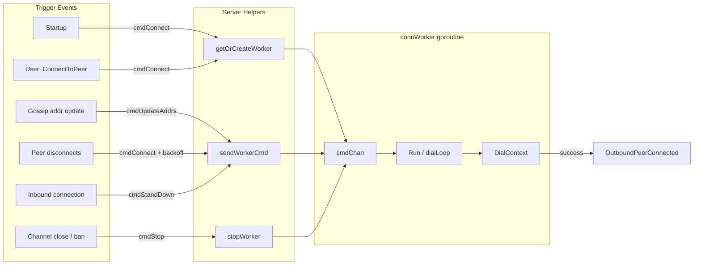

# Connection Worker Object Context

Structural overview of how the server communicates with per-peer connection
workers and what each caller needs from the worker layer.

Tags: #diagram #architecture #persistent-connections

## References
- Visualizes the trigger events and commands handled by:
  [[202602181001-connworker-run-loop.md]]
