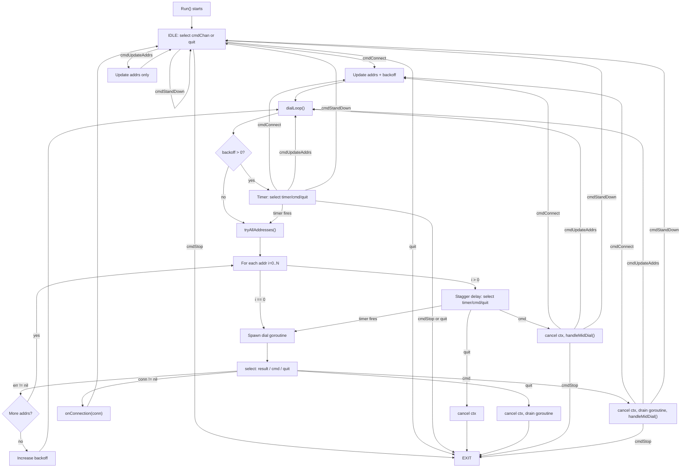

# Connection Worker Execution Flow

Runtime flow of a single `connWorker` goroutine showing state transitions,
command handling at each stage, and error paths.

Tags: #diagram #architecture #persistent-connections #concurrency

## References
- Visualizes runtime of: [[202602181001-connworker-run-loop.md]]
